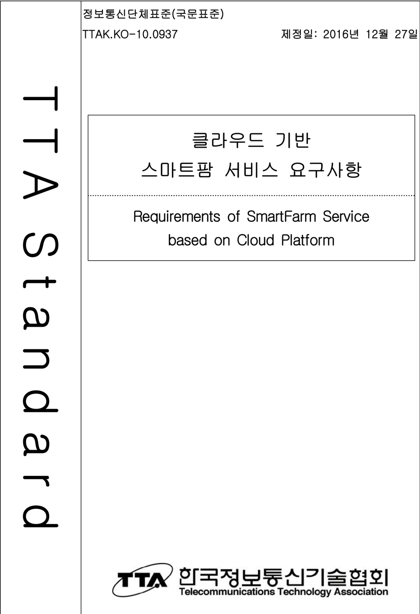
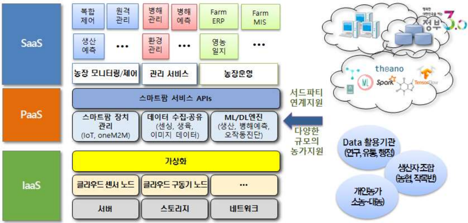
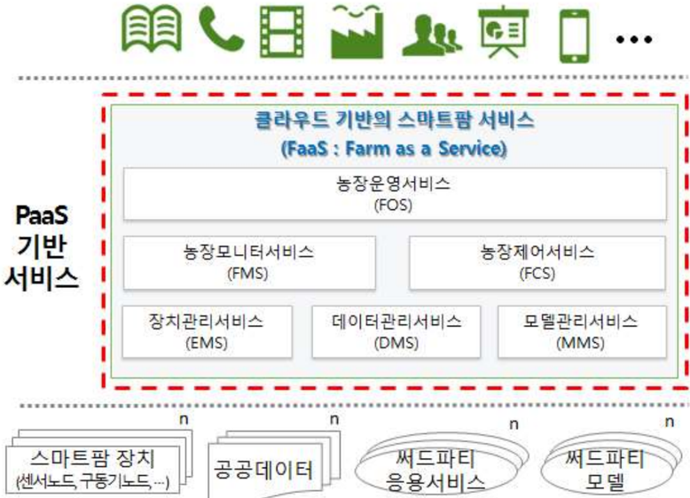
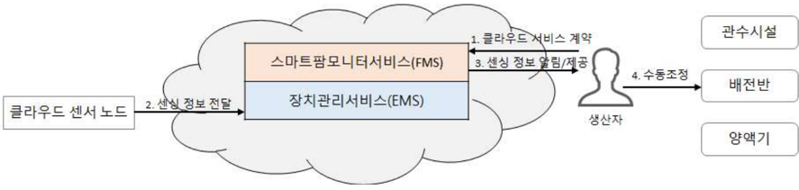
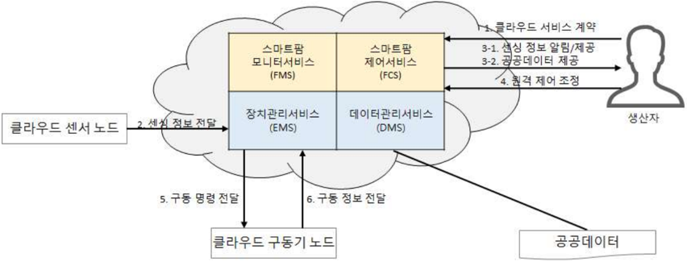
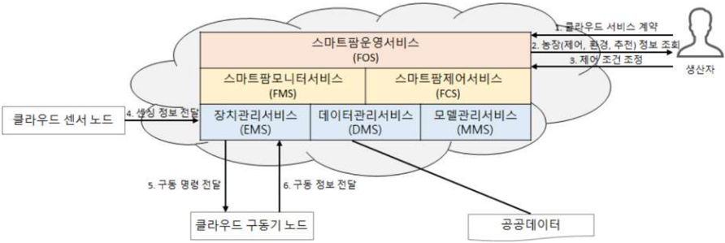
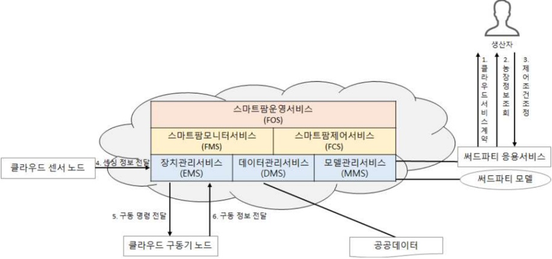

정보통신단체표준(국문표준) TTAK.KO-10.0937

제정일 2016.12.27.

(2025 확인)

## 클라우드 기반 스마트팜 서비스 요구사항

Requirements of SmartFarm Service based on Cloud Platform

제정일:  2016년  12월 27일

## 표준초안 검토 위원회 스마트농업 프로젝트그룹(PG426) 표준안 심의 위원회 정보기술 융합 기술위원회(TC4)

|               |        | 성명   | 소 속      | 직위       | 위원회 및 직위              | 표준번호        |
|---------------|--------|--------|------------|------------|-----------------------------|-----------------|
| 표준 과제 ( ) | 제안   | 이세용 | ㈜이지팜   | 책임연구원 | 농식품 ICT융합표준 포럼위원 |                 |
|               |        | 여현   | 순천대학교 | 교수       | 스마트농업 위원 PG          |                 |
| 표준 초안     | 작성자 | 이세용 | ㈜이지팜   | 책임연구원 | 농식품 ICT융합표준 포럼위원 | TTAK.KO-10.0937 |
|               |        | 김준용 | 서울대학교 | 책임연구원 | 농식품 ICT융합표준 포럼위원 |                 |
|               |        | 이명훈 | 순천대학교 | 교수       | 농식품 ICT융합표준 포럼위원 |                 |
|               |        | 김세한 | ETRI       | 책임연구원 | 농식품 ICT융합표준 포럼위원 |                 |
|               |        | 정희창 | 동의대학교 | 교수       | 스마트농업PG 위원장         |                 |
|               |        | 손정익 | 서울대학교 | 교수       | 농식품 ICT융합표준 위원장   |                 |
|               |        | 여현   | 순천대학교 | 교수       | 스마트농업 위원 PG          |                 |
| 사무국        | 담당   | 박준환 | TTA        | 전임연구원 |                             |                 |

본 문서에 대한 저작권은 에 있으며 와 사전 협의 없이 이 문서의 전체 또는 일부를 상업적 목적으로 복제 또는 TTA ,  TTA 배포해서는 안 됩니다.

본 표준 발간 이전에 접수된 지식재산권 확약서 정보는 본 표준의  부록 지식재산권 확약서 ' ( 정보 에 명시하고 있으며 이후 )' , 접수된 지식재산권 확약서는 TTA 웹사이트에서 확인할 수 있습니다.

본 표준과 관련하여 접수된 확약서 외의 지식재산권이 존재할 수 있습니다.

발행인 :

한국정보통신기술협회 회장

발행처  한국정보통신기술협회 :

13591, 경기도 성남시 분당구 분당로 47

발행일 :  2016.12

## 1   표준의 목적

본  표준의  목적은  클라우드  기술을  기반으로  스마트팜을  관리 , 운영하는데 있어 필요한 구성요소 및 서비스 요구사항을 정의한다 . 이를 통하여 농업분야에 클라우드 활용을 위 한 산업계의 관심을 고조시키고 스마트팜 활성화를 목적으로 한다.

## 2   주요 내용 요약

본 표준에서는 클라우드 기술을 기반으로 스마트팜의 모니터링 제어 관리 및 운영을 위 , , 한 요구사항을 기술하고 있다. 농장 자원의 가상화를 통해 스마트팜 서비스를 제공하고, 운영 및 개발 환경 (PaaS)을 위한 클라우드 기반 스마트팜 (FaaS,  Farm  as  a  Service) 플 랫폼의 서비스 구성요소를 정의한다 클라우드 기반 스마트팜 서비스는 장치관리 서비스 . (EMS  based  FaaS ), 데이터관리서비스(DMS  based  FaaS ), 모델관리서비스(MMS  based FaaS ) 등의 관리 서비스 기능과 스마트팜모니터서비스(FMS  based  FaaS ), 스마트팜 제 어서비스(FCS based FaaS ) 등  단순 복합제어 서비스 기능 스마트팜 운영서비스 및 농 / , 장생산 경영관리 등의 서비스 기능을 하는 스마트팜운영서비스 · (FOS  based  FaaS 등으 ) 로 구성된다 또한 부록 를 통해 본 표준이 적용되는  개의 시나리오를 제시한다 . II 4 .

## 3   인용 표준과의 비교

- 해당  사항 없음.

## 서   문

## 1    Purpose

The standard is to define the requirements of components  and service for managing  and  operating  smart-farm  based  on  cloud  platform  technology.  It  will focus  the  industry's  attention  on  the  importance  of  cloud  platform.

## 2    Summary

The  standard  describes  the  requirements  of  smartfarm  for  monitoring,  controlling, protected standard provides  smartfarm  service  and  defines  service  components  of  smartfarm(FaaS,

managing, and operating based on cloud platform technology in horticulture. Through the virtualization of smartfarm resources, the Farm as a Service)  for  managing  and  developing based  on  cloud  platform. Smartfarm  service  with  cloud  platform  contains  3  functions  of  the  management service  and  2  functions  of  the  simple/complex  control  service,  a  function  of  the farm  operation  services  as  follows:

-  management  service  based  FaaS  :  Equipment  Management  Service(EMS),  Data Management Service(DMS), Model Management Service(MMS)
-  simple/complex  control  service  based  FaaS  :  Farm  Monitor  Service(FMS),  Farm Control  Service(FCS)
- farm operation  service  based  FaaS  :  Farm  Operation  Service(FOS)

Also,  the  standard  describes  4  typical  smartfarm  service  scenarios  in  appendix  II.

## 3    Relationship  to  Reference  Standards

-  None.

## Preface

## 목   차

| 1      | 적용 범위 · · · · · · · · · · · · · · · · · · · · · · · · · · · · · · · · · · · · · · · · · · · · · · · · · · · · · · · · · · · · · · · · · · · · · · · · · · · · · · · · · · · · · · · · · · · · · · · · · · · · · · · · · · · · · · · · · · · · · · · · · · · · · · · · · ····1                                                                                                                                                                                                                                                                                                                                                                                                                                                                                                                                                                                           |
|--------|-----------------------------------------------------------------------------------------------------------------------------------------------------------------------------------------------------------------------------------------------------------------------------------------------------------------------------------------------------------------------------------------------------------------------------------------------------------------------------------------------------------------------------------------------------------------------------------------------------------------------------------------------------------------------------------------------------------------------------------------------------------------------------------------------------------------------------------------------------------------------------|
| 2      | 인용 표준 · · · · · · · · · · · · · · · · · · · · · · · · · · · · · · · · · · · · · · · · · · · · · · · · · · · · · · · · · · · · · · · · · · · · · · · · · · · · · · · · · · · · · · · · · · · · · · · · · · · · · · · · · · · · · · · · · · · · · · · · · · · · · · · · · ····2                                                                                                                                                                                                                                                                                                                                                                                                                                                                                                                                                                                           |
| 용어 3 | 정의 · · · · · · · · · · · · · · · · · · · · · · · · · · · · · · · · · · · · · · · · · · · · · · · · · · · · · · · · · · · · · · · · · · · · · · · · · · · · · · · · · · · · · · · · · · · · · · · · · · · · · · · · · · · · · · · · · · · · · · · · · · · · · · · · · ····2                                                                                                                                                                                                                                                                                                                                                                                                                                                                                                                                                                                                |
| 4      | 약어 · · · · · · · · · · · · · · · · · · · · · · · · · · · · · · · · · · · · · · · · · · · · · · · · · · · · · · · · · · · · · · · · · · · · · · · · · · · · · · · · · · · · · · · · · · · · · · · · · · · · · · · · · · · · · · · · · · · · · · · · · · · · · · · · · · · · · · · · · · · ····3                                                                                                                                                                                                                                                                                                                                                                                                                                                                                                                                                                            |
| 5      | 클라우드 기반 스마트팜 서비스 개요 · · · · · · · · · · · · · · · · · · · · · · · · · · · · · · · · · · · · · · · · · · · · · · · · · · · · · · · · · · · · · · · · · · · · · · · · · · · · · · · ····4                                                                                                                                                                                                                                                                                                                                                                                                                                                                                                                                                                                                                                                                      |
| 6      | 클라우드 기반 스마트팜 서비스 요구사항 · · · · · · · · · · · · · · · · · · · · · · · · · · · · · · · · · · · · · · · · · · · · · · · · · · · · · · · · · · · · · · · · · · · · · ····6 장치관리서비스 6.1 (EMS, Equipment Management Service based FaaS) ·· ··· ·····6 데이터관리서비스 6.2 (DMS, Data Management Service based FaaS) · ·· · · · ·· · · ·· · ····6 모델관리서비스 6.3 (MMS, Model Management Service based FaaS) · · · ·· · · · · · ·· · · ····6 스마트팜모니터서비스 6.4 (FMS, smartFarm Monitor Service based FaaS) ·· ·······7 스마트팜제어서비스 6.5 (FCS, smartFarm Control Service based FaaS) ·· ··· ·· ·· ·····7                                                                                                                                                                                                                                    |
| 부록   | 지식재산권 확약서 정보 -1 Ⅰ · · · · · · · · · · · · · · · · · · · · · · · · · · · · · · · · · · · · · · · · · · · · · · · · · · · · · · · · · · · · · · · · · · · · · · · · · · · · · · · · · · ······17 시험인증 관련 사항 -2 Ⅰ · · · · · · · · · · · · · · · · · · · · · · · · · · · · · · · · · · · · · · · · · · · · · · · · · · · · · · · · · · · · · · · · · · · · · · · · · · · · · · · · · · · · · · · · · · ······18 본 표준의 연계 표준 -3 (family) Ⅰ · · · · · · · · · · · · · · · · · · · · · · · · · · · · · · · · · · · · · · · ·· · · · · · · · · · · · · · · · · · · · · · · · · · · · · · · · · · ······19 참고 문헌 -4 Ⅰ · · · · · · · · · · · · · · · · · · · · · · · · · · · · · · · · · · · · · · · · · · · · · · · · · · · · · · · · · · · · · · · · · · · · · · · · · · · · · · · · · · · · · · · · · · · · · · · · · · · · · · · · · · · · ······20 |

## 정보통신단체표준 국문표준 ( )

## 클라우드 기반 스마트팜 서비스 요구사항

## (Requirements of  SmartFarm  Service based  on  Cloud Platform)

## 1   적용 범위

클라우드  기반의  스마트팜  서비스 (FaaS;  Farm  as  a  Service)를  위한  요구사항  표준은 클라우드  컴퓨팅  기술을  기반으로  스마트팜을  관리 ,  운영하는데  있어  필요한  서비스의 기술적 요구사항과 구성 내용을 정의한다 특히 기반으로 . ,  PaaS(Platform  as  a  Service) 다양한 형태의 스마트팜 자원 정보를 가상화하고 서비스 운영 및 개발 환경을 제공하는 , API 서비스 데이터 수집 제어 운영 관리 등을 위한 상위 응용 서비스에 대한 내용을 주 , / / / 내용으로 한다.

클라우드 기반 스마트팜 서비스는 서버 스토리지 미들웨어 응용소프트웨어 등 인프 , , , IT 라  자원을  네트워크를 통해 공유하는 클라우드 기술을 사용한다 또한 센서 노드 구동 . , , 기  노드  같은  스마트팜  장치들도  가상화하여  운영한다 이를  통해 기존  농가별로  설치 . , 운영되어  이기종  스마트팜  시스템  및  공급사별로  개별적 분산적으로  설치 운영  하였던 / / 레거시 시스템을 클라우드 기술을 통해 통합 운영할 수 있으며 , 농장 관리 기능을 저가 의 서비스 형태로 이용 할 수 있다.

스마트팜 서비스는 온실 과수원 등에 클라우드 컴퓨팅 및 사물인터넷 빅데이터 등의 기 , , 술을  적용하여 ,  농가의  요구사항에  맞춘  작물  생장  정보  모니터링  서비스를  제공할  수 있고 이를 활용한 생장 환경 제어 서비스를 제공할 수 있다 , .

그림 클라우드 기반의 개념도 ( 1-1) FaaS(Farm as a Service)

## 2   인용 표준

- 해당  사항 없음.

## 3   용어 정의

## 3.1 스마트팜 (SmartFarm)

를  온실 과수원 등 농업 시설 및 노지에 접목하여 작물의 생육상태를 모니터링하고 ICT , 원격자동으로 작물의 생육환경을 적정하게 유지 관리할 수 있는 농장 · ․

## 3.2 파스 플랫폼 (Faas;  Farm  as  a  Service)

농장 자원의 가상화를 통해 스마트팜 서비스를 제공하는 PaaS 환경으로써 데이터 수집 , / 제어 관리를 지원하는 운영 서비스 및 개발 환경을 제공하는 서비스 농장의 운영 / API , , 모니터링 단순 복합제어 장치 관리 데이터 관리 모델 관리를 지원하는 상위 응용 서비 , / , , , 스 등을 포함한다.

## 3.3 클라우드 센서 노드 (C-SensorNode, C-SN)

센서와 통신모듈이 결합된 구조로서 측정된 센싱 값 센서 상태 센서노드의 상태를  온 , , , 실 클라우드 통합제어기를 통해 전송하거나 ,  FaaS에 직접 전송이 가능한 노드

## 3.4 클라우드 구동기 노드 (C-Actuator  Node,  C-AN)

구동기와 통신모듈이 결합된 구조로서 클라우드 통합제어기 또는 , FaaS 서비스로부터 전달받은 명령을 통해 시설을 제어하고 구동 상태를 , FaaS 노드

## 3.5 클라우드 복합 노드

## (C-Hybrid  Node,  C-HN)

센서와 구동기 모듈이 단일 노드에 결합된 구조로 클라우드 통합제어기 및 관리서비스와 연결을 통해 모니터링 및 제어가 가능한 노드

의 스마트팜 제어 에  전달  가능한

FaaS의 장치

## 3.6 클라우드 통합제어기 (C-Greenhouse Control Gateway, C-GC)

로부터 받은 명령을 클라우드 구동기 노드 에게 전달하고 클라우드 센서 노 FaaS (C-AN) , 드 로  부터  전송된 센싱값을 로  전달하기 위한 장치로 클라우드 연결 및 프 (C-SN) FaaS , 로토콜 변환을 위한 게이트웨이 역할을 하는 장치

## 3.7 클라우드 게이트웨이 (C-Gateway, C-GW)

클라우드 기반 서비스 제공을 위해 필요한 데이터를 전달하기 위한 통신 장치로 클라우 , 드 연결 및 프로토콜 변환을 위한 게이트웨이 역할을 하는 장치

## 3.8 장치관리서비스 (Equipment Management Service)

클라우드  기반  센서노드 구동기노드 복합노드 통합제어기 (C-AN), (C-AN), (C-HN), (C-GC) 등 농장 내에 설치되어 있는 장치들을 등록 연결 관리하고 장치들로부터 센싱 , , 정보 및 구동 정보를 수집 및 제어하는 서비스

## 3.9 데이터관리서비스 (Data  Management Service)

공공데이터 등 외부서비스로부터 필요한 데이터를 수집하여 데이터베이스에 기록하는 관 리서비스

## 3.10 모델관리서비스 (Model  Management Service)

작물생육 환경 및 시설 제어 등 모니터링 결과를 반영한 알고리즘 모델을 스마트팜 서비 스에  적용하고,  클라우드의  내부  데이터를  외부의  응용서비스와  공유하도록  지원하는 관리서비스

## 3.11 스마트팜모니터서비스 (SmartFarm Monitor Service)

센서 및 구동기의 환경 데이터 생육 데이터 구동 데이터를 모니터링 및 조회하는 서비 , , 스

## 3.12 스마트팜제어서비스 (SmartFarm Control Service)

구동 명령을 구동기로 전달하고 구동 결과를 피드백하는 서비스

## 3.13 스마트팜운영서비스 (SmartFarm Operation Service)

농장의 생산 및 경영 데이터를 기록하고 분석 정보를 사용자에게 제공하는 서비스 스마 , 트팜을  위한 및 ERP(Enterprise Resource Planning) MIS(Management  Information System)를 제공

## 4   약어

- FaaS  Farm as a Service
- C-SN Cloud-SensorNode
- C-AN Cloud-Actuator Node
- C-HN Cloud-Hybrid Node
- C-GC Cloud-Greenhouse Control Gateway
- C-GW Cloud-Gateway
- EMS  Equipment Management Service
- DMS  Data Management Service
- MMS Model Management Service
- FMS  smartFarm Monitor Service
- FCS  smartFarm Control Service

## 정보통신단체표준 국문표준 ( )

## 5   클라우드 기반 스마트팜 서비스 개요

그림 클라우드 기반의 스마트팜 서비스 구성도 ( 5-1)

클라우드 기반 스마트팜 서비스 (FaaS)는 농장에서 작물을 생산하는데 있어 작물의 생육 , 상태를 모니터링하고 수동 또는 자동으로 시설 및 장치를 제어하고 , , PaaS 기반의 서비 스로 농장 운영 및 개발 환경을 제공한다.

클라우드 기반 스마트팜 (Faas) 서비스는 장치관리서비스(EMS  based  FaaS ), 데이터관리 서비스(DMS  based  FaaS ), 모델관리서비스(MMS  based  FaaS ) 등의 관리 서비스 스마 , 트팜모니터서비스(FMS based  FaaS ), 스마트팜 제어서비스(FCS  based  FaaS )  등  단순/ 복합제어  서비스 ,  농장  생산 경영관리를  서비스  하는  스마트팜운영서비스 · (FOS  based FaaS 로  구성된다 관리 서비스는 스마트팜을 구성하는 다양한 장치와 플랫폼 사이에 ) . 1 대 다수 (n)형태의 가상화 형태로 접근이 가능하며 외부 공공데이터와의 정보 연동과 써 , 드파티 모델  및 응용 서비스를 지원할 수 있다 스마트팜 서비스는 수집된 정보의 모니 . 터링이  가능해야  하며 수집 분석된  데이터를  통한  사용자 농가 수동  제어를  지원해야 , / ( ) 한다 한편 생육 환경 제어 알고리즘을 통한 복합 제어를 지원할 수도 있다 . , / .

사용자 농가 는 클라우드 기반 스마트팜 서비스 사용에 대한 계약 체결 후 파스 서 ( ) (Faas) 비스에 가입한다 서비스에 가입한 사용자는 부여된 권한에 따라 시스템 자원에 접근할 . 수 있으며 농장 모니터 농장 제어 농장 운영 등의 서비스를 이용할 수 있다 클라우드 , , , .

는  여러  농가에  설치되어  있는  스마트팜  장치의  가상화  및  장치  정보의  운영과  관리를 지원해야 한다.

클라우드 기반 스마트팜 서비스에서 수집한 데이터 중 일부 혹은 전부는 사용자의 권한 및 별도의 계약에 따라 외부에 개방될 수도 있다 시스템 개발 및 스마트팜 컨설팅 사업 . 자들은 클라우드에서 공개한 데이터를 활용하여 써드파티 (3rd  party) 응용서비스를 개발 할 수 있다 사용자는 써드파티 응용서비스를 이용하여 스마트팜관련  농장생산 경영관리 . · 서비스를 이용할 수도 있다.

스마트팜에 적용된 클라우드는 재배작목 농장의 규모 시설형태에 따라 다양한 방식으로 , , 구축 운영이 가능하기 때문에 스마트팜을 구성하는 센서 노드 제어 노드 농업용 통신 , , , 장비 등을 다양한 조합으로 통합하거나 분리하여 운영 할 수 있다 즉 각 장치들의 논리 . , 적 가상화를 통해 다양한 형태로 구성하여 서비스 될 수 있다.

클라우드 기반 스마트팜을 도입하는 농가는 농장의 시설 작물 재배 방식 등 농장 상황 , , 에 맞는 시스템 및 서비스 기능을 선택하여 이용할 수 있고 이에 따라 다양한 유형의 서 , 비스 시나리오가 존재 할 수 있다.

본  표준의  부록 클라우드 기반 스마트팜 서비스 적용 시나리오 에서는 대표적인 서비 ( II. ) 스 시나리오를 설명하고 있으며 그에 대한 요약은 다음과 같다 , .

- 수동제어 지원 - :

센싱 정보를 참조하여 현장에서 수동으로 장치 제어 및 운영

원격제어 지원 - :

센싱 정보를 참조하여 원격에서 수동으로 장치 제어 및 운영

자동제어 지원 - :

생산자가 미리 설정한 제어 조건으로 자동으로 장치 제어 및 운영

- 써드파티 지원 써드파티 응용서비스를 이용하여 모니터링 및 장치 제어 및 운영 - :

&lt;표 5 -1&gt; 클라우드 기반의 스마트팜 서비스 시나리오 구성 요건

|      |                 | 서비스 구성   | 서비스 구성   | 서비스 구성   | 서비스 구성   | 서비스 구성   | 서비스 구성   |
|------|-----------------|---------------|---------------|---------------|---------------|---------------|---------------|
| 번호 | 서비스 시나리오 | EMS           | DMS           | MMS           | FMS           | FCS           | FOS           |
| 1    | 수동제어 지원   | ○             |               |               | ○             |               |               |
| 2    | 원격제어 지원   | ○             | ○             |               | ○             | ○             |               |
| 3    | 자동제어        | 지원 ○        | ○             | ○             | ○             | ○             | ○             |
| 4    | 써드파티        | 지원 ○        | ○             | ○             | ○             | ○             | ◎             |

써드파티의 스마트팜운영 응용서비스 사용 * ◎  :

## 6   클라우드 기반 스마트팜 서비스 요구사항

클라우드 기반 스마트팜 서비스는 시스템을 구성하는 다양한 기술 요소들의 가상화 스 , 마트팜 내 외부 환경 상태 모니터링 스마트팜 구동 장비 제어 및 관리를 위한 서비스를 · , 제공한다 스마트팜 서비스를 통해 농장을 원격에서 모니터링하고 수동 자동으로 단순 . , / / 복합제어 관리할 수 있다 또한 농장 경영 의사결정에 필요한 보고 자료를 조회하고 농 . , , 장의 생산 경영 자료를 관리하고 운영하기 위한 서비스를 제공한다 , .

## 6.1 장치관리서비스 (EMS, Equipment Management Service based FaaS)

장치관리서비스는  농장에  설치되어  있는  클라우드용  센서노드 (C-SN),  구동기노드 복합노드 통합제어기 게이트웨이 등의  설치 변경 삭 (C-AN), (C-HN), (C-GC), (C-GW) , , 제 및 자동화된 연결을 지원하고 장치의 상태 및 운영 정보를 수집하는 서비스이다 장 , . 치관리서비스의 세부 요구사항은 다음과 같다.

- 농장에 설치되어 있는 클라우드 기반 장치들에 대하여 등록 변경 삭제 및 연결이 -, , 가능 해야 한다.
- 클라우드 기반 센서노드 및 구동기노드 등 장치들의 구동 주기 및 오류 관리가 가능 해야 한다.
- 센서 구동기 등 장치들의 펌웨어 버전 확인이 가능해야 한다 ,
- .
- 센서 구동기 등 장치들의 자동 수동 펌웨어 버전 업그레이드 설치를 지원할 수 있
- , / 다.
- 해당 서비스에 대한 유지보수를 위한 정보를 저장 및 유지 관리해야 한다.

## 6.2 데이터관리서비스 (DMS, Data Management Service based FaaS)

데이터관리서비스는 공공데이터 (Public  Data)서비스로부터 필요한 외부 데이터를 수집하 여  데이터베이스에  기록하는  서비스이다 .  데이터관리서비스의  세부  요구사항은  다음과 같다.

- 공개된 공공데이터서비스로부터 필요한 데이터를 수집할 수 있다.
- 공공데이터 명칭 제공기관 등록일 갱신일 등 공공데이터 메타 정보를 관리 할 수 , , , 있어야 한다.
- 수집된 데이터를 데이터베이스에 등록 연결 수정 삭제할 수 있어야 한다 , , ,
- .
- 해당 서비스에 대한 유지보수를 위한 정보를 저장 및 유지 관리해야 한다.

## 6.3 모델관리서비스 (MMS, Model Management Service based FaaS)

모델관리서비스는 생육모델 또는 환경제어 알고리즘 개발자가 개발한 작물 및 시설관리 ,

모델과  알고리즘들을  클라우드  서비스로  적용할  수  있도록  지원하는  서비스이다 또한 . 모델관리서비스를 통해 클라우드 기반 스마트팜 서비스의 내부데이터를 외부에서 접근할

## 정보통신단체표준 국문표준 ( )

수 있도록 공개할 수도 있으며 외부의 개발자가 이를 활용하여 제  의 응용서비스를 개 , 3 발할 수도 있다 모델관리서비스의 세부 요구사항은 다음과 같다 . .

- 생육모델 또는 환경제어 알고리즘 개발자가 자신의 생육모델 또는 환경제어 알고리 -( ) ( 즘 을 스마트팜 서비스에 등록 할 수 있는 규약을 제공해야 한다 ) .
- 모델 명칭 입력값 출력값 모델 실행 방법  통신 프로토콜 데이터 형식 작동 주기 , , , ( , , 등 ), 개발자 등 모델의 메타 정보를 등록 수정 할 수 있어야 한다 , .
- 생육모델은 입력 값으로 데이터관리서비스에서 제공하는 값을 사용할 수 있으며 별 , 도로 획득한 데이터를 입력 값으로 사용할 수도 있다.
- 생육모델은 데이터관리서비스를 활용하여 입력값을 미리 획득하여 실행되는 방식과 모델 실행시 입력값을 전달하는 방식으로 동작할 수 있다.
- 생육모델의 출력값은 클라우드기반 스마트팜 서비스에서 저장 관리 될수 있다 , .
- 개별 생육모델의 메타정보에 등록된 모델 실행 방법에 따라 모델을 구동하고 출력값 수신이 가능해야 한다.
- 서비스 개발자가 클라우드의 데이터를 이용할 수 있도록 사용 가이드 등 정보를 제 공해야 한다.
- 서비스 개발자가 클라우드의 데이터에 접근하기 위한 인증 및 권한 설정을 할 수 있 어야 한다.
- 모델관리서비스의 호출 횟수 전송 용량 등 사용량 데이터를 개발자별 서비스별로 -, , 집계 할 수 있어야 한다.
- 해당 서비스에 대한 유지보수를 위한 정보를 저장 및 유지 관리해야 한다.

## 6.4   스마트팜모니터서비스 (FMS, Farm Monitor Service based FaaS)

스마트팜모니터서비스는 장치관리서비스를 통해 수집된 센서 및 구동기의 환경 데이터와 구동  데이터를  모니터링하고  저장된  자료를  조회하는  서비스이다 . 농장모니터 서비스를 통해 농장 환경의 상태를 연속적으로 측정하여 결과를 집계 분석할 수 있다 스마트팜모 , . 니터서비스의 세부 요구사항은 다음과 같다.

- 농장 내 외부의 환경 데이터를 모니터링 및 조회 할 수 있어야 한다 · .
- 데이터 수집 주기 및 구역을 지정하여 정해진 시간에 환경 데이터를 수집 할 수 있 어야 한다.
- 정해진 시간에 데이터가 수집되지 않는 경우 사용자 및 관리자 알림 기능을 제공할 , 수 있어야 한다.
- 농장에 설치된 장치에 대한 상태정보를 제공할 수 있어야 한다.
- 해당 서비스에 대한 유지보수를 위한 정보를 저장 및 유지 관리해야 한다.

## 6.5   스마트팜제어서비스 (FCS,  Farm  Control  Service  based  FaaS)

스마트팜제어서비스는 장치관리서비스와 연동하여 사용자가 지정한 명령을 구동기가 실 행하도록 제어 명령을 전달하는 서비스이다 스마트팜제어서비스에서 농장제어 환경제어 .

## 정보통신단체표준 국문표준 ( )

알고리즘을 적용하도록 설정한 경우 자동 또는 반자동으로 농장을 자동화하여 관리할 수 있다 스마트팜제어서비스의 세부 요구사항은 다음과 같다 . .

- 사용자가 지정한 명령을 장치관리서비스로 전송하고 제어 결과를 피드백 받을 수 있 다.
- 하드웨어 고장 네트워크 단절 등 긴급 상황시 사용자 알림 등 비상 상황에 대한 파 , 악이 가능해야 한다.
- 농장에 설치된 구동기에 대한 자동 혹은 반자동 관리를 할 수 있다.
- 해당 서비스에 대한 유지보수를 위한 정보를 저장 및 유지 관리해야 한다.

## 6.6 스마트팜운영서비스 (FOS, Farm Operation Service based FaaS)

스마트팜운영서비스는 농장의 생산관리 정보를 기록 관리하고 생산 경영 의사결정에 유 , 용한  보고  기능을  집계하여  보여주는  총괄적인  서비스이다 . 스마트팜운영서비스를 통해 농장의 생산 경영 데이터를 전산화하고 이를 집계 분석하여 영농 활동 및 농장 경영 관 , , 리에 활용할 수 있다 스마트팜운영서비스의 세부 요구사항은 다음과 같다 . .

- 고유의 아이디를 갖는 농가 지역정보 시설하우스 시설하우스 형태 시설하우 -ID, , ID, , 스의 영역별 ID 등을 제공해야 한다.
- 영농 작업 상황을 수동 또는 자동으로 입력 가능해야 한다.
- 영농 작업 상황의 모니터링 및 조회 서비스를 제공해야 한다.
- 총괄적인 서비스 유지보수를 위한 정보를 저장 및 유지 관리해야 한다.
- 농장운영을 위한 별도의 등의 제공이 가능할 수 있다 -ERP, MIS .

## 부 속 서 A

(본 부속서는 표준 내용의 일부임)

## 클라우드 기반 스마트팜 서비스 적용 시나리오

클라우드 기반 스마트팜은 도입하는 농장의 시설 작물 재배 방식 등 농장 상황에 따라 , , 차별화 된 유형의 서비스 시나리오가 존재 할 수 있다 클라우드 기반 센서 노드 구동 . ( ), 기 노드 등  장치  구성의 방식 또한 서비스 시나리오별로 상이한 구성을 채택할 수 있으 ( ) 며 본 부록에서는 대표적  가지 유형의 시나리오를 제시한다 , 4 .

- 수동제어 지원 -

센싱 정보를 참조하여 현장에서 수동으로 장치 제어

- :

- 원격제어 지원 - :

센싱 정보를 참조하여 원격에서 수동으로 장치 제어

- 자동제어 지원 -

생산자가 미리 설정한 제어 조건으로 자동으로 장치 제어

- :

- 써드파티 지원 -

써드파티 응용서비스를 이용하여 모니터링 및 장치 제어

- :

&lt;표 Ⅱ -1&gt; 클라우드 기반의 스마트팜 서비스 시나리오 구성 요건

|      |                 | 서비스 구성   | 서비스 구성   | 서비스 구성   | 서비스 구성   | 서비스 구성   | 서비스 구성   |
|------|-----------------|---------------|---------------|---------------|---------------|---------------|---------------|
| 번호 | 서비스 시나리오 | EMS           | DMS           | MMS           | FMS           | FCS           | FOS           |
| 1    | 수동제어 지원   | ○             |               |               | ○             |               |               |
| 2    | 원격제어        | 지원 ○        | ○             |               | ○             | ○             |               |
| 3    | 자동제어        | 지원 ○        | ○             | ○             | ○             | ○             | ○             |
| 4    | 써드파티        | 지원 ○        | ○             | ○             | ○             | ○             | ◎             |

써드파티의 스마트팜운영 응용서비스 사용

* ◎  :

## 1   수동제어 지원 서비스

## 1.1   서비스 시나리오

- 농장은 스마트팜을 처음 도입하는 농가로 비용 부담을 최소화해 농장에 기술을 -  A ICT 적용하고 싶어 한다 저비용으로 구성 할 수 있는 농장 환경 센싱 위주로 현장에 적용 . 하고 효과 검증 후 적용 범위를 넓혀 나가고자 한다.
- 과수원 등 실외에서 작물을 기르는 노지 재배 농업의 경우 간단한 외부 환경 정보 모

## 정보통신단체표준 국문표준 ( )

## 정보통신단체표준 국문표준 ( )

니터링 수준에서 ICT 기술을 농장에 적용하기를 희망하는 경우가 많다.

- 토양환경 수분 영양분 기상환경 온도 습도 일사량 에 대한 지속적이고 연속적인 모 -( , ), ( , , ) , 니터링 정보를 제공하면 생산자는 영농지식과 경험에 근거해 적절한 관리전략을 수립 하고 현장 오프라인 에서 수동으로 관수기 등의 장비를 수동으로 조정한다 ( ) .

## 1.2   절차

그림 수동제어 지원 서비스 흐름도 ( Ⅱ-1)

- 1) 시스템 또는 별도의 계약에 따라 클라우드 센서노드 사용 및 클라우드 자원할당 관 , 련 서비스에 대한 권한을 승인 받는다
- 2) 클라우드 센서노드는 농장 내 환경 및 작물 생육에 대하여 수집한 센싱 값을 클라우 드에 전달하고 클라우드 서비스는 데이터를 저장한다 , .
- 3) 클라우드 서비스는 사전에 정해진 규칙에 의해 자동으로 센싱 정보를 사용자에게 알 려준다.
- 4) 사용자는 농장에 있는 관수시설 배전반 양액기를 직접 수동으로 조정한다 , , .

## 1.3   세부 요구사항

- 농장에 설치되어 있는 클라우드 센서 장치들을 등록 연결 수정 삭제가 가능해야 한 , , , 다.
- 농장 내 외부의 환경 생육 데이터를 모니터링하고 조회 할 수 있어야 한다 · , .
- 생산자 관리자 등의 사용자가 데이터 수집 주기를 지정할 수 있어야 하며 정해진 시 , 간에 자동으로 환경 생육 데이터를 수집 및 저장이 가능해야 한다 , .
- 정해진 시간에 데이터가 수집되지 않는 경우 사용자 알림 기능을 제공할 수 있어야 한 다.
- 사용자는 알림 발송 시간 관리 기준 값 초과 미달 등 알림 설정 조건을 지정할 수 있 , / 어야 하며 알림 설정 조건을 충족하면 클라우드 서비스 등을 통해 사용자에게 자동으 , 로 센싱 정보를 전달할 수 있어야 한다.

## 2   원격제어 지원 서비스

## 2.1   서비스 시나리오

-  B 농장은 비용 부담이 적은 서비스 위주로 스마트팜을 농장에 적용하고자 한다 도입 . 비용이 비교적 적은 농장 환경 센싱 설비 원격 제어 위주로 현장에 적용하고 효과 검 , 증 후 적용 범위를 넓혀 나가고자 한다.
- 시설  온실  등  실내에서  작물을  기르는  시설  재배  농업의  경우  환경  정보 생육 정보 -, 모니터링과 농장에 설치된 구동 장비 원격 제어 서비스를 함께 적용하기를 희망하는 경우가 많다 농장은 이를 통해 편리성 증진과 노동력 절감을 도모할 수 있다 . .
- 내부환경 온도 습도 일사 외부환경 온도 습도 강우 풍향 풍속 에 대한 지 -( , , ,  CO2), ( , , , , ) 속적이고 연속적인 모니터링 정보를 제공하면 생산자는 영농지식과 경험에 근거해 적 , 절한  관리전략을  수립하고  원격지 온라인 에서  냉난방 환기창  등의  장비를  수동으로 ( ) , 조정한다.

## 2.2   절차

그림 원격제어 지원 서비스 흐름도 ( Ⅱ-2)

- 1) 시스템 또는 별도의 계약에 따라 클라우드 센서 제어노드 사용 및 클라우드 자원할 / 당 관련 서비스에 대한 권한을 승인 받는다 , .
- 2) 클라우드 센서노드는 농장 내 환경 및 작물 생육에 대하여 수집한 센싱 값을 클라우 드에 전달하고 클라우드 서비스는 데이터를 저장한다 , .
3. 3-1) 클라우드 서비스는 사전에 정해진 규칙에 의해 자동으로 센싱 정보를 사용자에게 알려준다 또는 사용자가 수동으로 센싱 정보를 조회할 수도 있다 . , .
4. 3-2) 사용자는 기상 정보 가격 정보 등의 공공데이터를 조회할 수도 있다 , .
- 4) 사용자는 클라우드 서비스에 원격 제어 조정 명령을 전달한다.
- 5) 클라우드 서비스는 구동기노드에 구동 명령을 전달한다.
- 6) 구동기 노드는 구동기를 동작시키고 그 결과를 클라우드 서비스에 전달한다 , .

## 2.3   세부 요구사항

- 수동제어 지원 서비스의 모든 세부 요구사항을 포함한다.
- 농장에  설치되어  있는  클라우드  구동기  장치들을  등록 연결 수정 삭제가 가능해야 -, , , 한다.
- 클라우드 서비스는 공개된 공공데이터 서비스로부터 농업 기상 정보 시장 가격 정보 , 등 필요한 데이터를 수집 할 수 있다.
- 공공데이터 명칭 제공기관 등록일 갱신일 등 공공데이터의 메타 정보를 관리 할 수 , , , 있다.
- 사용자는 기간 지역 품목 등 검색조건을 지정하여 공공데이터를 조회 할 수 있다 , , .
- 클라우드 서비스는 구동기노드에 제어 명령을 전달 할 수 있어야 한다.
- 구동기노드는 사용자가 지정한 냉난방 환기창 등 장치를 구동시킬 수 있어야 하며 구 , 동 결과 정보를 클라우드에 전달 할 수 있어야 한다.
- 사용자는 구동기 제어 결과를 확인 할 수 있어야 한다.
- 클라우드 서비스는 센서 구동기 등 장치들의 데이터 수집 시간 구동 시간을 수집할 -, , 수 있어야 하며 장치들의 오류 정보 관리를 할 수도 있다 , .
- 사용자는 센서 구동기의 장치명 정상작동 유무 등 장치 상태 정보를 조회 할 수 있어 , , 야 한다.

## 3 자동제어 지원 서비스

## 3.1   서비스 시나리오

- 농장은 최신의 스마트팜 서비스를 농장에 적용하고자 한다 농장  환경  센싱 설비 -  C . , 제어를 넘어 자동 환경제어 , 생장관리 경영관리 등 스마트팜 서비스 전반을 적용 범 , 위로 한다.
- 규모화 현대화가 진행된 대규모 첨단 온실을 운영하는 농장에서는 시설과 작물의 특 , 성에 최적화된 생육관리를 지원할 수 있는 고품질 스마트팜 서비스를 요구한다 최적 . 화된 스마트팜 서비스를 통해 영농의 계량화 자동화 지능화를 도모하고 생산과 경영 , ,

## 정보통신단체표준 국문표준 ( )

의 고효율화를 지향한다.

- 재배작목 시설유형 시설수준에 맞는 맞춤형 추천 정보를 제공하면 생산자는 농장의 , , , 생산 경영  전략을  수립하고  자동  제어  조건을  최종  의사결정하며 생산자가  설정한 , , 제어 조건에 의해 농장은 자동으로 관리된다.

## 3.2   절차

그림 자동제어 지원 서비스 흐름도 ( Ⅱ-3)

- 1) 시스템 또는 별도의 계약에 따라 클라우드용 센서 제어 사용 및 클라우드 자원할당 / , 관련 서비스에 대한 권한을 승인 받는다.
- 2) 사용자는 클라우드 서비스를 통해 농장의 환경정보 제어정보 추천정보 사용이 가능 , , 하다.
- 3) 사용자는 최종 의사결정 후 제어 조건 조정을 한다.
- 4) 클라우드 센서노드는 농장 내 환경 및 작물 생육에 대하여 수집한 센싱 값을 클라우 드에 전달하고 클라우드 서비스는 데이터를 저장한다 , .
- 5) 클라우드 서비스는 구동기노드에 구동 명령을 전달한다.
- 6) 구동기노드는 구동기를 동작시키고 그 결과를 클라우드 서비스에 전달한다 , .

## 3.3   세부 요구사항

- 원격제어 지원 서비스의 모든 세부 요구사항을 포함한다.
- 사용자는 농장에 설치된 구동기의 제어 명령 구동 시간 등 제어 이력 정보를 조회할 , 수 있어야 한다.
- 사용자는 농장에 설치된 센서의 센싱 값 데이터 수집 시간 등 환경 이력 정보를 조회 , 할 수 있어야 한다.
- 클라우드는 서비스 사용자에게 재배작목 영농시기 시설 유형 및 시설 수준에 맞는 맞 , ,

춤형 제어 추천 정보를 제공할 수도 있다.

- 사용자는 생산 효율화 병해 진단 오작동 탐지 등 써드파티가 등록한 모델의 정보를 , , 조회할 수도 있다.
- 사용자는 구동 장치 제어 명령 구동 시간 등 구동기 제어 명령을 위자드 선택 방식 , , , 스크립트 입력 방식 등으로 직접 만들어서 등록할 수 있어야 한다.
- 클라우드에서 재배작물 시설유형별로 참조할 수 있는 제어 명령 템플릿을 제공할 수 , 도 있다.
- 제어 방식은 자동 반자동 수동 등 다양한 방식을 제공할 수도 있다 , , .
- 사용자가 등록한 제어 조건과 실제 농장에서 수집한 환경 정보 생육 정보 구동 정보 , , 를 시계열별로 추적해 조회 하는 기능을 제공할 수도 있다.
- 스마트팜운영서비스 를  통해  영농  일지  등  농작업  정보와  종자 투입재 부자재 -(FOS) , , 등 농자재 정보를 관리할 수도 있다.
- 스마트팜운영서비스 에서  입력한  농작업 농장재  등  생산  정보는  친환경  영농일 -(FOS) , 지 ,  GAP 영농일지 서식으로 변환하여 출력하거나 메일 등으로 전송하는 기능을 제공 할 수도 있다.
- 스마트팜운영서비스 를 통해 수입 비용 가격 판매 등 경영 정보를 관리할 수도 -(FOS) , , ,
- 있다.

## 4 써드파티 지원 서비스

## 4.1   서비스 시나리오

-  D 농장은 스마트팜 서비스를 도입해서 운영하고 있다 스마트팜 도입 이후 생산성 향 . 상 경영비 절감 등 운영 성과를 경험하였고 보다 향상된 스마트팜 서비스를 농장에 , , 적용하여 경쟁력을 유지 확산하기 위해 끊임없이 노력하고 있다 , .
- 스마트팜 서비스가 활성화 되어 써드파티 개발사들이 다양한 응용서비스들을 출시하고 있다 이들 응용서비스들은 고급 기능을 갖추고 있으며 성능에 대한 검증과 경쟁력을 . 확보하고 있다.
- 농장의 눈높이에 맞는 다양한 스마트팜 서비스들을 취사 선택 할 수 있는 시장과 환 ,

## 정보통신단체표준 국문표준 ( )

## 4.2   절차

- 1) 시스템 또는 별도의 계약에 따라 클라우드용 센서 제어노드 사용 및 클라우드 자원 / 할당 관련 서비스에 대한 권한을 승인 받는다 , .
- 2) 사용자는 써드파티 응용서비스를 통해 농장의 환경정보 제어정보 추천정보 사용이 , , 가능하다.
- 3) 사용자는 최종 의사결정 후 써드파티 응용서비스를 통해 제어 조건 조정을 한다.
- 4) 센서노드는 농장 내 환경 및 작물 생육에 대하여 수집한 센싱 값을 클라우드에 전달 한다.
- 5) 클라우드는 구동기노드에 구동 명령을 전달한다.
- 6) 구동기노드는 구동기를 동작시키고 그 결과를 클라우드에 전달한다 , .

## 4.3   세부 요구사항

- 자동제어 지원 서비스의 모든 세부 요구사항을 포함한다.
- 써드파티 응용서비스 개발자들은 데이터관리서비스를 통해 클라우드에 축적된 데이터 와 모델에 대한 정보를 조회하고 이와 연동된 제 의 응용서비스를 개발할 수 있다 , 3 .
- 써드파티 응용서비스 개발자가 데이터와 모델을 이용할 수 있도록 사용 가이드 등 정 보를 제공할 수 있다.

## 정보통신단체표준 국문표준 ( )

경이 조성되어 있다 클라우드에 축적된 작물 데이터 환경 데이터와 생육 관리 모델 . , , 시설  관리  모델을  결합해  다양한  특성의  고품질  스마트팜  서비스를  개발할  수  있다. 소프트웨어  개발  역량이  뛰어난  다수의  개발사들이  차별화된  스마트팜  응용서비스를 개발하고 있으며 생산자 등 사용자는 이들 서비스에 손쉽게 접근할 수 있다 , .

그림 써드파티 지원 서비스 흐름도 ( Ⅱ-4)

- 클라우드에 축적된 데이터와 모델에 대한 외부 제공 여부를 설정할 수 있는 기능이 있 어야 한다.
- 클라우드에 축적된 데이터와 모델에 대한 외부 제공 방식 원자료 통계값 등 을 설정할 ( , ) 수 있는 기능이 있어야 한다.
- 써드파티 응용서비스 개발자별로 데이터와 모델 접근을 위한 인증 및 권한 설정을 할 수도 있다.
- 써드파티 개발자별 응용서비스별로 데이터관리서비스의 호출 횟수 전송용량 등 사용 , , 량 데이터 조회 기능을 제공할 수도 있다.

## 부 록 Ⅰ-1

(본 부록은 표준을 보충하기 위한 내용으로 표준의 일부는 아님)

## 지식재산권 확약서 정보

## Ⅰ-1.1   지식재산권 확약서(1)

- 해당 사항 없음.

## Ⅰ-1.2 지식재산권 확약서(2)

- 해당 사항 없음.

※  상기  기재된  지식재산권  확약서  이외에도  본  표준이  발간된  후  접수된  확약서가

있을 수 있으니 ,  TTA 웹사이트에서 확인하시기 바랍니다.

## 정보통신단체표준 국문표준 (

## )

## 부 록 Ⅰ-2

(본 부록은 표준을 보충하기 위한 내용으로 표준의 일부는 아님)

## 시험인증 관련 사항

## Ⅰ-2.1   시험인증 대상 여부

- 해당 사항 없음.

## Ⅰ-2.2   시험표준 제정 현황

- 해당 사항 없음.

## 정보통신단체표준 국문표준 ( )

## 부 록 Ⅰ-3

(본 부록은 표준을 보충하기 위한 내용으로 표준의 일부는 아님)

## 본 표준의 연계 (family) 표준

- 해당 사항 없음.

## 정보통신단체표준 국문표준 ( )

## 부 록 Ⅰ-4

(본 부록은 표준을 보충하기 위한 내용으로 표준의 일부는 아님)

## 참고 문헌

- [1] TTAK.KO-10.0903, '스마트온실을 위한 센서 인터페이스',  2016.
- [2] TTAK.KO-10.0845, '스마트 온실을 위한 구동기 인터페이스',  2015.
3. 정보통신산업진흥원 기반 농작물 생장환경 관리 시스템 구축 및 운영 가이드 ,  'USN
- [3] 라인', 2010.
- [4] TTAK.KO-06.0286, '온실 관제 시스템 요구 사항 프로파일',  2012.

## 정보통신단체표준 국문표준 (

## )

- 해당 사항 없음.

## 부 록 Ⅰ-5

(본 부록은 표준을 보충하기 위한 내용으로 표준의 일부는 아님)

## 영문표준 해설서

## 정보통신단체표준 국문표준 ( )

## 부 록 Ⅰ-6

(본 부록은 표준을 보충하기 위한 내용으로 표준의 일부는 아님)

## 표준의 이력

| 판수   | 채택일     | 표준번호        | 내용   | 담당 위원회                     |
|--------|------------|-----------------|--------|---------------------------------|
| 제 1판 | 2016.12.27 | TTAK.KO-10.0937 | -      | 스마트농업 프로젝트그룹 (PG426) |

## 정보통신단체표준 국문표준 ( )