정보통신단체표준(국문표준) TTAK.KO-10.0943

제정일 2016.12.27.

(2025 확인)

## 스마트팜용 온실통합제어기와 센서-구동기 통합노드 간 통신 프로토콜

Communication Protocol between Greenhouse Control Gateway and Sensor-Actuator Integrated Nodes for Smartfarm Application

## T T A    S t a n d a r d

정보통신단체표준(국문표준) TTAK.KO-10.0943                제정일: 2016년 12월 27일

## 스마트팜용 온실통합제어기와 센서구동기 통합노드 간 통신 프로토콜

Communication Protocol between Greenhouse Control Gateway and SensorActuator Integrated Nodes for Smartfarm Application

표준초안  검토  위 스마트농업 프로젝트그룹(PG426)

| 원회             |                                    |                                    |                                    |                                    |                  |
|------------------|------------------------------------|------------------------------------|------------------------------------|------------------------------------|------------------|
| 표준안 심의 회   | 위원 정보기술 융합 기술위원회(TC4) | 위원 정보기술 융합 기술위원회(TC4) | 위원 정보기술 융합 기술위원회(TC4) | 위원 정보기술 융합 기술위원회(TC4) |                  |
|                  | 성명                               | 소 속                              | 직위                               | 위원회 및 직위                     | 표준번호         |
| 표준(과제) 제안  | 김재영                             | 한국전자통신연구원 대경권연구센터  | 책임연구원                         | 스마트농업PG위원                   |                  |
| 표준 초안 작성자 | 김재영                             | 한국전자통신연구원 대경권연구센터  | 책임연구원                         | 스마트농업PG위원                   | TTAK.KO- 10.0943 |
|                  | 안수용                             | 한국전자통신연구원 대경권연구센터  | 선임연구원                         | 스마트농업PG위원                   |                  |
|                  | 노동희                             | 한국전자통신연구원 대경권연구센터  | 연구원                             | 스마트농업PG위원                   |                  |
|                  | 문애경                             | 한국전자통신연구원 대경권연구센터  | 책임연구원                         | 스마트농업PG위원                   |                  |
|                  | 박주영                             | 한국전자통신연구원 표준연구센터    | 실장                               | 스마트농업PG위원                   |                  |
|                  | 허미영                             | 한국전자통신연구원 표준연구센터    | 책임연구원                         | 스마트농업PG위원                   |                  |
| 사무국 담당      | 박준환                             | TTA                                | 전임                               | -                                  |                  |

본 문서에 대한 저작권은 TTA에 있으며, TTA와 사전 협의 없이 이 문서의 전체 또는 일부를 상업적 목적으로 복제 또는 배포해서는 안 됩니다.

본 표준 발간 이전에 접수된 지식재산권 확약서 정보는 본 표준의 '부록(지식재산권 확약서 정보)'에 명시하고 있으며, 이후 접수 된 지식재산권 확약서는 TTA 웹사이트에서 확인할 수 있습니다.

본 표준과 관련하여 접수된 확약서 외의 지식재산권이 존재할 수 있습니다.

발행인 : 한국정보통신기술협회 회장

발행처 : 한국정보통신기술협회

13591,  경기도 성남시 분당구 분당로 47

Tel : 031-724-0114, Fax : 031-724-0109

발행일 : 2016.12

## 1   표준의 목적

본  표준은  온실에  IT  기술  적용  시  필요한  요소를  정의하고,  관련  서비스의  기술적 요구  사항과  구성  내용을  정의한다.  온실  관제  시스템은  온실에서  작물  생장 관리를  위해  온실  내·외부의  환경  및  제어  정보를  수집하고,  이를  활용해  생장 환경을  조성하는  설비기기의  제어가  가능한  시스템이다.  이에는  생장  환경  관리,

생장 환경 제어와 같은 서비스 기능 등이 포함된다.

본  표준은  온실관제시스템을  운용함에  있어  온실  내외부의  센서(외부기상환경, 내부대기환경,  토양환경)/액추에이터와  온실통합제어기  간의  인터페이스에  대한 표준을 제안하는 것을 목적으로 하며 다음의 세부 내용을 포함한다.

- -사용 환경: 센서-구동기 통합노드 구성, 환경, 운영 관리
- -메시지 전달 모델: 노드와 온실통합제어기 메시지 전달 모델
- -메시지 포맷: 일반 메시지 구조 및 각 필드 구성
- -메시지 흐름: 연결, 초기화, 메시지 설정 및 조회, 디바이스 제어, 알림 전송 등

## 2   주요 내용 요약

본  표준은  온실관제시스템에서  센서-구동기  통합노드들과  온실통합제어기  간의 인터페이스를  명세한다.  이를  위해  사용된  용어를  정리하고  온실  관제  시스템에 대한  소개와  기능적인  요구사항  및  운영  관리  방법,  센서-구동기  통합노드와 온실통합제어기 간 인터페이스 구성 및 동작 방법을 제안한다.

## 3   인용 표준과의 비교

## 3.1    인용 표준과의 관련성

- 이  표준에서  사용되는  ID  체계는  정보통신단체표준인  계층적  센서  노드  식별  체계 (hCode)(TTAK.KO-06.0201/R1)를  따른다.
- 이  표준에서  사용되는  메시지  포맷  구조는  정보통신단체표준인  온실관제시스템

## 서   문

센서 노드와 온실통합제어기 간 인터페이스 (TTAK.KO-06.0288-Part1/R1) 및 온실 관제  시스템  및  제어  노드와  온실통합제어기  간  인터페이스  (TTAK.KO-06.0288Part2)을  참조하였다,  본  표준에서는  한번의  메시지  전송으로  다수의  센서  및 액추에이터 값 조회, 설정 및 제어를 가능케 하기 위해 센서 및 액추에이터에 대한 인터페이스가 통합된 메시지 포맷을 제안함으로 참조 표준과의 차별성을 가진다.

## 3.2    인용 표준과 본 표준의 비교표

|                                                                                                         | TTAK.KO- 06.0201/R1                        | TTAK.KO-06.0288- Part1/R1   | TTAK.KO-06.0288- Part2   | 비고                                                                                       |
|---------------------------------------------------------------------------------------------------------|--------------------------------------------|-----------------------------|--------------------------|--------------------------------------------------------------------------------------------|
| 1. 적용 범위                                                                                            | -                                          | -                           | -                        |                                                                                            |
| 2. 인용 표준                                                                                            | -                                          | -                           | -                        |                                                                                            |
| 3. 용어 정리                                                                                            | -                                          | -                           | -                        |                                                                                            |
| 4. 약어                                                                                                 | -                                          | -                           | -                        |                                                                                            |
| 5.1. 구성요소 일반 5.2. 운영 관리                                                                       | -                                          | -                           | -                        |                                                                                            |
| 6.1. 온실통합제어 기 에서 노드로의 메시지 전달 모델 6.2. 노드에서 온실 통합 제어기로의 메시지 전달 모델 | -                                          | 7. 메시지 흐름              | 7. 메시지 전달 모델      | 수정 (TTAK.KO- 06.0288- Part1/R1) 수정 (TTAK.KO- 06.0288-Part2)                            |
| 7.1. 기본 메시지 포맷 및 종류 7.2. Header 구성 7.3. 페이로드 구성                                       | 7. 계층적인 센서 네트워크 식별 체계의 구조 | 6. 메시지 포맷              | 8. 메시지 포맷           | 추가 (TTAK.KO- 06.0201/R1) 수정 (TTAK.KO- 06.0288- Part1/R1) 수정 (TTAK.KO- 06.0288-Part2) |
| 8.1. Request/Response 메시지 흐름 8.2. Notify/ACK 메 시지 흐름                                          | -                                          | -                           | -                        |                                                                                            |

## 1   Purpose

The standard defines the components  which are needed for applying IT technologies to a greenhouse and specifies the requirements and the architecture for the technological issues. The Integrated Greenhouse Management and Control System  collects  the  information  for  the  growth  management  of  corps  and  can control  the  facilities  promoting  the  optimal  growth  environments  in  greenhouse. This system includes the services such as growth environment management and control.

The  standard  is  to  suggest  the  interface  between  the  sensor  (external-internal weather environment, Soil environment, etc.)-actuator and the  Greenhouse Control  Gateway  for  operating  the  Integrated  Greenhouse  Management  and Control System. The standard includes subsequent details as follows:

- -Operating Environment: The Integrated of sensor-actuator node configuration, operating environment and management
- -Message Transmission Model: Message transmission model between sensoractuator Nodes and Greenhouse Control Gateway
- -Message Format: General message structure and each field configuration
- -Message Flow: Connection, Initialization, sensor-actuator property setting and query, device control, notification, etc.

## 2   Summary

The standard specifies the interface between sensor-actuator nodes and greenhouse  control  gateway  in  the  Integrated  Greenhouse  Management  and Control System. In the standard, It defines the terms used and introduce general details of Integrated Greenhouse Management and Control System. It also explain its functional requirements, the operation management, and the interface configuration.

## Preface

## 3   Relationship to Reference Standards

The Identification Scheme of the standard is based on Hierarchical Identification Scheme for Sensor Nodes: hCode (TTAK.KO-06.0201/R2) standard.

The  Message  format  structure  of  the  standard  is  based  on  Greenhouse  Control System  -  Part  1:  Interface  between  Sensor  Nodes  and  Greenhouse  Control Gateway (TTAK.KO-06.0288-Part1/R1) and Greenhouse Control System - Part 2: Interface  between  Actuator  Nodes  and  Greenhouse  Control  Gateway  (TTAK.KO06.0288-Part2/R1)  standards.  The  main  differences  between  the  standard  and reference  ones  are  that  the  standard  1)  integrates  TTAK.KO-06.0288-Part1/R1 and TTAK.KO-06.0288-Part2/R1, and 2) enables us to set-query-control multiple sensors and actuators within one message transmission.

## 목   차

| 1    | 적용 범위 ·······················································································   | 1                                                                                                                                     |
|------|-----------------------------------------------------------------------------------------------------|---------------------------------------------------------------------------------------------------------------------------------------|
| 2    | 인용 표준                                                                                           | ······················································································· 2                                             |
| 3    | 용어 정의                                                                                           | ······················································································· 2                                             |
| 4    | 약어 ······························································································ | 4                                                                                                                                     |
| 5    | 일반사항                                                                                            | ························································································ 4                                            |
| 5.1  | 구성요소 일반 ·············································································         | 5                                                                                                                                     |
| 5.2  | 운영 관리                                                                                           | ·················································································· 5                                                  |
| 6    | 메시지 전달 모델 ··············································································     | 6                                                                                                                                     |
| 6.1  | 온실통합제어기에서 노드로의 메시지 전달 모델                                                        | ···································· 6                                                                                                |
| 6.2  | 노드에서 온실통합제어기로의 메시지 전달                                                             | 모델 ···································· 8                                                                                           |
| 7    | 메시지 구성                                                                                         | ···················································································· 9                                                |
| 7.1  | 기본 메시지 포맷 및 종류                                                                            | ······························································ 9                                                                      |
| 7.2  | Header 구성 ··············································································          | 13                                                                                                                                    |
| 7.3  | 페이로드 구성                                                                                       | ············································································ 15                                                       |
| 8    | 메시지 흐름                                                                                         | ··················································································· 20                                                |
| 8.1  | Request-Response 메시지 흐름                                                                        | ······················································ 20                                                                             |
| 8.2  | Notify-ACK 메시지 흐름                                                                              | ································································ 43                                                                   |
| 부록 | Ⅰ-1 지식재산권 확약서 정보                                                                          | ························································· 52                                                                          |
|      | Ⅰ-2 시험인증 관련 사항 ······························································               | 53                                                                                                                                    |
|      | Ⅰ-3 본 표준의 연계(family) 표준 Ⅰ-4 참고 문헌                                                       | ···················································· 54 ·········································································· 55 |
|      | Ⅰ-5 영문표준 해설서                                                                                 | ·································································· 56                                                                 |
|      | Ⅰ-6 표준의 이력                                                                                     | ·······································································                                                               |
|      |                                                                                                     | 57                                                                                                                                    |

## 정보통신단체표준(국문표준)

## 스마트팜용 온실통합제어기와 센서-구동기 통합노드 간 통신 프로 토콜

## (Communication Protocol between

## Greenhouse Control Gateway and Sensor-Actuator Integrated Nodes for Smartfarm Application)

## 1   적용 범위

본  '스마트팜용  온실통합제어기와  센서-구동기  통합노드  간  통신  프로토콜'  표준은 온실통합제어기와  센서-구동기  통합노드  (이하  노드로  표기)  간  통신  프로토콜 표준을  제안하는  것을  목적으로  한다.  본  표준을  통하여,  유무선  센서  네트워크 환경이  구축된  시설원예  환경에서  온실통합제어기는  노드에  부착된  센서를  통해 온실  내외의  환경정보  및  작물  생육관련  정보를  수집할  수  있으며,  액추에이터 구동을 통해 온실 내 시설제어 및 작물 생장 환경을 제어할 수 있다.

(그림 1-1) 표준 인터페이스 및 그 범위

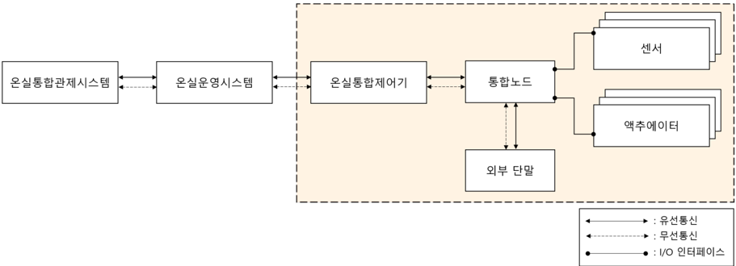

본  표준은  온실통합제어기  및  N개  노드  간  통신  인터페이스를  정의하였으며,  본 표준을 통하여 노드-디바이스의 구성, 온실통합제어기 및 노드 간 메시지 구조 및 흐름 등에 대하여 정의한다.

본 표준 (Smartfarm-specialized Integrated Application Protocol, SIAP)은 센서 및 액추 에이터에 대한 인터페이스를 통합하여 불필요한 메시지를 최소화하였으며, 한번의 메시 지 전송으로 다수의 센서 및 액추에이터 값 조회, 설정 및 제어가 가능함을 특징으로 한

## 정보통신단체표준(국문표준)

다. 또한, 사용자는 외부 단말을 통하여 노드에 직접 접속한 후 노드-디바이스 속성값을 수정할 수 있으며 변경사항을 확인하여 자동 동기화가 가능한 인터페이스를 제공한다.

&lt;표 1-1&gt; 표준 구성 및 정의

| 범위        | 정의                                                                                                                                                                                                                                                                                                                                                                                                                                          |
|-------------|-----------------------------------------------------------------------------------------------------------------------------------------------------------------------------------------------------------------------------------------------------------------------------------------------------------------------------------------------------------------------------------------------------------------------------------------------|
| 구성        | 노드 구성: 표 7-13 참조 디바이스 구성: 표 7-15 참조                                                                                                                                                                                                                                                                                                                                                                                           |
| 통신 환경   | 유선(Ethernet, RS232, 485 등) 및 무선 (WiFi, IEEE 802.15.4.4e 등)                                                                                                                                                                                                                                                                                                                                                                             |
| 메시지 포맷 | 기본 메시지 구조: 그림 7-1 및 표 7-1 참조 세부 메시지 구조: 8장 참조                                                                                                                                                                                                                                                                                                                                                                          |
| 메시지 흐름 | 연결 설정: GCG-노드 간 연결 설정 절차 정의 (8.1.1 참조) 초기화 개별, 전체 디바이스 초기화 절차 정의 (8.1.2 참조) 속성 설정: 노드-디바이스 속성 정보 설정 절차 정의 (8.1.3 참조) 속성 조회: 노드-디바이스 속성 정보 조회 절차 정의 (8.1.4 참조) 디바이스 제어: 디바이스 제어 절차 정의 (8.1.5 참조) 리부팅: 노드 리부팅 명령 절차 정의 (8.1.6 참조) 알림: 현재 노드-디바이스 상태 및 리부팅 및 네트워크 연결 상태 등 알림 절차 정의 (8.2 참조) |

## 2   인용 표준

TTAK.KO-06.0201/R1 (2010)  -  계층적  센서  노드  식별  체계(hCode) -

TTAK.KO-06.0288-Part1/R1  (2015):  온실관제시스템  -  제1부  센서  노드와  온실통 합제어기 간 인터페이스

TTAK.KO-06.0288-Part2  (2012):  온실  관제  시스템  -  제2부  제어  노드와  온실통합 제어기 간 인터페이스

## 3   용어 정의

## 3.1 노드 (Node) [TTAK.KO-06.0201]

온실통합제어기와 디바이스(센서-구동기)간 통신을 가능하게 하는 매개체

## 3.2  노드 ID (Node ID) [TTAK.KO-06.0201]

다수 노드를 구분하기 위한 식별자로서 온실 내부에서 유일한 값을 가짐

## 3.3  디바이스 (Device) [TTAK.KO-06.0201]

온실  내외의  환경  정보를  수집하거나  생육  환경을  제어하는  장치로서,  그  역할에 따라 따라 센서 혹은 액추에이터로 분류됨

## 3.4  디바이스 ID (Device ID) [TTAK.KO-06.0201]

다수 디바이스를 구분하기 위한 식별자로서 단일 노드에서 유일한 값을 가짐

## 3.5  센서 (Sensor) [TTAK.KO-06.0288-Part1/R1]

온실 내외의 환경 정보를 수집하는 장치

## 3.6  액추에이터 (Actuator) [TTAK.KO-06.0288-Part2]

온실 내에서 환경을 제어하기 위한 장치

## 3.7  스마트팜 온실 (Smart Farm Greenhouse) [TTAK.KO-06.0288-Part1/R1]

기존 온실에 IT 기술을 융합하여 식물의 생장을 극대화하기 위해 식물 생장에 중요

한 생육 환경 요소(예: 광, 온도, 습도 등)을 조절할 수 있는 시설장치

- 3.8  온실통합관제시스템  (Integrated  Greenhouse  Management  and  Control  System) [TTAK.KO-06.0288-Part3]

외부  데이터서버와  연동  기능  및  N개의  온실운영시스템으로부터  작물생육정보를

피드백 받음으로써 다수의 온실운영시스템을 관리 및 제어

## 3.9  온실운영시스템 (Greenhouse Operating System) [TTAK.KO-06.0288-Part1/R1]

온실 내·외부 센서로부터 환경 및 작물생육 모니터링, 온실 환경 제어 알고리즘 운

영 및 제어, 수집된 데이터를 데이터베이스에 기록

## 3.10 온실통합제어기 (GCG, Greenhouse Control Gateway) [TTAK.KO-06.0286]

온실운영시스템과  노드의  중간  매개체로서,  온실운영시스템으로부터  받은  명령을

노드로 전달해 주는 장치

## 3.11 온실통합제어기 ID (GCG ID) [TTAK.KO-06.0201]

온실통합제어기를 구분하기 위한 식별자

## 3.12 환경 정보 (Environment Information) [TTAK.KO-06.0288-Part4]

온실 내외의 센서 및 액추에이터로부터 수집된 정보, 혹은 액추에이터에 의해 변화

하는 정보

## 3.13 수신확인메시지 (Acknowledgement Message, ACK) [TTAK.KO-06.0288-Part1/R1]

상태알림메시지(Notify Message)에 대한 수신확인메시지

## 정보통신단체표준(국문표준)

## 4   약어

GCG Greenhouse Control Gateway

ID Identifier

ACK Acknowledgement Message

RSC Response State Code

NEC Notify Error Code

S/W Software

I/O Input and Output

## 5   일반사항

본  장에서는  온실통합제어기와  노드  간  인터페이스  사용환경에  대해  기술한다.  하 나의  온실통합제어기는 다수의 노드를 제어할 수 있도록 하나 이상의 다양한 형태 의  유무선 통신 인터페이스를 포함한다. 이러한 통신인터페이스의 예로는 Wi-Fi 등 으로  분류되는  IEEE  802.11  무선통신기술,  그리고  Zigbee,  Bluetooth  등으로  분류 되는 IEEE  802.15.4  무선통신기술,  RS-232,  485  및  Ethernet  등  유선통신  기술들 이 있다.

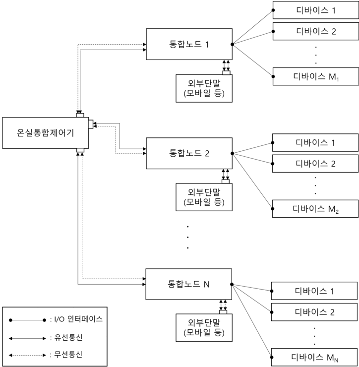

## 5.1    구성요소 일반

온실통합제어기는  N개의  노드와  통신이  이루어지며,  각각의  노드는 N M 개의 디바이스(센서-구동기)를  탑재할  수  있다.  온실통합제어기  ID  및  노드  ID는  각각 20비트를  가지며,  이는  TTA의  TTAK.KO-06.0201/R1,  계층적  센서  노드  식별 체계(hCode)  표준을 따른다. 디바이스 ID는 8비트를 가진다.

각 외부단말은 각 노드에 Wi-Fi, Zigbee 등 무선통신 기술을 통해 접속이 가능하며, 사용자는 외부단말을 이용하여 노드 속성값 설정 및 조회가 가능하다 (그림 5-1).

## 5.2    운영 관리

본  장은  노드  및  디바이스를  활용한  온실  운영  시  요구되는  서비스  종류  및  그 방법을 포함한다.

## 5.2.1    운영 관리 요소

최적의  생육환경에  맞게  각  센서와  액추에이터는  온실  내외부의  적합한  위치에 설치된다. 설치된 센서 및 액추에이터 등의 디바이스는 각 노드에 I/O 인터페이스를  통해  연결되며,  해당  노드는  온실통합제어기와  유무선통신  방식으로 연결되어  속성  설정  및  조회,  상태  알림  등  인터페이스를  제공한다.  각  센서  및 액추에이터  등  디바이스의  설치  방법  및  그  운용  환경  조건에  대해서는  본 표준에서 정의하지 않는다.

다음은 본 표준에서 정의하고 있는 운영 관리 요소들이다.

-  노드  별  디바이스  (센서  및 액추에이터) 설치
-  단일-복수개의 디바이스 초기화 방법
-  노드  및  디바이스 모니터링 방법 설정
-  노드와 디바이스 속성 조회, 설정
-  장애상황 발생 시 적합한 장애처리 환경 설정
-  외부단말을 통한 노드 접속 및 속성 조회, 설정 방법

## 5.2.2    운영 관리 방법

온실통합제어기는 통합노드 및 I/O  인터페이스를  통해  연결된  디바이스의  속성  설 정  및  조회를  위한  메시지  전달  기능이  제공되어야 한다. 이 때,  메시지는 장애 발 생  시  N번의  재전송횟수  동안  주기적으로  전달되며,  재전송  횟수가  초과될  시  이 에 대응할 수 있는 장애 처리 메시지 호출 방법 또한 제공되어야 한다.

또한,  온실통합제어기는 통합노드 및 I/O 인터페이스를 통해 연결된 디바이스의 속 성값을  초기화하기  위한  기능이  제공되어야  하며,  사용자가  수동으로  통합노드  및 디바이스의 속성값을 초기화하는 기능 또한 제공되어야 한다.

사용자는 온실통합제어기와 통합노드 및 I/O 인터페이스를 통해 연결된 디바이스를 관리하기 위한 생명주기관리, 장애관리, 상태 모니터링 등 기능을 주기적으로 알림 받는 기능이 제공되어야 한다.

사용자는  외부  단말을  활용하여  온실  내에  설치된  노드에  접속하여  디바이스들의 원격  설정  서비스가  제공되어야  하며,  이를  위해  외부단말과  노드  간의  Wi-Fi, Zigbee  등을  통한  무선접속  통신기능이  제공되어야  한다.  사용자는  이를  통해  각 노드  별  속성값을  새롭게  설정  및  조회가  가능하여야  하며,  변경된  속성값은  온실 통합제어기에게 자동 통보하는 동기화 기능이 제공되어야 한다.

## 6   메시지 전달 모델

메시지 전달 모델은 두 가지 타입이 있다. 첫 번째는 온실통합제어기에서 노드로의 메시지  전달  모델로써  노드-디바이스  초기화,  속성조회  및  설정,  프로파일  속성조 회  및  설정,  디바이스  값  조회,  디바이스  제어,  리부팅을  위하여  온실통합제어기에 서  노드로  요청메시지 (Request Message)를  전달한다.  연결  해제  알림,  리부팅  알 림을 위한 확인메시지 (Notify Message) 또한 전달한다.

두  번째는  노드에서  온실통합제어기로의  메시지  전달  모델로써  통신연결,  노드-디 바이스 속성설정, 프로파일 속성 설정을 위하여 노드에서 온실통합제어기로 요청메 시지(Request Message)를  전달한다.  디바이스  값 알림,  연결 해제 알림, 리부팅 알 림  및  네트워크  상태  체크  알림을  위한  확인메시지  (Notify  Message)  또한  전달한 다.

## 6.1    온실통합제어기에서 노드로의 메시지 전달 모델

온실통합제어기에서 노드로의  메시지  전달  모델에는  온실통합제어기의  요청메시지 에  대해  노드가 응답하는 방식 (Request-Response Message,  그림  6-1)과  온실통 합제어기에 대한  상태메시지  전달  및  노드가  이에  대한  응답하는  메시지  (NotifyACK Message,  그림  6-2)로  구성된다.

## 6.1.1    Request-Response 모델

## 정보통신단체표준(국문표준)

온실통합제어기가 노드에게 요청할 수 있는 Request 메시지는 다음과 같다.

-  디바이스 초기화 요청 메시지
-  전체  디바이스 초기화 요청 메시지
-  노드  속성  설정  요청  메시지
-  디바이스 속성 설정 요청 메시지
-  노드  및  전체  디바이스 속성 설정 요청 메시지
-  프로파일 설정 요청 메시지
-  노드  속성  조회  요청  메시지
-  디바이스 속성 조회 요청 메시지
-  노드  및  전체  디바이스 속성 조회 요청 메시지
-  프로파일 조회 요청 메시지
-  디바이스 제어 요청 메시지
-  리부팅 요청 메시지

-

(그림 6-1) 온실통합제어기에서 노드로의 메시지 전달 모델 (Request-Response Message)

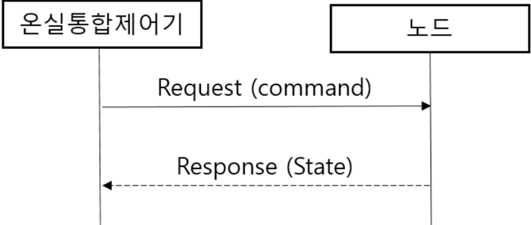

요청 Request  Message)에  대한  응답  메시지  (Response  Message)는  다음과  같은 정보를 포함한다.

-  노드  속성
-  디바이스 주 속성 (N개)
-  디바이스 속성 (N개)
-  디바이스 ID 그룹
-  프로파일 속성
- RSC (Response State Code)

## 6.1.2    Notify-ACK  모델

온실통합제어기가 노드에 전달하는 상태 정보 알림 메시지는 다음과 같다.

-  연결  해제  알림  메시지
-  리부팅 알림 메시지

ACK  메시지는  노드가  알림  메시지를  정상적으로  수신했을  경우  이에  대한  응답메 시지로써 온실통합제어기로 전송되며, 메시지 헤더 정보만을 포함한다.

(그림 6-2) 온실통합제어기에서 노드로의 메시지 전달 모델 (Notify-ACK Message)

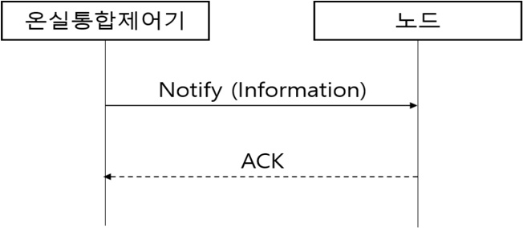

## 6.2.  노드에서 온실통합제어기로의 메시지 전달 모델

노드에서 온실통합제어기로의 메시지 전달 모델에는 노드의 요청메시지에 대해 온 실통합제어기가 응답하는 방식 (Request-Response Message, 그림 6-3)과 노드에 대한  상태메시지  전달  및  온실통합제어기가  이에  대해  응답하는  메시지  (NotifyACK Message,  그림  6-4)  로  구성된다.

## 6.2.1    Request-Response 모델

노드가 온실통합제어기에게 요청할 수 있는 메시지는 다음과 같다.

-  연결  요청  메시지
-  노드  속성  설정  요청  메시지
-  디바이스 속성 설정 요청 메시지
-  노드  및  전체  디바이스 속성 설정 요청 메시지
-  프로파일 설정 요청 메시지

(그림 6-3) 노드에서 온실통합제어기로의 메시지 전달 모델 (Request-Response Message)

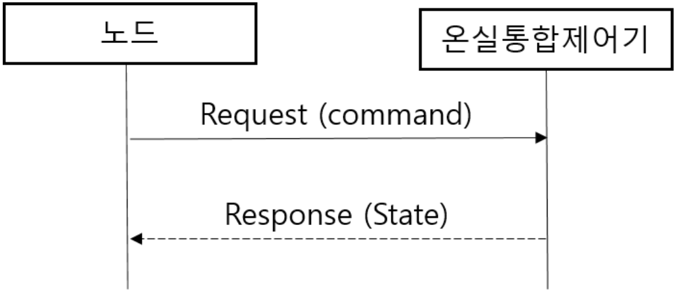

요청 (Request Message)에  대한  응답  메시지  (Response Message)는  다음과 같은 정보를 포함한다.

-  노드  속성
-  디바이스 주 속성 (N개)
-  디바이스 속성 (N개)
-  디바이스 ID 그룹
-  프로파일 속성
- RSC (Response State Code)

## 6.2.2    Notify-ACK  모델

노드가 온실통합제어기에게 전달하는 상태 정보 알림 메시지는 다음과 같다.

-  디바이스 값 알림 메시지
-  연결  해제  알림  메시지
-  리부팅 알림 메시지
-  네트워크 체크 알림 메시지
-  에러  알림  메시지

ACK  메시지는  온실통합제어기로부터  알림  메시지를  정상적으로  수신했을  경우  이 에 대한 응답메시지로서 노드로 전송되며, 메시지 헤더 정보만을 포함한다.

(그림 6-4) 노드에서 온실통합제어기로의 메시지 전달 모델 (Notify-ACK Message)

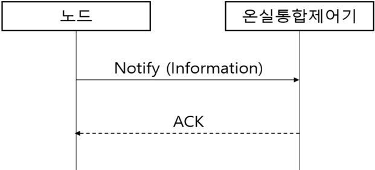

## 7.  메시지 구성

본  장에서는 온실통합제어기와 노드 사이에 전송되는 일반적인 메시지 구조를 정의 한다.  메시지는 고정적인 크기를 가지는 헤더와 메시지 타입에 따라 가변적인 크기 를 가지는 페이로드로 구성된다.

## 7.1.  기본 메시지 포맷 및 종류

본 표준에서 정의된 메시지 구성은 (그림 7-1)과 같다.

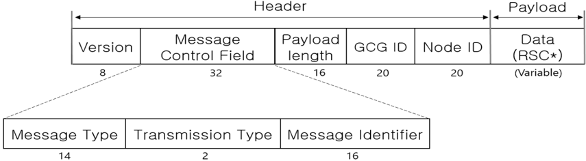

- RSC(*):ResponseStatus Code(8bit),Response叫人IXo亚喜

## (그림  7-1)  기본  메시지  구조

본  표준에서  교환되는  메시지는  고정  길이의  헤더와  가변  길이의  데이터  (페이로 드)로  구성된다.  다음  &lt;표  7-1&gt;은  헤더와  페이로드를  구성하는  요소와  의미를  정 리한 표이다.

&lt;표 7-1&gt; 기본 메시지 구성 테이블

| 메시지 구성요소    | 설명                                                                                                                                                                                                                                                                                                                                                                                                                                     |
|--------------------|------------------------------------------------------------------------------------------------------------------------------------------------------------------------------------------------------------------------------------------------------------------------------------------------------------------------------------------------------------------------------------------------------------------------------------------|
| 헤더 (Header)      | 프로토콜 버전, 메시지 컨트롤 필드, 페이로드 길이, 온실통합제어기 아이디, 노드 아이디의 정보를 포함한다. 메시지 전송 시 반드시 포함되어야 할 필수 영역이다.                                                                                                                                                                                                                                                                               |
| 페이로드 (Payload) | Request, Response, Notify 메시지 타입에 따른 페이로드를 포함하며, 특히 Response 메시지의 경우 * RSC (Response Status Code)를 포함하고 있다. RSC 는 요청메시지에 대한 응답메시지의 상태코드를 의미한다. 정상적으로 요청에 대한 처리결과를 보낼 때에는 'SUCCESS, 0x00'을, 그렇지 않을 경우 각 상황에 대해 'INVALID_FAILURE <표 7- 10>' 에러 메시지를 담아 보낸다. ACK 메시지의 경우 페이로드는 존재하지 않는다 (i.e., Payload length = 0). |

본  표준에서  정의하고  있는  메시지는  크게  3종류로  구분된다.  다음  &lt;표  7-2&gt;에서 &lt;표 7-4&gt;는  Request  메시지,  Response  메시지  및  Notify-ACK  메시지를  요약한다.

&lt;표 7-2&gt; Request 메시지

| 메시지 종류   | 정의   | 설명   | 방향   | 비고   |
|---------------|--------|--------|--------|--------|

## 정보통신단체표준(국문표준)

## 정보통신단체표준(국문표준)

|                                  |                |                                        | 노드 → GCG   | GCG →노 드   |              |
|----------------------------------|----------------|----------------------------------------|--------------|--------------|--------------|
| REQ_SET_CONNECTION               | 0x0000         | 연결 요청                              | ○            |              | 8.1.1 참 조  |
| REQ_SET_DEVICE_INIT              | 0x0001         | 디바이스 초기화 요청                   |              | ○            | 8.1.2.1 참조 |
| REQ_SET_DEVICE_INIT_ALL          | 0x0002         | 전체 디바이스 초 기화 요청             |              | ○            | 8.1.2.2 참조 |
| REQ_SET_NODE_PROPERTY            | 0x0003         | 노드 속성 설정 요 청                   | ○            | ○            | 8.1.3.1 참조 |
| REQ_SET_DEVICE_PROPERTY          | 0x0004         | 디바이스 속성 설 정 요청               | ○            | ○            | 8.1.3.2 참조 |
| REQ_SET_NODE_DEVICE_PROPERTY_ALL | 0x0005         | 노드 및 전체 디바 이스 속성 설정 요 청 | ○            | ○            | 8.1.3.3 참조 |
| REQ_SET_MSG_FLOW_CONTROL_PROFILE | 0x0006         | 프로파일설정 요청                      | ○            | ○            | 8.1.3.4 참조 |
| REQ_GET_NODE_PROPERTY            | 0x0007         | 노드 속성 조회 요 청                   |              | ○            | 8.1.4.1 참조 |
| REQ_GET_DEVICE_PROPERTY          | 0x0008         | 디바이스 속성 조 회 요청               |              | ○            | 8.1.4.2 참조 |
| REQ_GET_NODE_DEVICE_PROPERTY_ALL | 0x0009         | 노드 및 전체 디바 이스 속성 조회 요 청 |              | ○            | 8.1.4.3 참조 |
| REQ_GET_DEVICE_VALUE             | 0x000A         | 디바이스 값 조회 요청                  |              | ○            | 8.1.4.4 참조 |
| REQ_GET_MSG_FLOW_CONTROL_PROFILE | 0x000B         | 프로파일조회 요청                      |              | ○            | 8.1.4.5 참조 |
| REQ_SET_DEVICE_CONTROL           | 0x000C         | 디바이스 제어 요 청                    |              | ○            | 8.1.5 참 조  |
| REQ_SET_REBOOT                   | 0x000D         | 리부팅 요청                            |              | ○            | 8.1.6 참 조  |
| REQ_RESERVED                     | 0x000E~ 0x03FF | Reserved                               |              |              |              |

&lt;표 7-3&gt; Response 메시지

| 메시지 종류   | 정의   | 설명   | 방향   | 비고   |
|---------------|--------|--------|--------|--------|

## 정보통신단체표준(국문표준)

|                                  |                |                                        | 노드 → GCG   | GCG →노 드   |              |    |
|----------------------------------|----------------|----------------------------------------|--------------|--------------|--------------|----|
| RES_SET_CONNECTION               | 0x0400         | 연결 요청 응답                         |              | ○            | 8.1.1 조     | 참 |
| RES_SET_DEVICE_INIT              | 0x0401         | 디바이스 초기화 응답                   | ○            |              | 8.1.2.1 참조 |    |
| RES_SET_DEVICE_INIT_ALL          | 0x0402         | 전체 디바이스 초 기화 응답             | ○            |              | 8.1.2.2 참조 |    |
| RES_SET_NODE_PROPERTY            | 0x0403         | 노드 속성 설정 응 답                   | ○            | ○            | 8.1.3.1 참조 |    |
| RES_SET_DEVICE_PROPERTY          | 0x0404         | 디바이스 속성 설 정 응답               | ○            | ○            | 8.1.3.2 참조 |    |
| RES_SET_NODE_DEVICE_PROPERTY_ALL | 0x0405         | 노드 및 전체 디바 이스 속성 설정 응 답 | ○            | ○            | 8.1.3.3 참조 |    |
| RES_SET_MSG_FLOW_CONTROL_PROFILE | 0x0406         | 메시지흐름제어 프 로파일설정 응답      | ○            | ○            | 8.1.3.4 참조 |    |
| RES_GET_NODE_PROPERTY            | 0x0407         | 노드 속성 조회 응 답                   | ○            |              | 8.1.4.1 참조 |    |
| RES_GET_DEVICE_PROPERTY          | 0x0408         | 디바이스 속성 조 회 응답               | ○            |              | 8.1.4.2 참조 |    |
| RES_GET_NODE_DEVICE_PROPERTY_ALL | 0x0409         | 노드 및 전체 디바 이스 속성 조회 응 답 | ○            |              | 8.1.4.3 참조 |    |
| RES_GET_DEVICE_VALUE             | 0x040A         | 디바이스 값 조회 응답                  | ○            |              | 8.1.4.4 참조 |    |
| RES_GET_MSG_FLOW_CONTROL_PROFILE | 0x040B         | 메시지흐름제어 프 로파일조회 응답      | ○            |              | 8.1.4.5 참조 |    |
| RES_SET_DEVICE_CONTROL           | 0x040C         | 디바이스 제어 응 답                    | ○            |              | 8.1.5 조     | 참 |
| RES_SET_REBOOT                   | 0x040D         | 리부팅 응답                            | ○            |              | 8.1.6 조     | 참 |
| RES_RESERVED                     | 0x040E~ 0x07FF | Reserved                               |              |              |              |    |

## &lt;표 7-4&gt; Notify-ACK 메시지

| 메시지 종류   | 정의   | 설명   | 방향   | 비고   |
|---------------|--------|--------|--------|--------|

## 정보통신단체표준(국문표준)

|                   |                |                                 | 노드→ GCG   | GCG→ 노드   |            |      |
|-------------------|----------------|---------------------------------|-------------|-------------|------------|------|
| NOTI_ERROR        | 0x0800         | 에러 알림메시지                 | ○           |             | 8.2.1.1 조 | 참   |
| NOTI_DEVICE_VALUE | 0x0800         | 디바이스 값 알림메시 지         | ○           |             | 8.2.1.2 조 | 참   |
| NOTI_DISCONNECT   | 0x0801         | 연결 해제 알림메시지            | ○           | ○           | 8.2.1.3 조 | 참   |
| NOTI_REBOOT       | 0x0802         | 리부팅 알림메시지               | ○           | ○           | 8.2.1.4 조 | 참   |
| NOTI_KEEP_ALIVE   | 0x0803         | 네트워크 체크 알림메 시지       | ○           |             | 8.2.1.5 조 | 참   |
| NOTI_RESERVED     | 0x0805~ 0x0BFF | Reserved                        |             |             |            |      |
| ACK               | 0x0C00         | Notify 메시지에 대한 응답메시지 | ○           | ○           | 8.2        | 참조 |

## 7.2. Header 구성

다음 절에서는 헤더와 페이로드의 상세 내역을 정리한다.

## 7.2.1    프로토콜 버전 (Version)

Version  필드는  프로토콜  버전에  대한  정보를  나타내며  8비트  길이로  구성되어  있 다.  예를  들어,  프로토콜  버전이 0x12이면 해당  프로토콜 버전은  1.2버전으로 정의 할  수  있으며,  프로토콜  버전이  0x43이면  해당  프로토콜  버전은  4.3버전으로  정의 할 수 있다.

&lt;표 7-5&gt; 프로토콜 버전 구성

| 이름    | 타입         |   길이 (비트) | 설명                                          | 참조   |
|---------|--------------|---------------|-----------------------------------------------|--------|
| Version | UNSIGNED INT |             8 | 프로토콜 버전 예) 0x12: 1.2버전 0x43: 4.3버전 |        |

## 7.2.2    메시지 제어 필드 (Message Control Field)

메시지  제어  필드의  길이는  4바이트이며,  Request-Response,  Notify-ACK  메시지 를 결정하는 메시지 타입 (Message Type), Unicast, Multicast,  Broadcast  의  메시 지  전달  방법을  결정하는  메시지 전달 타입 (Transmission Type), Request,  Notify

## 정보통신단체표준(국문표준)

메시지에 대한 순번 지정을 통해 Response, ACK  메시지에  대한  매칭을  수행하기 위한 메시지 식별자 (Message Identifier)와  같은  정보를  포함한다.

Message Type에  대한  세부  설명은  &lt;표  7-2&gt;, &lt;표  7-3&gt;  및  &lt;표  7-4&gt;를  참조한다. Message  Identifier는  메시지  일련번호로써  필드의  길이는  2바이트이며  '0'에서 '65535'까지  사용할 수 있다.  일련번호는 데이터 전송 시마다 +1을 하며 만료되면 0부터 다시 시작한다.

&lt;표 7-6&gt; 메시지 제어 필드 구성

| 이름               | type         |   Length (bit) | 설명                                                                                                                                      | 참조                |
|--------------------|--------------|----------------|-------------------------------------------------------------------------------------------------------------------------------------------|---------------------|
| Message Type       | UNSIGNED INT |             14 | Request: 0x0000 ~ 0x000D Response: 0x0400 ~ 0x040D Notify: 0x0800 ~ 0x0803 ACK: 0x0C00                                                    | 표 7-2 ~ 표 7.4참조 |
| Transmission Type  | UNSIGNED INT |              2 | Unicast: 0x00, 단일 노드에 한해 메시지 전송 Multicast: 0x01, 특정 그룹의 Node에 한해 메시지 전송 Broadcast: 0x02, 전체 노드로 메시지 전송 |                     |
| Message Identifier | UNSIGNED INT |             16 | Request-Notify 메시지에 대한 Identifier number를 부여하여 Request- Response, Notify-ACK 구분을 통해 메시지 유실 문제로부터 보호 목적      |                     |

## 7.2.3    페이로드 길이 (Payload Length)

페이로드  길이  필드는  가변의  페이로드  길이를  정수로  표현한  값이며,  단위로는 byte를  사용한다.

&lt;표 7-7&gt; 페이로드 길이

| 이름           | type         |   Length (bit) | 설명                 | 참조   |
|----------------|--------------|----------------|----------------------|--------|
| Payload Length | UNSIGNED INT |             16 | 페이로드 길이 (byte) |        |

## 7.2.4    ID (GCG ID  및 Node ID)

노드 및 온실통합제어기 별 고유번호를 의미하며, 표준 'TTAK.KO-06.0201/R1'  에 서  정의된  계층별  센서  노드  식별  체계에  근거하여  각각  20비트  길이를  사용한다. 노드  및  온실통합제어기  식별자는  네트워크  운영자  또는  온실  운영시스템으로부터 수동  혹은  자동으로  부여되며,  네트워크  설치  시  등록하여  사용하기  위한  고유의 구분번호이다.

동일한  온실운영시스템과  연결되는  온실통합제어기의  ID는  서로  중복되지  않는  한 에서  임의의  값을  가질  수  있으며,  반드시  순차적일  필요는  없다.  마찬가지로,  동 일한  온실통합제어기와 연결되는 노드의 ID 또한 서로 중복되지 않는 한에서 임의 의 값을 가질 수 있으며, 반드시 순차적일 필요는 없다.

&lt;표 7-8&gt; ID 구성

| 이름    | type         |   Length (bit) | 설명                  | 참조   |
|---------|--------------|----------------|-----------------------|--------|
| GCG ID  | UNSIGNED INT |             20 | 온실통합제어기 식별자 |        |
| Node ID | UNSIGNED INT |             20 | 노드 식별자           |        |

## 7.3    페이로드 구성

각  요청  메시지  타입에  대한  응답  메시지에  포함되는  실제  데이터를  의미하며,  요 청메시지에 대한 응답메시지의 상태코드를 의미하는 RSC와 실제 데이터 정보 (노 드  속성,  디바이스  속성  등)을  포함한다.  또한  알림메시지의  경우,  센서-구동기  통 합노드에서  오류가  발생할  시,  이에  대한  오류코드를  의미하는  NEC를  포함한다. ACK  메시지의 경우 페이로드는 존재하지 않는다. 해당 정보는 요청 및 알림메시지 타입에 따라 가변적이다.

## 7.3.1    Response Status Code (RSC)

RSC  필드는  Request  메시지에  대한  Response  메시지를  전달할  때의  상태코드를 나타낸다 (Response  메시지가  아닐  경우  페이로드에서  제외됨).  요청에  대한  정상 적인 처리결과를 보낼 때에는 'SUCCESS, 0x00'을, 그렇지 않을 경우 각 상황에 대 해 &lt;표 7-10&gt; 에 명시된  'INVALID\_FAILURE'  에러  메시지를  담아  보낸다. 'INVALID\_FAILURE'  에러  메시지는  요청에  대한  처리  결과가  정상이지  않을  경우에 대해, 각각의 오류에 대한 정보를 포함하는 코드 &lt;표 7-10&gt;를 의미한다.

&lt;표 7-9&gt; Response Status Code

| 이름   | type         |   Length (bit) | 설명                        | 참조         |
|--------|--------------|----------------|-----------------------------|--------------|
| RSC    | UNSIGNED INT |              8 | Response 메시지의 상태 정보 | 표 7-10 참조 |

&lt;표 7-10&gt; Response Status Code 리스트

| Response Status Code      | 정의       | 설명                       |
|---------------------------|------------|----------------------------|
| SUCESS                    | 0x00       | 정상                       |
| INVALID_VERSION           | 0x01       | 버전 정보 오류             |
| INVALID_GCG_ID            | 0x02       | 온실통합제어기 식별자 오류 |
| INVALID_NODE_ID           | 0x03       | 노드 식별자 오류           |
| INVALID_DEVICE_ID         | 0x04       | 디바이스 식별자 오류       |
| INVALID_DEVICE_TYPE       | 0x05       | 디바이스 타입 오류         |
| INVALID_DATA_TYPE         | 0x06       | 데이터 타입 오류           |
| INVALID_DATA_SUBTYPE      | 0x07       | 데이터 서브타입 오류       |
| INVALID_TRANSMISSION_TYPE | 0x08       | 데이터 전송방법 오류       |
| INVALID_FORMAT            | 0x09       | 메시지 포맷 방식 오류      |
| RESERVED                  | 0x0A~ 0xFF | Reserved                   |

## 7.3.2    Notify Error Code (NEC)

NEC  필드는  센서-구동기 노드에서 오류가 발생할 시, 이를 온실통합제어기로 알림 메시지를 전달할 때 페이로드에 포함되는 에러코드를 나타낸다. 각 에러코드는 &lt;표 7-11&gt;에  명시된 Notify Error Code  리스트를  참조한다.

&lt;표 7-11&gt; Notify Error Code

| 이름   | type         | 설명                        | 참조         |
|--------|--------------|-----------------------------|--------------|
| NEC    | UNSIGNED INT | 'Notify' 메시지의 오류 정보 | 표 7-12 참조 |

&lt;표 7-12&gt; Notify Error Code  리스트

| Notify Error Code      | 정의   | 설명                         |
|------------------------|--------|------------------------------|
| ERROR_DEVICE_STATUS    | 0x00   | 디바이스 상태 오류           |
| ERROR_DEVICE_INTERFACE | 0x01   | 디바이스 I/O 인터페이스 오류 |
| ERROR_RECEIVE          | 0x02   | 제어기 → 노드 수신 오류      |

## 정보통신단체표준(국문표준)

## 정보통신단체표준(국문표준)

| ERROR_SW_TIMER    | 0x03       | 소프트웨어 타이머 오류   |
|-------------------|------------|--------------------------|
| ERROR_HW_TIMER    | 0x04       | 하드웨어 타이머 오류     |
| ERROR_PWR         | 0x05       | 전원부(상전) 오류        |
| ERROR_BATTERY     | 0x06       | 배터리 오류              |
| ERROR_BATTERY_LOW | 0x07       | 배터리 저전력 오류       |
| ERROR_BATTERY_OFF | 0x08       | 배터리 꺼짐 오류         |
| ERROR_UNKNOWN     | 0x09       | 알 수 없는 오류          |
| RESERVED          | 0x0A~ 0xFF | Reserved                 |

## 7.3.3    페이로드 데이터 구성

Request  및  Notify  메시지  전송  시  필요에  따라  부가정보들을  포함하며  그  길이는 가변적이다 (ACK 메시지일 경우 페이로드는 없음).

현재 페이로드에 포함되어 전송되는 정보들은 다음과 같이 총 6종류로 이루어진다.

-  노드  속성
-  디바이스 주 속성
-  디바이스 속성
-  노드-디바이스 통합 속성
-  디바이스 식별자 그룹 ID
-  메시지 제어 프로파일

다음은 페이로드에 포함 가능한 정보들을 나타내었다.

## 7.3.3.1    노드 속성 (NODE\_PROPERTY)

노도  속성값은  디바이스  (센서-구동기)가  연결되는  노드에  대한  정보이며,  설치된 소프트웨어에 대한 버전정보, 온실통합제어기 식별자 및 노드 식별자, 해당 노드에 연결된 전체 디바이스 개수 정보 등을 담고 있다.

&lt;표 7-13&gt; 노드 속성 (NODE\_PROPERTY)

| 이름        | type         |   Length (bit) | 설명                            | 참조   |
|-------------|--------------|----------------|---------------------------------|--------|
| S/W Version | UNSIGNED INT |              8 | 노드에 설치된 소프트웨어의 버전 |        |
| GCG ID      | UNSIGNED INT |             20 | 온실통합제어기 식별자           |        |
| Node ID     | UNSIGNED INT |             20 | 노드 식별자                     |        |

정보통신단체표준(국문표준)

| Status          | UNSIGNED INT   |   8 | NORMAL: 0x00 ABNORMAL 오류: 0x01 UNKNOWN 오류: 0x02 RESERVED : 0x03~0xFF   |
|-----------------|----------------|-----|----------------------------------------------------------------------------|
| Num. of Devices | UNSIGNED INT   |   8 | 노드에 연결된 디바이스 수                                                  |

## 7.3.3.2    디바이스 주 속성 (DEVICE\_MAIN\_INFO)

디바이스 주 속성은 &lt;표 7-14&gt;와  같이  디바이스  식별자,  센서-구동기  타입  및  값 (센싱값  혹은  구동기  명령값)을  포함하는  정보를  담고  있다.  디바이스를  제어하거 나  그  값을  조회하고자  할  경우에  요청  및  응답  메시지에  디바이스  주  속성값 (DEVICE\_MAIN\_INFO)을  담아  전송하며,  부가적인  디바이스  속성  조회  및  설정  요 청 시 사용되는 디바이스 속성(DEVICE\_PROPERTY, 다)과는 구분된다.

&lt;표 7-14&gt; 디바이스 주 속성 (DEVICE\_MAIN\_INFO)

| 이름       | type         |   Length (bit) | 설명                                                    | 참조   |
|------------|--------------|----------------|---------------------------------------------------------|--------|
| Device ID  | UNSIGNED INT |              8 | 디바이스 식별자                                         |        |
| Type       | UNSIGNED INT |              1 | 센서: 0x00 액추에이터: 0x01                             |        |
| Subtype    | UNSIGNED INT |              8 | 센서-구동기 타입                                        | ※      |
| Value Type | UNSIGNED INT |              2 | INT: 0x00 UNSIGNED INT: 0x01 FLOAT: 0x02 RESERVED: 0x03 |        |
| Reserved   | UNSIGNED INT |              5 | 예약                                                    |        |
| Value      | Value Type a |             32 | Type 0x00: 센서값 Type 0x01: 제어값                     |        |

## 7.3.3.3    디바이스 속성 (DEVICE\_PROPERTY)

디바이스 주 속성 (DEVICE\_MAIN\_INFO, 나)과는 달리, 디바이스 속성 (DEVICE\_PROPERTY)은  &lt;표  7-15&gt;와  같이  전송방식,  데이터  전달주기,  디바이스

## 정보통신단체표준(국문표준)

값에 대한 상한, 하한,  최소,  최대,  디바이스  상태  등  &lt;표  7-14&gt;에서  포함되지  않 은 부가적인 정보를 담고 있다.

디바이스 속성에 대한 설정-조회 요청 시 디바이스 속성값 (DEVICE\_PROPERTY)을 요청 및 응답 메시지에 담아 전송한다.

&lt;표 7-15&gt; 디바이스 속성 (DEVICE\_PROPERTY)

| 이름             | type             |   Length (bit) | 설명                                                                                               | 참조         |
|------------------|------------------|----------------|----------------------------------------------------------------------------------------------------|--------------|
| Device Main Info | DEVICE_MAIN_INFO |             56 | 디바이스 주 속성                                                                                   | 표 7-14 참조 |
| Transfer Mode    | UNSIGNED INT     |              2 | Periodic 방식: 0x00 Event 방식: 0x01 Both 방식: 0x02 Reserved: 0x03                                |              |
| Period           | UNSIGNED INT     |             14 | 데이터 전달주기 ('sec' 단위)                                                                       |              |
| Lower Value      | USER a DEPENDENT |             32 | 디바이스의 하한값 (Transfer Mode 가 Event, Both 일 때 Value 가 Lower Value 보다 작으면 value 전송) |              |
| Upper Value      | USER DEPENDENT   |             32 | 디바이스의 상한값 (Transfer Mode가 Event, Both일 때 Value가 Upper Value보다 크면 value 전송)       |              |
| Lower Limit      | USER DEPENDENT   |             32 | Value가 가지는 최소값                                                                              |              |
| Upper Limit      | USER DEPENDENT   |             32 | Value가 가지는 최대값                                                                              |              |
| Precision        | USER DEPENDENT   |             32 | 디바이스 센싱 및 구동기 정밀도                                                                     |              |
| Status           | UNSIGNED INT     |              8 | NORMAL: 0x00, ABNORMAL 오류: 0x01, UNKNOWN 오류: 0x02 RESERVED: 0x03~0xFF                          |              |

## 7.3.3.4    노드-디바이스 통합 속성 (COMBINED\_PROPERTY)

노드-디바이스 통합 속성은 노드 속성과 해당 노드에 연결된 N개 디바이스의 속성 정보를 포함한다.

&lt;표 7-16&gt; 노드-디바이스 통합 속성 (COMBINED\_PROPERTY)

| 이름            | type            | Length (bit)   | 설명                | 참조         |
|-----------------|-----------------|----------------|---------------------|--------------|
| Node Property   | NODE_PROPERTY   | 64             | 노드 속성값         | 표 7-13 참조 |
| Device Property | DEVICE_PROPERTY | (N*240)        | N개의 디바이스 속성 | 표 7-15 참조 |

## 7.3.3.5    디바이스 식별자 그룹 (DEVICE\_ID)

디바이스 ID는 디바이스를 식별하기 위한 8비트의 값으로, 0~255까지 관리자가 임 의로  설정할  수  있으며,  디바이스  식별자  그룹은  조회  및  제어하고자  하는  N개의 디바이스 식별자로 구성된다.

&lt;표 7-17&gt; 디바이스 식별자 그룹 (DEVICE\_ID)

| 이름      | type         | Length (bit)   | 설명                  | 참조         |
|-----------|--------------|----------------|-----------------------|--------------|
| Device ID | UNSIGNED INT | (N*8)          | N개의 디바이스 식별자 | 표 7-13 참조 |

## 7.3.3.6 메시지 제어 프로파일 (MSG\_CONTROL\_PROFILE)

메시지 제어 프로파일은 메시지의 흐름을 제어하기 위해 정의된 속성이다. 요청 메 시지를 몇  번  전송할지에  대한  최대전송횟수  설정,  노드에  오류가  발생할  시  이에 대한  알림메시지  전송주기  설정,  네트워크  상태  체크  메시지에  대한  주기  설정  및 요청메시지에 대한 만료 시간 등 메시지 전송에 대한 흐름을 제어하기 위한 기능으 로서 사용된다.

&lt;표 7-18&gt; 메시지 제어 프로파일 (MSG\_CONTROL\_PROFILE)

| 이름                    | type         |   Length (bit) | 설명               | 참조   |
|-------------------------|--------------|----------------|--------------------|--------|
| Message Receive Timeout | UNSIGNED INT |             16 | 응답 만료 시간     |        |
| Num. of Retry           | UNSIGNED INT |              8 | 메시지 재전송 횟수 |        |

| Notify Error Interval   | UNSIGNED INT   |   16 | NOTI_ERROR 전송 주기      | 8.2.1.가 참조   |
|-------------------------|----------------|------|---------------------------|-----------------|
| Keep Alive Interval     | UNSIGNED INT   |   16 | NOTI_KEEP_ALIVE 전송 주기 | 8.2.1.마 참조   |

## 8   메시지 흐름

본  장에서는  단일  온실통합제어기와  N개의  노드,  그리고  각  노드에  연결되는  M개 의 디바이스 (센서-구동기) 간 연결 설정, 초기화, 속성 설정 및 조회, 디바이스 제 어,  리부팅 및 알림 절차에 대해 정의하였다.

## 8.1    Request-Response 메시지 흐름

8.1.1부터  8.1.6의  Request-Response  메시지  흐름은  제한된  재전송  횟수  내  요청 메시지에 대한 응답 처리가 진행된 경우 (그림 8-1)와 재전송 횟수를 초과할 때까 지 요청 메시지에 대한 응답 처리가 진행되지 못한 경우 (그림 8-2)를 따른다.

(그림 8-1) Request-Response 대표 메시지 흐름도 (재전송횟수 내 요청메시지 전송)

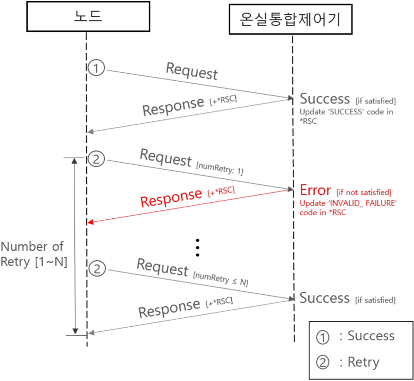

(그림 8-2) Request-Response 대표 메시지 흐름도 (재전송횟수 내 요청메시지 전송 실패)

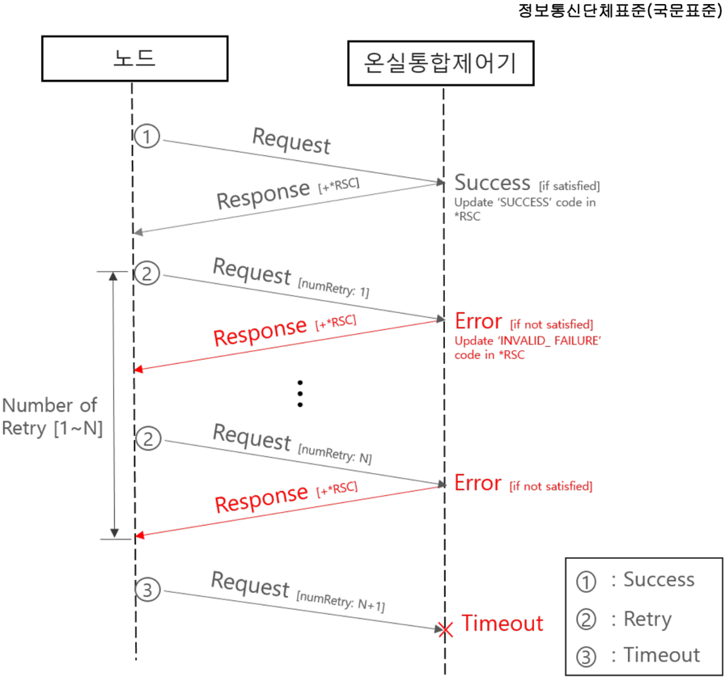

## 8.1.1    연결 설정

연결 설정 메시지 (REQ\_SET\_CONNECTION)는 노드가 단일 온실통합제어기와의 조 회,  설정,  알림  등  기능을  운용하기  하기  위한  초기  연결승인  절차를  설정하기  위 함을 목적으로 한다.

Request  메시지는  [노드  →  GCG],  Response  메시지는  [GCG  →  노드]의  방향으 로 전송되며, 이에 대한 세부 메시지 흐름 절차는 (그림 8-3)을 따른다.

## 정보통신단체표준(국문표준)

(그림 8-3) REQ\_SET\_CONNECTION 메시지 흐름도

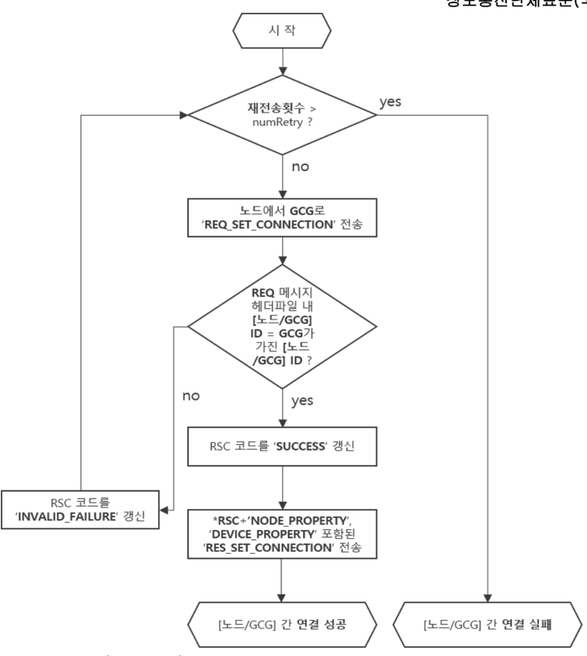

(그림  8-4)는  노드  및  온실통합제어기  간  통신  연결  설정을  위하여  노드가  온실통 합제어기에게 보내는 연결 설정 요청 상세 메시지 (REQ\_SET\_CONNECTION)  포맷 이다.

(그림 8-4) REQ\_SET\_CONNECTION 메시지

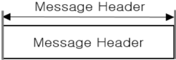

(그림 8-5)는 온실통합제어기가 노드에게 보내는 응답 상세 메시지 (RES\_SET\_CONNECTION)  포맷이다.  연결  설정  응답  메시지는  페이로드에  노드  속 성값  및  노드에  연결된  N개의  디바이스  속성값을  포함하며,  연결  요청에  대한  상 태에 따라 RSC 정보가 업데이트되어 전송된다.

Payload

(그림 8-5) RES\_SET\_CONNECTION 메시지

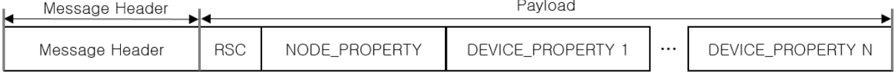

## 8.1.2    초기화

## 8.1.2.1    디바이스 초기화

디바이스  초기화  메시지  (REQ\_SET\_DEVICE\_INIT)는  디바이스  (센서-구동기)를  노 드에 연결된 디바이스 속성값을 초기화할 경우 전송함을 목적으로 한다.

Request  메시지는  [GCG  →  노드],  Response  메시지는  [노드  →  GCG]의  방향으 로 전송되며, 이에 대한 세부 메시지 흐름 절차는 (그림 8-6)을 따른다.

(그림 8-6) REQ\_SET\_DEVICE\_INIT 메시지 흐름도

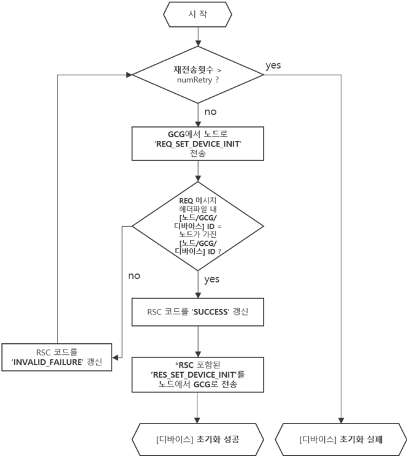

(그림  8-7)은  노드에  연결된  디바이스  (센서-구동기)의  속성값을  초기화하기  위하 여  온실통합제어기가  노드에게  보내는  디바이스  초기화  요청  상세  메시지

## 정보통신단체표준(국문표준)

(REQ\_SET\_DEVICE\_INIT)  포맷이다.  디바이스  초기화  요청  상세  메시지는  페이로드 에 노드에 연결된 N개의 디바이스 식별자 그룹이 포함하여 전송된다.

(그림 8-7) REQ\_SET\_DEVICE\_INIT 메시지

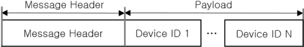

(그림  8-8)은  노드가  온실통합제어기에게  보내는  디바이스  초기화  응답  상세  메시 지  (RES\_SET\_DEVICE\_INIT)  포맷이다.  디바이스  초기화  응답  메시지는  페이로드에 연결 요청에 대한 상태에 따라 업데이트되는 RSC를 포함하여 전송된다.

(그림 8-8) RES\_SET\_DEVICE\_INIT 메시지\

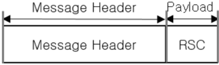

## 8.1.2.2    전체 디바이스 초기화

전체  디바이스  초기화  요청메시지  (REQ\_SET\_DEVICE\_INIT\_ALL)는  디바이스  (센서 -구동기)를 노드에 연결된 전체 디바이스 속성값을 초기화할 경우 전송함을 목적으 로 한다.

Request  메시지는  [GCG  →  노드],  Response  메시지는  [노드  →  GCG]의  방향으 로 전송되며, 이에 대한 세부 메시지 흐름 절차는 (그림 8-9)를 따른다.

(그림 8-9) REQ\_SET\_DEVICE\_INIT\_ALL 메시지 흐름도

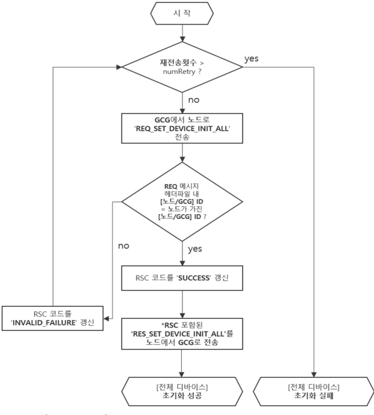

(그림  8-10)은  노드에  연결된  전체  디바이스 (센서-구동기)의 속성값을 초기화하기 위하여 온실통합제어기가 노드에게 보내는 전체 디바이스 초기화 요청 상세 메시지 (REQ\_SET\_DEVICE\_INIT\_ALL)  포맷이다.

(그림 8-10) REQ\_SET\_DEVICE\_INIT\_ALL 메시지

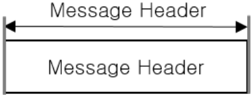

(그림  8-11)은  노드가  온실통합제어기에게  보내는  전체  디바이스  초기화  응답  상 세  메시지  (RES\_SET\_DEVICE\_INIT\_ALL)  포맷이다.  전체  디바이스  초기화  응답  메 시지는  페이로드에  연결  요청에  대한  상태에  따라  업데이트되는  RSC를  포함하여 전송된다.

(그림 8-11) RES\_SET\_DEVICE\_INIT\_ALL 메시지

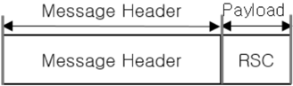

## 8.1.3    속성 설정

## 8.1.3.1    노드 속성 설정

노드  속성  설정  메시지  (REQ\_SET\_NODE\_PROPERTY)는  현재  설정되어  있는  노드 속성값을 사용자의 목적에 따라 변경하고자 할 경우 전송함을 목적으로 한다. Request  메시지는  [GCG  →  노드],  Response  메시지는  [노드  →  GCG]의  방향으 로  전송되며,  목적에  따라  Request  및  Response  메시지가  역방향으로  전송될  수

도 있다. 이에 대한 세부 메시지 흐름 절차는 (그림 8-12)를 따른다.

(그림 8-12) REQ\_SET\_NODE\_PROPERTY 메시지 흐름도

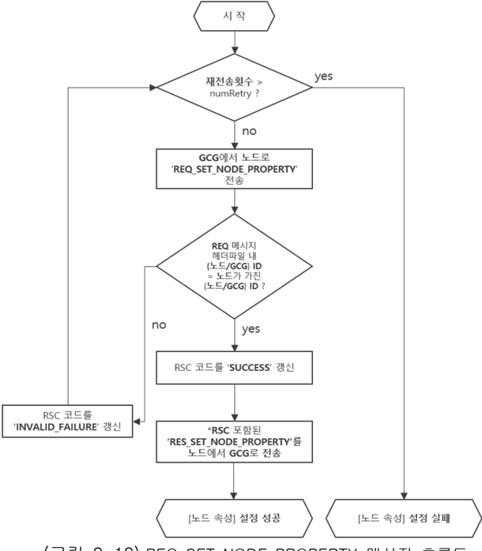

※ Request 메시지 방향은 [노드 → GCG]도 가능함

(그림  8-13)은  현재  설정되어  있는  노드  속성값을  사용자의  목적에  따라  변경하고 자  할  경우  온실통합제어기가  노드에게  보내는  노드  속성  설정  요청  메시지 (REQ\_SET\_NODE\_PROPERTY)  포맷이다.  노드  속성  설정  요청  상세  메시지는  페이 로드에 노드 속성값을 포함하여 전송된다.

## 정보통신단체표준(국문표준)

(그림 8-13) REQ\_SET\_NODE\_PROPERTY 메시지

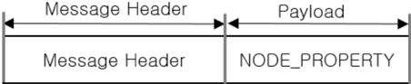

(그림  8-14)은  노드가  온실통합제어기에게  보내는  노드  속성  설정  응답  상세  메시 지 (RES\_ SET\_NODE\_PROPERTY)  포맷이다.  노드  속성  설정  응답  메시지는  페이로 드에 연결 요청에 대한 상태에 따라 업데이트되는 RSC를 포함하여 전송된다.

(그림 8-14) RES\_SET\_NODE\_PROPERTY 메시지\

## 8.1.3.2    디바이스 속성 설정

디바이스 속성 설정 메시지 (REQ\_SET\_DEVICE\_PROPERTY)는  현재  설정되어  있는 디바이스  속성값을  사용자의  목적에  따라  변경하고자  할  경우  전송함을  목적으로 한다.

Request  메시지는  [GCG  →  노드],  Response  메시지는  [노드  →  GCG]의  방향으 로  전송되며,  목적에  따라  Request  및  Response  메시지가  역방향으로  전송될  수 도 있다. 이에 대한 세부 메시지 흐름 절차는 (그림 8-15)를 따른다.

## 정보통신단체표준(국문표준)

(그림 8-15) REQ\_SET\_DEVICE\_PROPERTY 메시지 흐름도

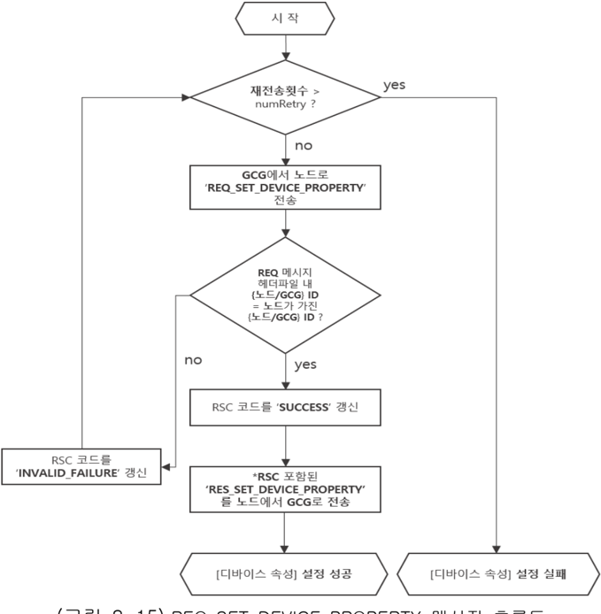

※ Request 메시지 방향은 [노드 → GCG]도 가능함

(그림  8-16)은  현재  설정되어  있는  디바이스  속성값을  사용자의  목적에  따라  변경 하고자 할 경우 온실통합제어기가 노드에게 보내는 디바이스 속성 설정 요청 메시 지  (REQ\_SET\_DEVICE\_PROPERTY)  포맷이다.  디바이스  속성  설정  요청  상세  메시 지는 페이로드에 노드에 연결되어 있는 N개의 디바이스에 관한 속성값을 포함하여 전송된다.

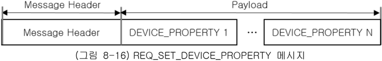

(그림  8-17)은  노드가  온실통합제어기에게  보내는  디바이스  속성  설정  응답  상세 메시지 (RES\_SET\_DEVICE\_PROPERTY)  포맷이다.  디바이스  속성  설정  응답  메시지 는  페이로드에  연결  요청에  대한  상태에  따라  업데이트되는  RSC를  포함하여  전송 된다.

## 정보통신단체표준(국문표준)

(그림 8-17) RES\_SET\_DEVICE\_PROPERTY 메시지

## 8.1.3.3    노드 및 전체 디바이스 속성 설정

노드 및 노드에 연결되어 있는 전체 디바이스 속성 설정 메시지 (REQ\_SET\_NODE\_DEVICE\_PROPERTY\_ALL)는  현재  설정되어  있는  노드  속성  및 노드에 연결되어 있는 전체 디바이스의 속성값을 사용자의 목적에 따라 변경하고자 할 경우 전송함을 목적으로 한다.

Request  메시지는  [GCG  →  노드],  Response  메시지는  [노드  →  GCG]의  방향으 로  전송되며,  목적에  따라  Request  및  Response  메시지가  역방향으로  전송될  수

도 있다. 이에 대한 세부 메시지 흐름 절차는 (그림 8-18)을 따른다.

(그림 8-18) REQ\_SET NODE\_DEVICE\_PROPERTY\_ALL 메시지 흐름도

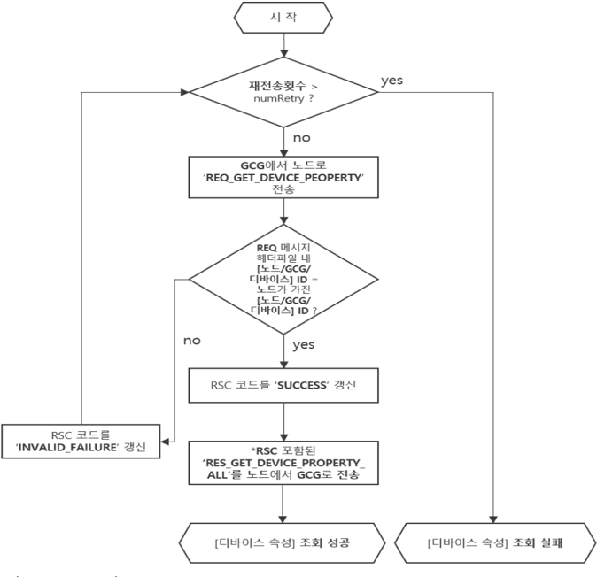

※ Request 메시지 방향은 [노드 → GCG]도 가능함

(그림  8-19)은  현재  설정되어  있는  노드  및  노드에  연결되어  있는  전체  디바이스 속성값을 사용자의 목적에 따라 변경하고자 할 경우 온실통합제어기가 노드에게 보 내는 노드 및 전체 디바이스 속성 설정 요청 메시지

## 정보통신단체표준(국문표준)

(REQ\_SET\_NODE\_DEVICE\_PROPERTY)  포맷이다.  노드  및  전체  디바이스  속성  설 정  요청  상세  메시지는  페이로드에  노드  속성값  및  노드에  연결되어  있는  N개의 디바이스에 관한 속성값을 포함하여 전송된다.

(그림 8-19) REQ\_SET\_NODE\_DEVICE\_PROPERTY 메시지

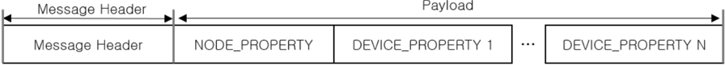

(그림  8-20)은  노드가  온실통합제어기에게  보내는  노드  및  전체  디바이스  속성  설 정  응답  상세  메시지  (RES\_SET\_NODE\_DEVICE\_PROPERTY)  포맷이다.  노드  및  전 체  디바이스  속성  설정  응답  메시지는  페이로드에  연결  요청에  대한  상태에  따라 업데이트되는 RSC를 포함하여 전송된다.

(그림 8-20) RES\_SET\_NODE\_DEVICE\_PROPERTY 메시지

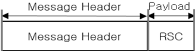

## 8.1.3.4    프로파일 속성 설정

프로파일 설정 메시지 (REQ\_SET\_MSG\_CONTROL\_PROFILE)는 현재 설정되어 있는 프로파일  속성값  (네트워크  연결  알림  전송주기,  응답  만료  시간,  메시지  재전송 횟수)을 사용자의 목적에 따라 변경하고자 할 경우 전송함을 목적으로 한다.

Request  메시지는  [GCG  →  노드],  Response  메시지는  [노드  →  GCG]의  방향으 로  전송되며,  목적에  따라  Request  및  Response  메시지가  역방향으로  전송될  수 도 있다. 이에 대한 세부 메시지 흐름 절차는 (그림 8-21)을 따른다.

## 정보통신단체표준(국문표준)

(그림 8-21) REQ\_SET\_MSG\_CONTROL\_PROFILE 메시지 흐름도

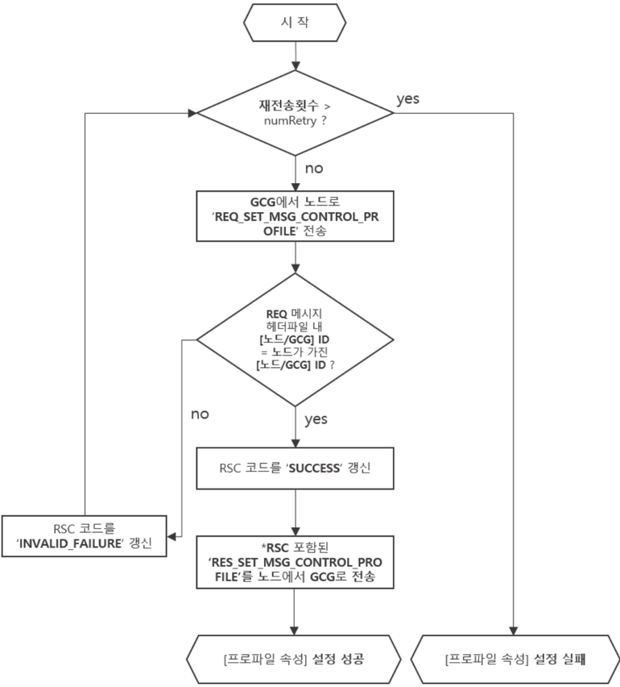

※ Request 메시지 방향은 [노드 → GCG]도 가능함 (그림  8-22)는  현재  설정되어  있는  프로파일  속성값을  사용자의  목적에  따라  변경 하고자 할 경우 온실통합제어기가 노드에게 보내는 프로파일 속성 설정 요청 메시 지  (REQ\_  SET\_MSG\_CONTROL\_PROFILE)  포맷이다.  프로파일  속성  설정  요청  상 세 메시지는 페이로드에 설정하고자 하는 프로파일 속성값을 포함하여 전송된다.

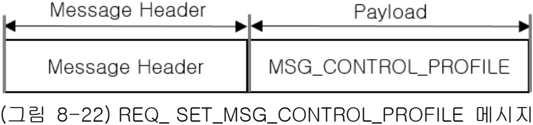

(그림  8-23)은  노드가  온실통합제어기에게  보내는  프로파일  속성  설정  응답  상세 메시지  (RES\_SET\_MSG\_CONTROL\_PROFILE)  포맷이다.  프로파일  속성  설정  응답 메시지는 페이로드에 연결 요청에 대한 상태에 따라 업데이트되는 RSC를 포함하여

전송된다.

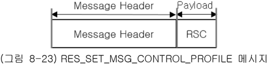

## 8.1.4    속성 조회

## 8.1.4.1    노드 속성 조회

노드  속성  조회  메시지  (REQ\_GET\_NODE\_PROPERTY)는  현재  설정되어  있는  노드 속성값을 사용자가 조회하고자 할 경우 전송함을 목적으로 한다.

Request  메시지는  [GCG  →  노드],  Response  메시지는  [노드  →  GCG]의  방향으 로 전송되며, 이에 대한 세부 메시지 흐름 절차는 (그림 8-24)를 따른다.

(그림 8-24) REQ\_GET\_NODE\_PROPERTY 메시지 흐름도

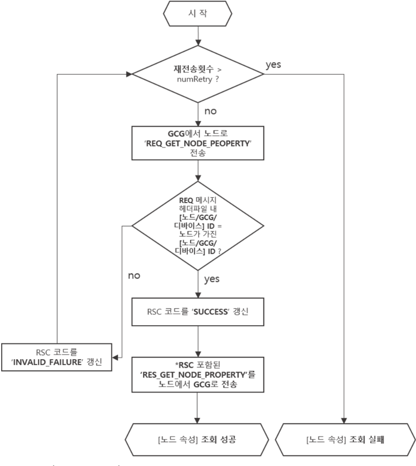

## 정보통신단체표준(국문표준)

(그림  8-25)는  현재  설정되어  있는  노드  속성값을  사용자가  조회하고자  할  경우 온실통합제어기가 노드에게 보내는 노드 속성 조회 요청 메시지 (REQ\_GET\_NODE\_PROPERTY)  포맷이다.

(그림 8-25) REQ\_GET\_NODE\_PROPERTY 메시지

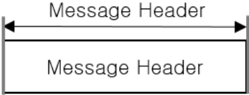

(그림  8-26)은  노드가  온실통합제어기에게  보내는  노드  속성  조회  응답  상세  메시 지  (RES\_GET\_NODE\_PROPERTY)  포맷이다.  노드  속성  조회  응답  메시지는  페이로 드에 조회하고자 하는 노드 속성값 및 연결 요청에 대한 상태에 따라 업데이트되는 RSC를 포함하여 전송된다.

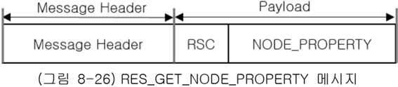

## 8.1.4.2    디바이스 속성 조회

디바이스 속성 조회 메시지 (REQ\_GET\_DEVICE\_PROPERTY)는  현재  설정되어 있는 디바이스 속성값을 사용자가 조회하고자 할 경우 전송함을 목적으로 한다. Request  메시지는  [GCG  →  노드],  Response  메시지는  [노드  →  GCG]의  방향으

로 전송되며, 이에 대한 세부 메시지 흐름 절차는 (그림 8-27)을 따른다.

(그림 8-27) REQ\_GET DEVICE\_PROPERTY 메시지 흐름도

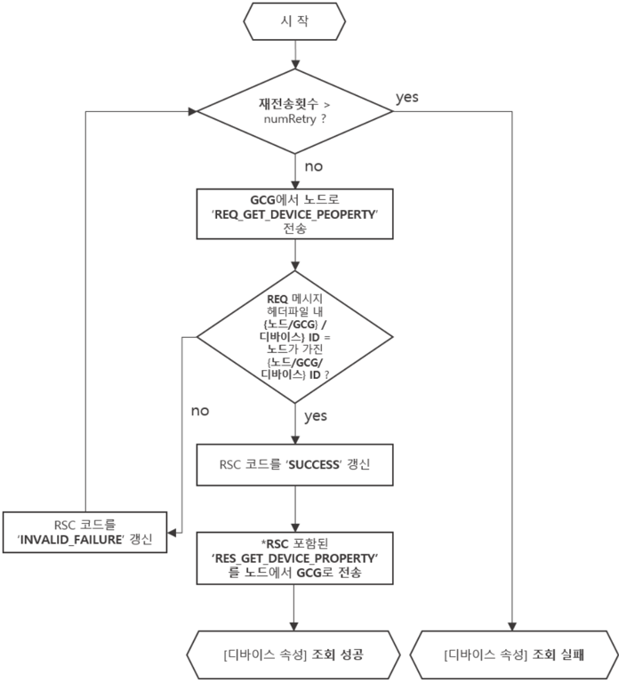

(그림  8-28)은  노드에  연결되어  있는  디바이스  (센서-구동기)의 속성값을 조회하기 위하여  온실통합제어기가  노드에게  보내는  디바이스  속성  조회  요청  상세  메시지 (REQ\_GET\_DEVICE\_PROPERTY)  포맷이다.  디바이스  속성  조회  요청  상세  메시지 는 페이로드에 조회하고자 하는 디바이스 식별자 그룹을 포함하여 전송된다.

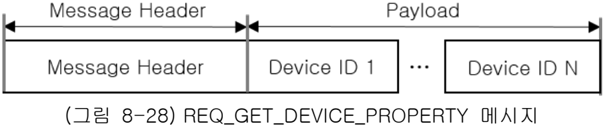

(그림  8-29)은  노드가  온실통합제어기에게  보내는  디바이스  속성  조회  응답  상세 메시지  (RES\_GET\_DEVICE\_PROPERTY)  포맷이다.  디바이스  속성  조회  응답  메시 지는 페이로드에 조회하고자 하는 디바이스 속성값 및 연결 요청에 대한 상태에 따 라 업데이트되는 RSC를 포함하여 전송된다.

(그림 8-29) RES\_GET\_DEVICE\_PROPERTY 메시지

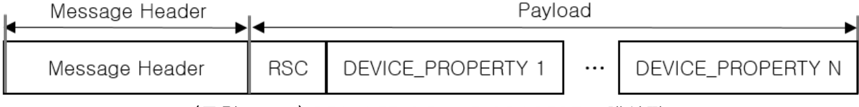

## 8.1.4.3    노드 및 전체 디바이스 속성 조회

노드 및 노드에 연결되어 있는 전체 디바이스 속성 조회 메시지 (REQ\_GET\_NODE\_DEVICE\_PROPERTY\_ALL)은  현재  설정되어  있는  노드  속성  및 노드에 연결되어 있는 전체 디바이스의 속성값을 사용자가 조회하고자 할 경우 전 송함을 목적으로 한다.

Request  메시지는  [GCG  →  노드],  Response  메시지는  [노드  →  GCG]의  방향으 로 전송되며, 이에 대한 세부 메시지 흐름 절차는 (그림 8-30)을 따른다.

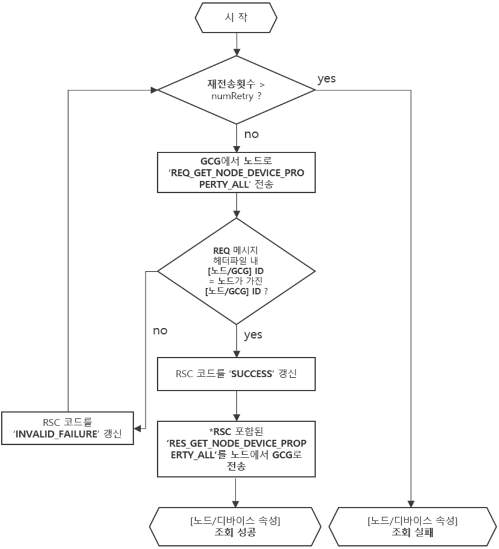

## 정보통신단체표준(국문표준)

(그림 8-30) REQ\_GET NODE\_DEVICE\_PROPERTY\_ALL 메시지 흐름도

(그림  8-31)은  현재  설정되어  있는  노드  및  노드에  연결되어  있는  전체  디바이스 속성값을 사용자가 조회하고자 할 경우 온실통합제어기가 노드에게 보내는 노드 및 전체 디바이스 속성 설정 요청 메시지 (REQ\_SET\_NODE\_DEVICE\_PROPERTY) 포맷 이다.

(그림 8-31) REQ\_GET\_NODE\_DEVICE\_PROPERTY 메시지

(그림  8-32)은  노드가  온실통합제어기에게  보내는  노드  및  전체  디바이스  속성  조 회  응답  상세  메시지  (RES\_SET\_NODE\_DEVICE\_PROPERTY)  포맷이다.  노드  및  전 체 디바이스 속성 조회 응답 메시지는 페이로드에 조회하고자 하는 노드 및 노드에 연결되어 있는 전체 디바이스 속성값, 연결 요청에 대한 상태에 따라 업데이트되는 RSC를 포함하여 전송된다.

(그림 8-32) RES\_GET\_NODE\_DEVICE\_PROPERTY 메시지

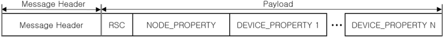

## 8.1.4.4    디바이스 값 조회

디바이스  값  조회  메시지  (REQ\_GET  DEVICE\_VALUE)은  온실  내·외부의  환경  및 구동기 정보를 사용자가 조회하고자 할 경우 전송함을 목적으로 한다.

Request  메시지는  [GCG  →  노드],  Response  메시지는  [노드  →  GCG]의  방향으 로 전송되며, 이에 대한 세부 메시지 흐름 절차는 (그림 8-33)을 따른다.

(그림 8-33) REQ\_GET DEVICE\_VALUE 메시지 흐름도

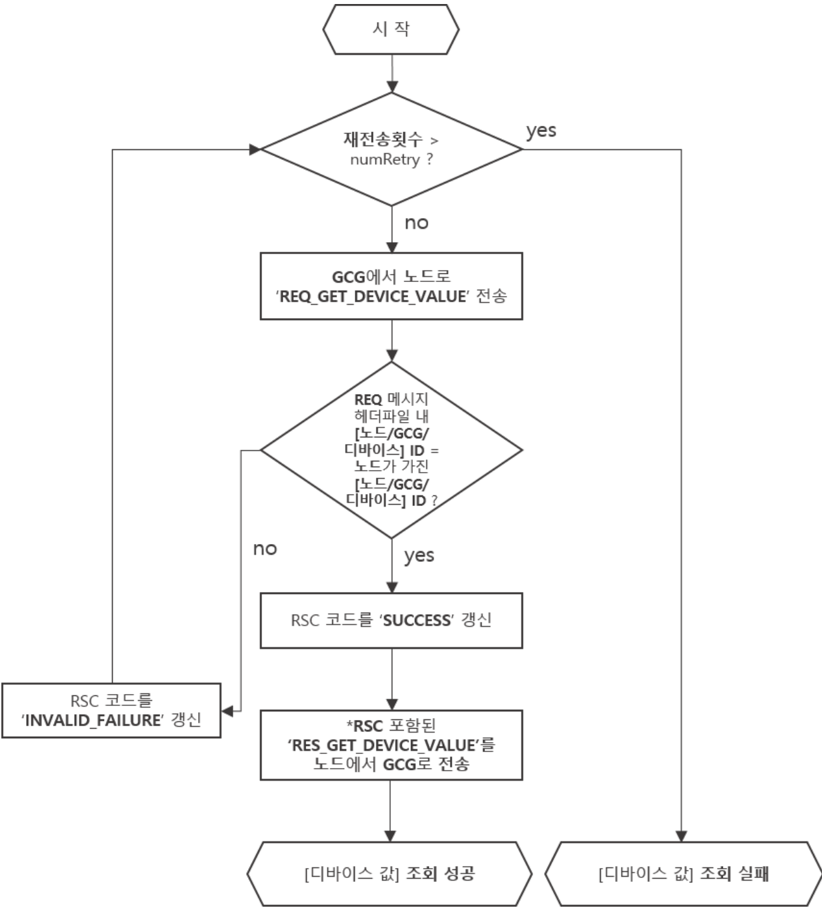

(그림  8-34)는  현재  센서를  통해  얻어지는  온실  내·외부의  환경  정보  및  액추에이 터  구동  정보를  사용자가  조회하고자  할  경우  온실통합제어기가  노드에게  보내는 디바이스 값 조회 요청 메시지 (REQ\_GET\_DEVICE\_VALUE) 포맷이다.

(그림 8-34) REQ\_GET\_DEVICE\_VALUE 메시지

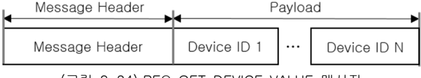

(그림  8-35)는  노드가  온실통합제어기에게  보내는  디바이스  값  조회  응답  상세  메 시지  (RES\_SET\_NODE\_DEVICE\_PROPERTY)  포맷이다.  디바이스  값  조회  응답  메

시지는 페이로드에 조회하고자 하는 디바이스 주 속성값 및 연결 요청에 대한 상태 에 따라 업데이트되는 RSC를 포함하여 전송된다.

(그림 8-35) RES\_GET\_DEVICE\_VALUE 메시지

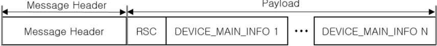

## 8.1.4.5    프로파일 속성 조회

프로파일  조회  메시지  (REQ\_GET\_MSG\_CONTROL\_PROFILE)는  현재  설정되어  있 는  프로파일  속성값  (네트워크  연결  알림  전송주기,  응답  만료  시간,  메시지  재전 송 횟수)을 사용자가 조회하고자 할 경우 전송함을 목적으로 한다.

Request  메시지는  [GCG  →  노드],  Response  메시지는  [노드  →  GCG]의  방향으 로 전송되며, 이에 대한 세부 메시지 흐름 절차는 (그림 8-36)을 따른다.

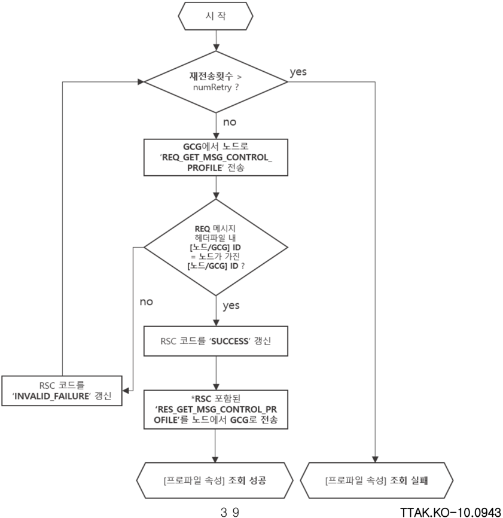

## 정보통신단체표준(국문표준)

(그림 8-36) REQ\_GET MSG\_CONTROL\_PROFILE 메시지 흐름도

(그림  8-37)은  현재  설정되어  있는  프로파일  속성값을  사용자가  조회하고자  할  경 우  온실통합제어기가  노드에게  보내는  프로파일  속성  조회  요청  메시지  (REQ\_ GET\_MSG\_CONTROL\_PROFILE)  포맷이다.

(그림 8-37)  REQ\_GET\_MSG\_CONTROL\_PROFILE 메시지

(그림  8-38)은  노드가  온실통합제어기에게  보내는  프로파일  속성  조회  응답  상세 메시지  (RES\_GET\_MSG\_CONTROL\_PROFILE)  포맷이다.  프로파일  속성  조회  응답 메시지는  페이로드에  조회하고자  하는  프로파일  속성값,  연결  요청에  대한  상태에 따라 업데이트되는 RSC를 포함하여 전송된다.

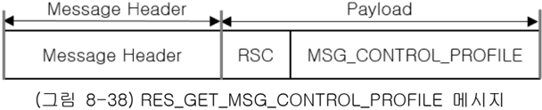

## 8.1.5    디바이스 제어

디바이스  제어  메시지  (REQ\_SET\_DEVICE\_CONTROL)은  노드에  연결되어  있는  디 바이스 (액추에이터)를 사용자가 제어하고자 할 경우 전송함을 목적으로 한다. Request  메시지는  [GCG  →  노드],  Response  메시지는  [노드  →  GCG]의  방향으

로 전송되며, 이에 대한 세부 메시지 흐름 절차는 (그림 8-39)를 따른다.

(그림 8-39) REQ\_SET\_DEVICE\_CONTROL 메시지 흐름도

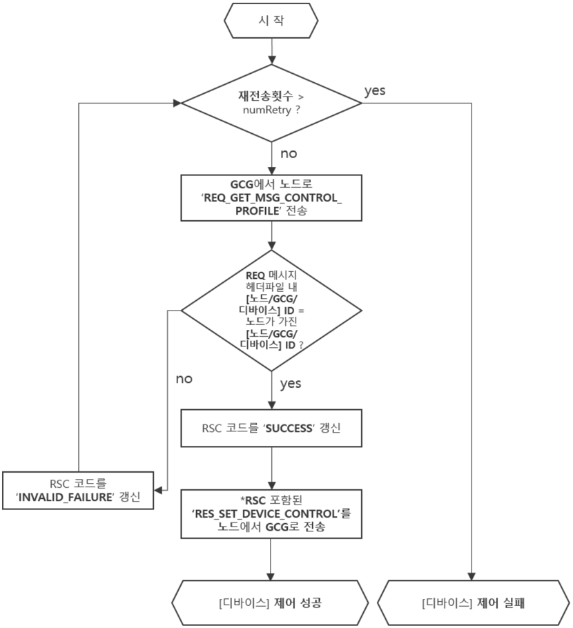

(그림  8-40)은  노드에  연결되어  있는  디바이스를  사용자가  제어하고자  할  경우  온 실통합제어기가 노드에게 보내는 디바이스 제어 요청 메시지 (REQ\_SET\_DEVICE\_CONTROL)  포맷이다.  디바이스  제어  요청  메시지는  페이로드 에 제어하고자 하는 디바이스 주 속성값을 포함하여 전송된다.

(그림 8-40) REQ\_SET\_DEVICE\_CONTROL 메시지

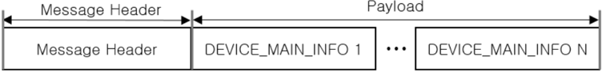

(그림  8-41)은  노드가  온실통합제어기에게  보내는  디바이스  제어  응답  상세  메시

## 8.1.6    리부팅

리부팅  메시지  (REQ\_SET\_REBOOT)은  노드  운용에  있어  사용자가  리부팅이  필요 할 시 전송함을 목적으로 한다.

Request  메시지는  [GCG  →  노드],  Response  메시지는  [노드  →  GCG]의  방향으 로 전송되며, 이에 대한 세부 메시지 흐름 절차는 (그림 8-42)를 따른다.

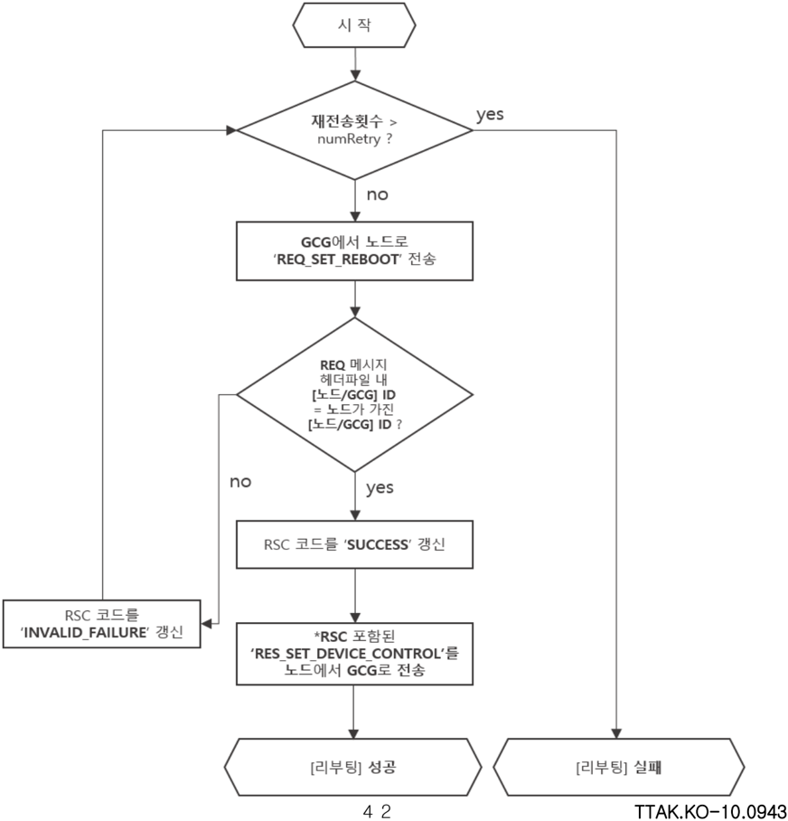

## 정보통신단체표준(국문표준)

지  (RES\_SET\_DEVICE\_CONTROL)  포맷이다.  디바이스  제어  응답  메시지는  페이로 드에 연결 요청에 대한 상태에 따라 업데이트되는 RSC를 포함하여 전송된다.

(그림 8-41) RES\_SET\_DEVICE\_CONTROL 메시지

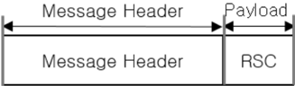

## (그림 8-42) REQ\_SET\_REBOOT 메시지 흐름도

(그림  8-43)은  노드를  사용자가  리부팅을  할  경우  온실통합제어기가  노드에게  보 내는 리부팅 요청 메시지 (REQ\_SET\_REBOOT) 포맷이다.

(그림  8-44)는  노드가  온실통합제어기에게  보내는  리부팅  응답  상세  메시지 (RES\_SET\_REBOOT)  포맷이다.  리부팅  응답  메시지는  페이로드에  연결  요청에  대 한 상태에 따라 업데이트되는 RSC를 포함하여 전송된다.

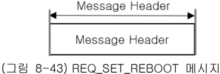

## 8.2    Notify-ACK  메시지 흐름

## 8.2.1    알림

8.2.1의  Notify-ACK  메시지  흐름은  제한된  재전송  횟수  내  정상적으로  디바이스 값,  GCG와  노드  간  연결해제  여부,  리부팅에  대한  알림,  네트워크  연결  확인  등에 대한  정보가  주기적으로  알림이  된  경우  (그림  8-45)와  그렇지  못한  경우  (그림 8-46)을  따른다.

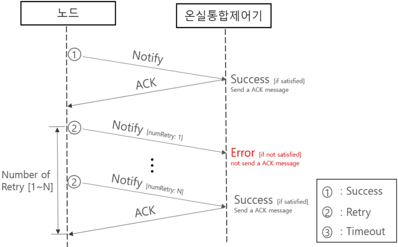

(그림 8-45) Notify-ACK 대표 메시지 흐름도 (재전송횟수 내 알림메시지 전송 성공)

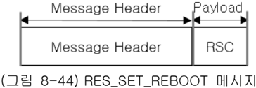

## 정보통신단체표준(국문표준)

(그림 8-46) Notify-ACK 대표 메시지 흐름도 (재전송횟수 내 알림메시지 전송 실패)

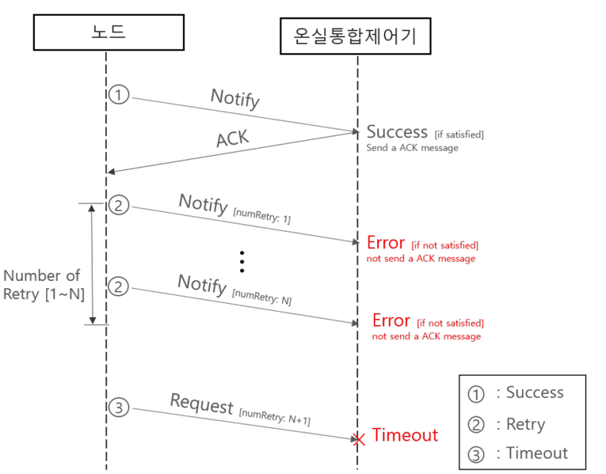

## 8.2.1.1    오류 알림

오류  알림메시지  (NOTI\_ERROR)는  노드  및  디바이스에  통신장애,  배터리  상태  등 노드에서 발생되는 오류 정보들을 온실통합제어기로 알림 기능을 제공함을 목적으 로 한다.

Notify  메시지는  [노드  →  GCG],  ACK  메시지는  [GCG  →  노드]의  방향으로  전송 되며,  이에  대한  세부  메시지  흐름  절차는  (그림  8-47)를  따른다. NEC는  노드에서 이상 정보가 발생 시 이에 해당하는 각각의 에러 정보를 포함하는 코드를 의미한다 &lt;표 7-12&gt;.

또한,  오류  현상이  수정될  때까지  메시지  제어  프로파일에  정의된  Notify  Error Interval  간격으로  주기적인  오류  알림메시지를 온실통합제어기로 전달한다.

(그림  8-48)은  노드에서  오류가  발생할  시,  노드에서  온실통합제어기로  해당  정보 를  알림하기  위하여  보내는  오류  알림에  관한  상세  메시지  (NOTI\_ERROR)  포맷이 다.

(그림 8-49)는 오류 알림에 대한 ACK 메시지 포맷이다.

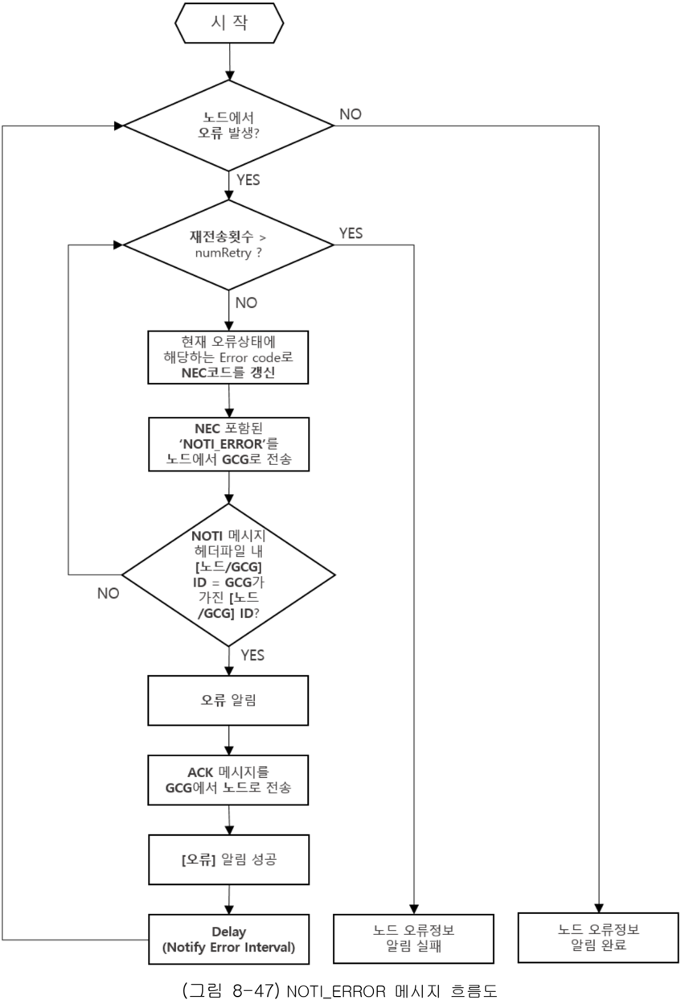

## 8.2.1.2    디바이스 값 알림

디바이스 값 알림 메시지 (NOTI\_DEVICE\_VALUE)은  노드에  연결된  디바이스  (센서 -구동기)의 값을 주기적으로 온실통합제어기로 알려주기 위함을 목적으로 한다. Notify  메시지는  [노드  →  GCG],  ACK  메시지는  [GCG  →  노드]의  방향으로  전송 되며, 이에 대한 세부 메시지 흐름 절차는 (그림 8-50)을 따른다.

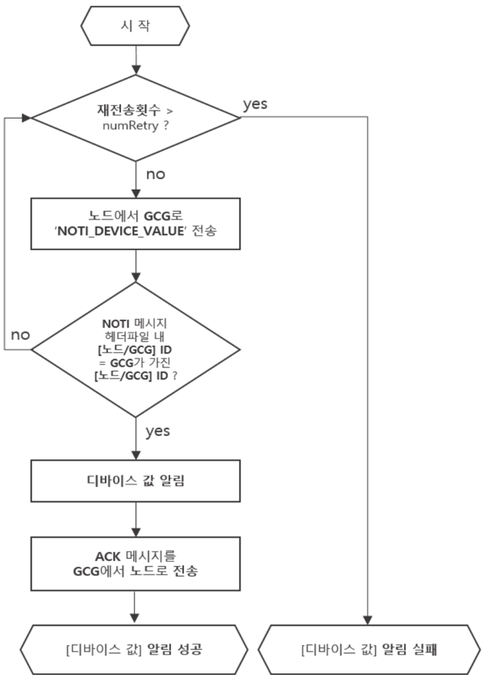

(그림 8-49) ACK 메시지

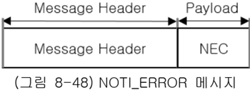

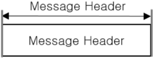

## 정보통신단체표준(국문표준)

## 8.2.1.3    연결 해제 알림

연결  해제  알림  메시지  (NOTI\_DISCONNECT)는  온실통합제어기와  노드  간의  연결 이 해제될 시 이를 온실통합제어기 혹은 노드로 알려주기 위함을 목적으로 한다. Notify  메시지는  [노드  →  GCG],  ACK  메시지는  [GCG  →  노드]의  방향으로  전송 되며, 목적에 따라 Notify  및  ACK  메시지가  역방향으로 전송될 수도 있다. 이에 대 한 세부 메시지 흐름 절차는 (그림 8-53)을 따른다.

## 정보통신단체표준(국문표준)

(그림 8-50) NOTI\_DEVICE\_VALUE 메시지 흐름도

(그림  8-51)은  디바이스  값  (온실  내·외부의  환경  및  구동기  정보)을  알림하기  위 하여 노드가 온실통합제어기에게  보내는  디바이스 값 알림 상세 메시지 (RES\_SET\_REBOOT)  포맷이다.  디바이스  값  알림  메시지는  페이로드에  디바이스 주 속성값을 포함하여 전송된다.

(그림 8-51) NOTI\_DEVICE\_VALUE 메시지

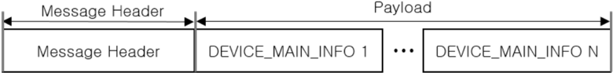

(그림 8-52)는 디바이스 값 알림에 대한 ACK 메시지 포맷이다.

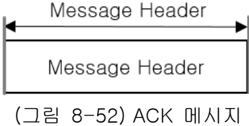

(그림 8-53) NOTI\_DISCONNECT 메시지 흐름도

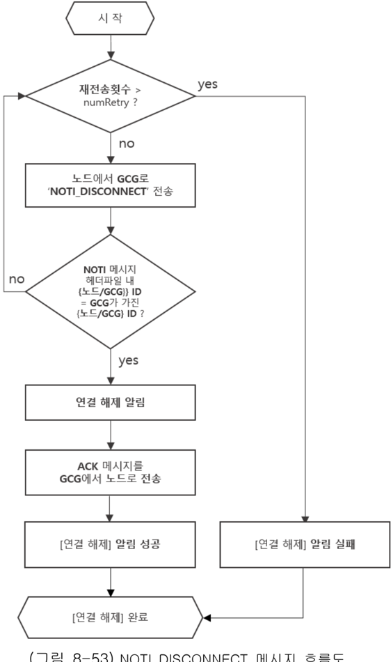

※ Request 메시지 방향은 [GCG → 노드]도 가능함

(그림  8-54)는  온실통합제어기와  노드  간  통신  연결이  해제되었을  시  이를  알림하 기  위하여  보내는  연결  해제  알림에  관한  상세  메시지  (NOTI\_DISCONNECT)  포맷 이다.

(그림 8-55)은 연결 해제 알림에 대한 ACK 메시지 포맷이다.

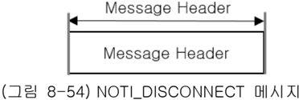

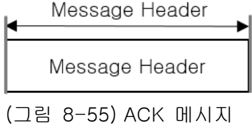

## 8.2.1.4    연결 해제 알림

리부팅 알림 메시지는 온실통합제어기 또는 노드가 리부팅 될 때, 이를 온실통합제 어기 혹은 노드로 알려주기 위함을 목적으로 한다.

Notify  메시지는  [노드  →  GCG],  ACK  메시지는  [GCG  →  노드]의  방향으로  전송 되며, 목적에 따라 Notify  및  ACK  메시지가  역방향으로 전송될 수도 있다. 이에 대 한 세부 메시지 흐름 절차는 (그림 8-56)을 따른다.

(그림 8-56) NOTI\_REBOOT 메시지 흐름도

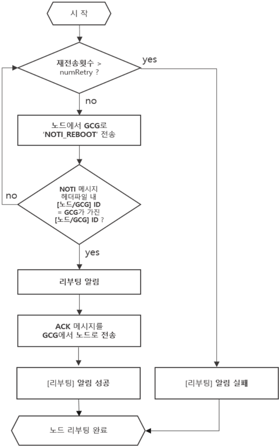

- ※ Request 메시지 방향은 [GCG → 노드]도 가능함

(그림  8-57)는  노드가  리부팅될  때,  이를  알림하기  위하여  보내는  리부팅  알림에 관한 상세 메시지(NOTI\_REBOOT) 포맷이다.

(그림 8-58)은 리부팅 알림에 대한 ACK 메시지 포맷이다.

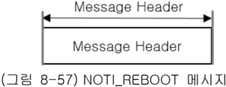

## 8.2.1.5    네트워크 연결 알림

네트워크  연결  알림  메시지(NOTI\_KEEP\_ALIVE)는  온실통합제어기와  노드  간  네트 워크  연결이  정상적으로  수립되어  있음을  알리기  위하여  노드에서  온실통합제어기 로 전송함을 목적으로 한다.

Notify  메시지는  [노드  →  GCG],  ACK  메시지는  [GCG  →  노드]의  방향으로  전송 되며, 목적에 따라 Notify  및  ACK  메시지가  역방향으로 전송될 수도 있다. 이에 대 한 세부 메시지 흐름 절차는 (그림 8-59)를 따른다.

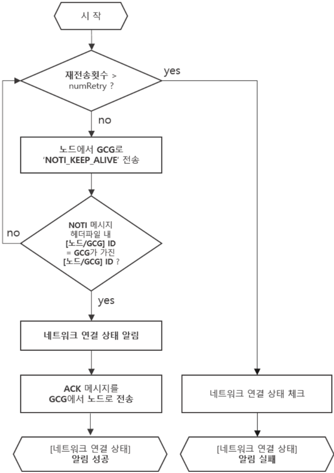

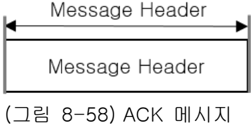

## 정보통신단체표준(국문표준)

## (그림 8-59) NOTI\_KEEP\_ALIVE 메시지 흐름도

(그림  8-60)은  노드와  온실통합제어기  간  통신  연결  수립  여부를  프로파일  속성값 에  정의된  'Keep  Alive  Interval'  시간에  따라  지속적으로  알림  기능을  제공함에  관 한 상세 메시지 (NOTI\_KEEP\_ALIVE)포맷이다.

(그림 8-61)은 네트워크 연결 알림에 대한 ACK 메시지 포맷이다.

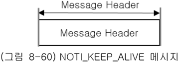

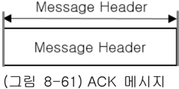

## 부 록 Ⅰ-1

(본 부록은 표준을 보충하기 위한 내용으로 표준의 일부는 아님)

## 지식재산권 확약서 정보

## Ⅰ-1.1  지식재산권 확약서(1)

-  해당  사항  없음.

## Ⅰ-1.2  지식재산권 확약서(2)

-  해당  사항  없음.
- ※  상기  기재된  지식재산권  확약서  이외에도  본  표준이  발간된  후  접수된  확약서가  있을 수 있으니, TTA 웹사이트에서 확인하시기 바랍니다.

## 부 록 Ⅰ-2

(본 부록은 표준을 보충하기 위한 내용으로 표준의 일부는 아님)

## 시험인증 관련 사항

## Ⅰ-2.1  시험인증 대상 여부

-  해당  사항  없음.

## Ⅰ-2.2  시험표준 제정 현황

-  해당  사항  없음.

## 부 록 Ⅰ-3

(본 부록은 표준을 보충하기 위한 내용으로 표준의 일부는 아님)

## 본 표준의 연계(family) 표준

-  해당  사항  없음.

## 부 록 Ⅰ-4

(본 부록은 표준을 보충하기 위한 내용으로 표준의 일부는 아님)

## 참고 문헌

- [1] TTAK.KO-06.0201/R1:  계층적  센서  노드  식별  체계(hCode), 16 June, 2010.
- [2]  TTAK.KO-06.0288-Part1/R1:  온실관제시스템  -  제1부  센서  노드와  온실통합
3. 제어기 간 인터페이스
- [3]  TTAK.KO-06.0288-Part2:  온실  관제  시스템  -  제2부  제어  노드와  온실통합제
5. 어기 간 인터페이스

-  해당  사항  없음.

## 부 록 Ⅰ-5

(본 부록은 표준을 보충하기 위한 내용으로 표준의 일부는 아님)

## 영문표준 해설서

## 부 록 Ⅰ-6

(본 부록은 표준을 보충하기 위한 내용으로 표준의 일부는 아님)

## 표준의 이력

| 판수   | 채택일     | 표준번호        | 내용   | 담당 위원회                      |
|--------|------------|-----------------|--------|----------------------------------|
| 제1판  | 2016.12.27 | TTAK.KO-10.0943 | -      | 스마트농업 프로젝트 그룹 (PG426) |