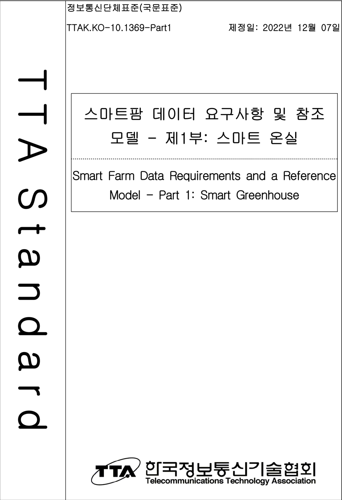
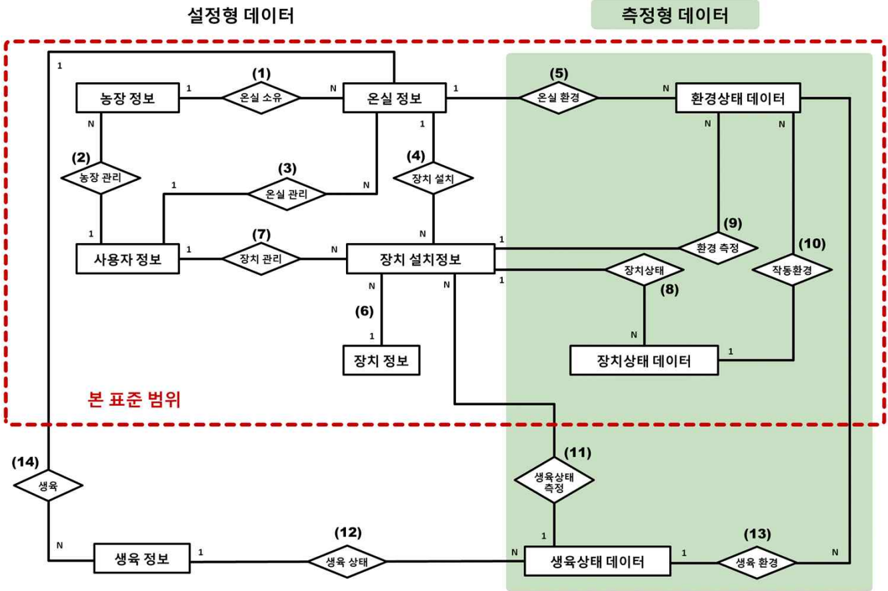
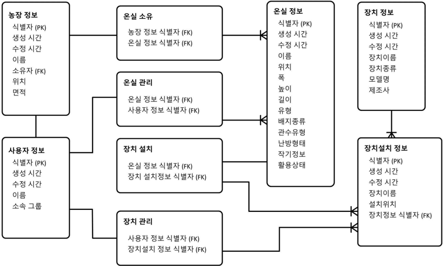
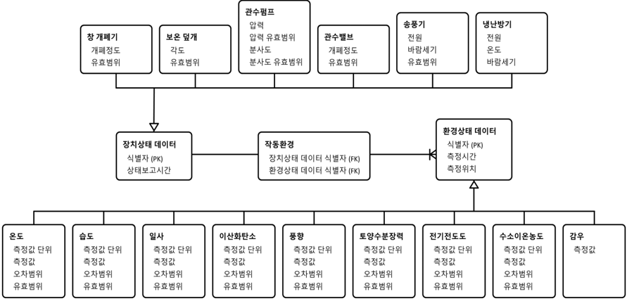
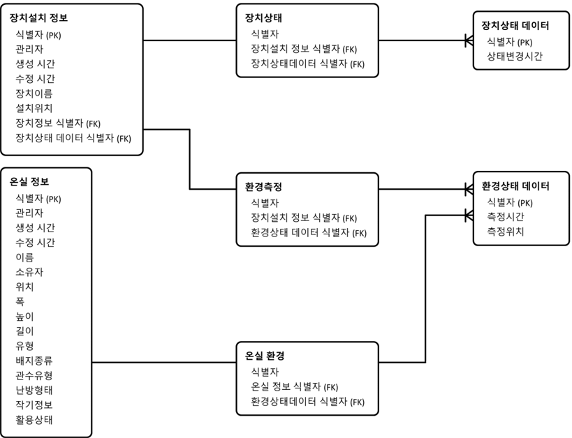

제정일: 2022년 12월 07일

## 표준초안 검토 위원회  스마트농축수산 프로젝트그룹(PG426)

## 표준안 심의 위원회 ICT융합 기술위원회(TC4)

|            |        | 성명   | 소 속   | 직위   | 위원회   | 및 직위   |
|------------|--------|--------|---------|--------|----------|-----------|
| 표준(과제) | 제안   | 윤성현 | ETRI    | 책임   | PG426    | 위원      |
| 표준 초안  | 에디터 | 윤성현 | ETRI    | 책임   | PG426    | 위원      |
|            |        | 최문환 | ETRI    | 선임   | PG426    | 간사      |
|            |        | 이창규 | ETRI    | 선임   | PG426    | 위원      |
|            |        | 박주영 | ETRI    | 책임   | PG426    | 의장      |
| 사무국     | 담당   | 이혜진 | TTA     | 수석   | -        |           |

본 문서에 대한 저작권은 TTA에 있으며, TTA와 사전 협의 없이 이 문서의 전체 또는 일부를 상업적 목적으로 복제 또는 배포해서는 안 됩니다.

본 표준 발간 이전에 접수된 지식재산권 확약서 정보는 본 표준의 '부록(지식재산권 확약서 정보)'에 명시하고 있으며, 이후 접수된 지식재산권 확약서는 TTA 웹사이트에서 확인할 수 있습니다.

본 표준과 관련하여 접수된 확약서 외의 지식재산권이 존재할 수 있습니다.

발행인 : 한국정보통신기술협회 회장

발행처 : 한국정보통신기술협회

13591,  경기도  성남시 분당구 분당로 47

Tel  :  031-724-0114,  Fax  :  031-724-0109

발행일 : 2022. 12.  07.

## 1    표준의 목적

이 표준은 스마트 온실 서비스를 위한 데이터에 대한 요구사항과 이에 기반한 데이터 참 조 모델을 정의한다. 이에 따라 이 문서는 스마트 온실 서비스를 위해 필요한 데이터 항 목과 이들에 대한 요구사항을 정의하고, 또한, 각 데이터들간 관계성을 나타내는 데이터 참조 모델을 정의한다.

## 2    주요  내용 요약

스마트  온실의  IoT  장치들이  생성하고  소비하는  데이터는  기하급수적으로  증가하고  있 다. 방대한 양의 데이터를 효율적으로 관리 및 분석하고, 분석된 데이터에 기반한 다양한 서비스를 창출하기 위해서는 데이터 수집 및 관리 체계를 포함하는 정형화된 데이터 모 델이 필요하다. 특히, 이종 밴더간 상호 호환성을 보장하기 위해서는 이종 기기가 생성하 고  소비하는  데이터의  호환성을  보장하여야  한다.  현재  시중에서  활용되는  스마트  온실 데이터 모델은 각 제조사마다 특화되어 있기 때문에, 장치간 상호 호환성을 보장하지 않 는다. 따라서 이종 장치간 실시간 데이터 통신뿐만 아니라 데이터셋 교환을 위한 데이터 공유 또한 어렵다.

이  표준은  스마트  온실  서비스를  위한  주요  데이터  항목을  분류하고,  각  데이터  항목에 대한 요구사항을 정의한다. 또한, 데이터 항목간 관계성을 나타내는 데이터 참조 모델을 정의한다.

## 3    인용  표준과의 비교

해당 사항 없음

## 서   문

## 1    Purpose

This  standard  defines  the  requirements  of  data  for  smart  greenhouse  services  and  a data  reference  model  based  on  it.  Accordingly,  this  document  defines  the  data items  necessary  for  smart  greenhouse  services  and  the  requirements  for  them,  and also  define  a  data  reference  model  that  indicates  the  relationship  between  each data.

## 2    Summary

The data generated  and consumed  by  IoT  devices in smart greenhouses  is increasing  exponentially.  In  order  to  efficiently  manage  and  analyze  vast  amounts of  data,  and  create  a  variety  of  services  based  on  analyzed  data,  a  standardized data model  including data collection  and  management  system  is  required.  In particular,  in  order  to  ensure  interconnection  between  heterogeneous  vendors,  it  is necessary to ensure the compatibility of data generated and consumed by heterogeneous  devices.  Since  the  smart  greenhouse  data  model  currently  used  in the market is specialized for each manufacturer, it does not guarantee compatibility  between  devices.  Therefore,  it  is  difficult  to  share  data  for  dataset exchanges  as  well  as  real  -time  data  communication  between  heterogeneous devices.

This standard classifies major data items for smart greenhouse  services  and defines  requirements  for  each  data  item.  It  also  defines  a  data  reference  model that  indicates  the  relationship  between  data  items.

## 3    Relationship  to  Reference  Standards

None

## Preface

## 목   차

| 1       | 적용 범위··········· · · · · · · · · · · · · · · · · · · · · · · · · · · · · · · · · · · · · · · · · · · · · · · · · · · · · · · · · · · · · · · · · · · · · · · · · · · · · · · · · · · · · · · · · · · · · · · · · · · · · · · · · · · · · · · · · · · · · ····1                                                                                                                                                                                                                                                                                                                                                                                               |
|---------|------------------------------------------------------------------------------------------------------------------------------------------------------------------------------------------------------------------------------------------------------------------------------------------------------------------------------------------------------------------------------------------------------------------------------------------------------------------------------------------------------------------------------------------------------------------------------------------------------------------------------------------------------------------|
| 2       | 인용 표준··········· · · · · · · · · · · · · · · · · · · · · · · · · · · · · · · · · · · · · · · · · · · · · · · · · · · · · · · · · · · · · · · · · · · · · · · · · · · · · · · · · · · · · · · · · · · · · · · · · · · · · · · · · · · · · · · · · · · · · ····1                                                                                                                                                                                                                                                                                                                                                                                               |
| 3       | 용어 정의··········· · · · · · · · · · · · · · · · · · · · · · · · · · · · · · · · · · · · · · · · · · · · · · · · · · · · · · · · · · · · · · · · · · · · · · · · · · · · · · · · · · · · · · · · · · · · · · · · · · · · · · · · · · · · · · · · · · · · · ····1                                                                                                                                                                                                                                                                                                                                                                                               |
| 4       | 약어··········· · · · · · · · · · · · · · · · · · · · · · · · · · · · · · · · · · · · · · · · · · · · · · · · · · · · · · · · · · · · · · · · · · · · · · · · · · · · · · · · · · · · · · · · · · · · · · · · · · · · · · · · · · · · · · · · · · · · · · · · · · · · · · · ····1                                                                                                                                                                                                                                                                                                                                                                                |
| 5       | 개요··········· · · · · · · · · · · · · · · · · · · · · · · · · · · · · · · · · · · · · · · · · · · · · · · · · · · · · · · · · · · · · · · · · · · · · · · · · · · · · · · · · · · · · · · · · · · · · · · · · · · · · · · · · · · · · · · · · · · · · · · · · · · · · · · ····1                                                                                                                                                                                                                                                                                                                                                                                |
| 6       | 스마트 온실 데이터 요구사항······················ · · · · · · · · · · · · · · · · · · · · · · · · · · · · · · · · · · · · · · · · · · · · · · · · · · · · · · · · · · · · · · · · · · · · · ····2 6.1 일반 요구사항······················· · · · · · · · · · · · · · · · · · · · · · · · · · · · · · · · · · · ·· · · · · · · · · · · · · · · · · · · · · · · · · · · · · · · · · · · · · · · · · · · · · · · · · · · · · ····2                                                                                                                                                                                                                                  |
| 7.1 7.2 | 스마트 온실 데이터 참조모델······················· ·· · · · · · · · ·· · · · · · · · ·· · · · · · · · ·· · · · · · · · ·· · · · · · · · ·· · · · · · · · ·· · · · · · · · ······17 개념적 모델············· · · · · · · · · · · · · · · · · · · · · · · · · · · · · · · · · · · · · · · · · · · · · · · · · · · · · · · · · · · · · · · · · · · · · · · · · · · · · · · · · · · · · · · · · · · · · · · · · · · · ·····17 논리적 모델············· · · · · · · · · · · · · · · · · · · · · · · · · · · · · · · · · · · · · · · · · · · · · · · · · · · · · · · · · · · · · · · · · · · · · · · · · · · · · · · · · · · · · · · · · · · · · · · · · · · · ·····19 |
| 6.3     | 측정형 데이터 요구사항······················· · · · · · · · · · · · · · · · · · · ·· · · · · · · · · · · · · · · · · · · · · · · · · · · · · · · · · · · · · · · · · · · ·· · · · · · · ····6                                                                                                                                                                                                                                                                                                                                                                                                                                                                    |
| 7       |                                                                                                                                                                                                                                                                                                                                                                                                                                                                                                                                                                                                                                                                  |
|         | 지식재산권 확약서 정보············· · · · · · · · · · · · · · · · · · · · · · · · · · · · · · · · · · · · · · · · · · · · · · · · · · · · · · · · · · · · · · · · · · · · · ·····29                                                                                                                                                                                                                                                                                                                                                                                                                                                                              |
| 부록    | Ⅰ-1 Ⅰ-2 시험인증 관련 사항············· · · · · · · · · · · · · · · · · · · · · · · · · · · · · · · · · · · · · · · · · · · · · · · · · · · · · · ·                                                                                                                                                                                                                                                                                                                                                                                                                                                                                                              |
|         | · · · · · · · · · · · · · · · · · · · · · · ·····30                                                                                                                                                                                                                                                                                                                                                                                                                                                                                                                                                                                                              |
|         | Ⅰ-3 본 표준의 연계(family) 표준············· · · · · · · · · · · · · · · · · · · · · · · · · · · · · · · · · · · ·· · · · · · · · · · · · · · · · · · · · · · · · · ·····31                                                                                                                                                                                                                                                                                                                                                                                                                                                                                      |
|         | Ⅰ-4 참고 문헌············· · · · · · · · · · · · · · · · · · · · · · · · · · · · · · · · · · · · · · · · · · · · · · · · · · · · · · · · · · · · · · · · · · · · · · · · · · · · · · · · · · · · · · · · · · · · · · · ·····32                                                                                                                                                                                                                                                                                                                                                                                                                                   |
|         | Ⅰ-5 영문표준 해설서·················· · · · · · · · · · · · · · · · · · · · · · · · · · · · · · · · · · · · · · · · · · · · · · · · · · · · · · · · · · · · · · · · · · · · · · · · · · · · · · ·····33                                                                                                                                                                                                                                                                                                                                                                                                                                                          |
|         | Ⅰ-6 표준의 이력············· · · · · · · · · · · · · · · · · · · · · · · · · · · · · · · · · · · · · · · · · · · · · · · · · · · · · · · · · · · · · · · · · · · · · · · · · · · · · · · · · · · · · · · · · · · ·····34                                                                                                                                                                                                                                                                                                                                                                                                                                         |

## 정보통신단체표준(국문표준)

## 스마트팜 데이터 요구사항 및 참조 모델 - 제1부: 스마트 온실 Smart Farm Data Requirements and a Reference Model Part  1:  Smart  Greenhouse

## 1    적용  범위

이 표준은 스마트 온실 서비스를 위한 데이터에 대한 요구사항과 이에 기반한 데이터 참 조 모델을 정의한다. 이에 따라 이 문서는 스마트 온실 서비스를 위해 필요한 데이터 항 목과 이들에 대한 요구사항을 정의하고, 또한, 각 데이터들간 관계성을 나타내는 데이터 참조 모델을 정의한다.

이 표준은 스마트 온실 서비스를 위한 데이터 중에서 농장 기본 데이터, 스마트 온실 환 경  상태  및  제어  데이터  등과  같이  스마트  온실  고유의  기능이나  서비스에 관련된 데이 터만을 다루며, 농장 경영 및 농산물 유통 등 스마트 온실관련 작물생육과 무관한 데이 터는 범위에 포함하지 않는다.

## 2    인용  표준

해당 사항 없음

## 3    용어  정의

해당 사항 없음

## 4    약어

해당 사항 없음

## 5    개요

스마트  온실은  작물의  생육환경을  제어함으로써  생산성을  향상시켜왔다.  스마트  온실이 지속적으로 확산됨에 따라, 축적되는 데이터는 기하급수적으로 증가하고 있다. 최근에는 빅데이터를 활용한 인공지능 기술을 스마트 온실에 적용하기 위한 시도들이 태동되면서 데이터에 대한 중요성이 더욱 주목받고 있다. 예로, 병해충 방제, 농장 자율 제어 등 데 이터 기반의 지능형 스마트 온실 서비스에 대한 요구가 매우 가파르게 증가하고 있다.

이러한 스마트 온실 지능화 요구에 부응하기 위해서는 데이터를 잘 축적하고, 축적된 데 이터를 잘 활용할 수 있어야 한다. 이를 위해서는 무엇보다도 스마트 온실의 다양한 장 치들이 생성하고 소비하는 데이터들이 서로 잘 호환될 수 있게 하는 것이 중요하다.

미래의 스마트 온실은 더욱 더 많은 다양한 장치들이 설치될 것이다. 이에 따라, 클라우 드,  인공지능, 빅데이터 기술과 연계되어 다양한 신규 스마트 온실 서비스들이 창출되어, 농가 및 농업연구자들에게 제공될 전망이다.

이 표준은 스마트 온실 서비스를 위한 데이터에 대한 요구사항 및 표준화된 데이터 참조 모델을 정의함으로써, 스마트 온실의 상호호환성을 보장하고 특정 벤더에 대한 의존성을 해결하며, 아울러 미래에 제공될 신규 스마트 온실 서비스를 위한 데이터 수집 및 관리 를 용이하게 하고자 한다.

이 표준은 스마트 온실 서비스를 위한 데이터에 대한 요구사항과 이에 기반한 데이터 참 조  모델을  정의하기 위해,  스마트  온실  서비스를  위해  필요한  데이터 항목과  이들에  대 한 요구사항, 그리고 각 데이터들의 관계를 정의하는 데이터 참조 모델을 정의한다.

## 6    스마트 온실 데이터 요구사항

## 6.1    일반 요구사항

스마트 온실에서 생성되고 활용될 수 있는 작물생육 관련(Crop-growth related)  데이터 는 다음과 같이 크게 두 가지 유형으로 구분될 수 있다.

- ◼ 설정형 데이터 (Configuration  Data):  스마트  온실  시설  및  작물  생육을  대상으로  스 마트 온실 서비스를 활용하기 위해 데이터 사용자에 의해 자체적으로 설정하여 사용 할 수 있는 데이터이다.
- ◼ 측정형 데이터 (Measurement  Data):  스마트  온실  시설에  설치된  장치로부터  측정되 거나, 또는 농장 외부의 제 3자로부터 제공받아 사용할 수 있는 데이터로서, 농장 외 부로부터 제공받는 데이터는 외부의 장치를 통해 측정되어 인터넷 등과 같은 통신 네 트워크 수단을 통해 전송받거나, 제 3자에 의해 구축된 데이터베이스를 구매하여 획 득할 수 있다.

두 유형의 데이터는 별도의 데이터가 아닌 상호 연관성을 가진 상태로 관리되어야 한다. 예로써, 과거 특정 기간 동안의 스마트 온실 상태를 알기 위해서는 온실의 형상 및 장치 설치정보를 포함하는 온실 설정 정보, 온실 내 환경상태, 온실 내 장치들의 상태 등이 동 시에 복합적으로 제공될 필요가 있다.

스마트  온실에서  사용될  수  있는  데이터는  스마트팜을  운영하는  목적에  따라  다양하게 존재할 수 있다. 스마트 온실에서 활용되는 데이터는 특정 목적에 따라 다양하게 수집될 수  있으며,  추후  스마트  온실  데이터  분석을  통한  최적  생육  모델  발굴  등  스마트  온실 서비스에 활용될 수 있다.

이를 위해 스마트 온실 사용자 및 서비스 제공자는 서비스의 목적에 따라 저장된 데이터 를  다양한  측면으로 분석하여 가공하여 활용할 수 있어야 한다. 결국 스마트 온실 데이 터는 각 데이터 인스턴스가 관리 될 수 있어야 의미 있는 데이터 분석이 가능해진다. 추 후  각각의 식별자로 구분된 데이터 인스턴스들은 데이터 관리 시스템에 의한 상호 연계 작업을 통해 새로운 데이터 뷰가 제공될 수 있다.

또한,  스마트  온실  데이터는  다수의  사용자가  활용할  수  있으며,  각  사용자는  데이터의 종류에 따라 각기 다른 권한을 가진다. 예로 설정형 데이터의 경우 생성 및 수정은 데이 터  관리자가  하며,  데이터  사용자는 사용 목적에 따른 일부 데이터에 대한 조회 권한만 가질 수 있다.

스마트 온실 데이터는 다음과 같은 일반 요구사항을 가진다.

-  스마트 온실 데이터는 데이터 관리 시스템 (Data Management System; DMS)에 저장 되어 관리되어야 한다.
-  스마트  온실  데이터의  생성,  검색,  삭제,  수정  (Create,  Retrieve,  Update,  Delete; CRUD) 등의 연산이 가능해야 한다.
-  작물 생육 과정 분석을 위해서는 과거 특정 기간 동안의 스마트 온실 내 환경 및 작물 의 상태에 관련된 데이터를 분석할 수 있어야 한다.
-  스마트 온실 데이터의 효용성을 제고하기 위해서는 시간 및 공간 데이터와 결합될 수 있어야 한다.
-  시간 데이터는 연, 월, 일, 시, 분, 초 단위로 관리될 수 있어야 한다. 또한, 시간을 다 루는 일관된 형식의 표기가 지정되어야 한다.
-  시간 데이터 초 단위의 경우 장치가 지원하는 소숫점 이하 자리까지 표기될 수 있다.
-  시간  데이터의  표현  방법에  있어서  기본적으로  데이터  관리  시스템이  사용하는  시간 표기를 준용하는 것이 권고된다.
-  공간 데이터는 절대적 위치와 상대적 위치를 구분하여 관리 될 수 있어야 한다. 또한, 2차원 공간과 3차원 공간을 모두 표기할 수 있어야 한다.
-  절대적  위치는  GPS  등  장치에  의해  측정하며,  상대적  위치는  관리자가  지정한  기준 위치로부터 상대적인 방향과 거리로 정의하는 것이 권고된다.
-  데이터 관리 시스템에 의해 관리되는 모든 스마트 온실 데이터는 각 데이터 인스턴스 를 구분할 수 있는 식별자가 함께 관리되어야 한다.
-  식별자의 표기는 ITU-T X.667 권고안을 준용하는 것이 권고된다.
-  모든 스마트 온실 데이터는 사용자에 따라 접근, 사용, 관리 권한이 구분되어야 한다.

-  모든  사용자  권한을  포함하는  최상의  관리자  권한이  보안이  확보된  특정  사용자에게 부여되어야 한다.
-  사용자 권한은 관리 편의 및 복잡성 해소를 위해 사용자 그룹별로 관리되는 것이 권고 된다.

## 6.2    설정형 데이터 요구사항

## 6.2.1    설정형 데이터 특성

설정형 데이터는 스마트 온실 관련 기본적 정보를 나타내며 특정 기준에 따라 농가에서 직접 입력하여 활용할 수 있는 데이터이다. 설정형 데이터는 초기 입력 이후에는 정보의

변경 작업이 거의 수행되지 않는 특성이 있다.

설정형 데이터는 데이터 관리자에 의해 입력되어 활용되는 특성상 데이터와 정보의 성격 을 함께 가지고 있다. 데이터와 정보의 구분은 목적 및 의도의 반영 여부에 따른다. 데이 터가 현실 세계에서 측정되고 수집된 사실 또는 값이라면, 정보는 특정 목적이나 의도가 반영되도록 가공된 데이터이다.

설정형 데이터는 다음과 같은 요구사항을 가진다.

-  설정형 데이터는 데이터의 변경(생성, 수정, 삭제)에 대해 이력이 관리되어야 한다.
-  데이터의 변경 이력에는 변경시간, 수정내용, 변경을 수행한 사용자 정보 등이 포함하
- 는 것이 권고된다.
-  데이터의 변경 이력에 따른 버전별 데이터가 관리 되는 것이 권고된다.
-  설정형  데이터의  종류에는  농장정보,  온실정보,  장치정보,  장치설치정보,  사용자정보 등이 포함되어야 한다.

## 6.2.2    농장정보

농가를 표현하는 기본적인 정보를 포함한다.

사용자는 다수의 농장을 소유할 수 있으므로 다수의 농장을 고유하게 식별할 수 있어야 한다. 또한, 사용자가 농장을 직관적으로 식별할 수 있도록 농장의 이름, 주소 등을 포함 하는 기본 정보가 요구된다. 특히, 지리적 특성에 따라 작물의 생육에 영향을 미치는 기 상  환경이  다르므로  각  농장의  지리적  위치를  나타내는  정보가  요구된다.  이는  스마트 온실도 외부 기상환경에 영향을 받기 때문이다. 외부와 내부의 기온차에 따라 냉방과 난

방을 결정할 수 있다.

농장정보는 다음과 같은 요구사항을 가진다.

## 정보통신단체표준(국문표준)

-  농장정보에는 농장식별자, 농장이름, 농장주소, 농장위치 등이 포함되어야 한다.
-  지리적 위치정보는 GPS 등의 장치를 이용한 물리적 위치정보와 사용자에 친숙한 상대
- 적 위치정보를 함께 사용하는 것이 권고된다.

## 6.2.3    온실정보

농가가 소유하고 있는 스마트 온실을 표현하는 정보를 포함한다.

농장에는 다양한 작물을 생육하기 위해 복수의 온실이 있을 수 있다. 따라서 각 온실을 고유하게 식별할 수 있어야 한다. 또한, 사용자가 각 온실을 직관적으로 식별할 수 있도 록 각 온실의 특성을 나타내는 정보들이 요구된다.

온실정보는 다음과 같은 요구사항을 가진다.

- 온실정보에는 온실식별자, 온실이름, 온실유형, 온실위치, 온실폭, 온실길이, 온실높이, 배지종류, 관수유형, 난방형태, 생육작물, 작기정보, 활용상태 등이 포함되어야 한다

## 6.2.4    장치정보

스마트 온실에 설치할 수 있는 장치를 표현하는 기본 정보를 포함한다.

스마트 온실에 사용되는 각 장치는 생명주기가 다르다. 특정 장치가 교체될 필요가 발생 할  경우  해당  장치와  연동되는  다른  장치와  호환성이  담보될  수  있어야  한다.  장치정보 는  특정  장치를  대체할  수  있는  다른  장치를  찾는데  활용될  수  있으며,  이를  위해  장치 의 특성을 직관적으로 파악할 수 있도록 해당 정보들이 요구된다.

장치정보는 다음과 같은 요구사항을 가진다.

-  장치정보에는 장치코드, 장치이름, 장치종류, 장치모델, 장치제조사, 장치특성 등이 포
- 함되어야 한다.
- 사용자는 제조사가 제공한 정보를 토대로 장치정보를 관리하는 것이 권고된다.

## 6.2.5    장치설치정보

스마트 온실에 설치되어 운영되는 장치를 표현하는 정보를 포함한다.

온실에는 다양한 장치가 설치될 수 있다. 따라서 각 장치는 고유하게 식별될 수 있어야 한다.  또한,  작물을  효율적으로  생육하고,  작물생육에  유의미한  데이터를  획득하고  분석

## 정보통신단체표준(국문표준)

하기  위해서는  온실에  설치된  각  장치들의  구성  정보가  필요하다.  따라서  특정  온실에 설치된 장치들의 특성을 직관적으로 파악할 수 있도록 해당 정보들이 요구된다.

장치설치정보는 다음과 같은 요구사항을 가진다.

-  장치설치정보에는 장치식별자, 장치이름, 설치온실. 설치일자. 설치위치 등이 포함되어 야 한다.

## 6.2.6    사용자정보

데이터를 조회하고, 변경할 수 있는 사용자정보를 포함한다.

스마트 온실 데이터는 사용자에 따라 다른 권한이 주어지므로, 각 데이터 사용자가 관리

될 수 있기 위한 정보들이 요구된다.

사용자정보는 다음과 같은 요구사항을 가진다.

-  사용자정보에는 식별자, 사용자이름, 소속 그룹 등이 포함되어야 한다.

## 6.3    측정형 데이터 요구사항

## 6.3.1  측정형 데이터 특성

측정형  데이터는  스마트  온실에  활용되는  장치에  의해  측정되거나  또는  기존  데이터를 단순  가공하여  획득할  수  있는  데이터이다.  여기서  단순  가공이  의미하는  바는  스마트 온실에 활용되는 장치에 추가적인 사양 변경이 필요 없이 기존 장치를 그대로 활용하여

데이터의 변형을 가할 수 있는 수준으로, 예로서 데이터 단위 변환 등이 될 수 있다.

## 6.3.2  측정형 데이터 기본 요구사항

측정형 데이터의 종류는 다음과 같은 유형으로 구분될 수 있다.

- 환경상태 데이터: 스마트 온실 내외의 환경을 나타내는 데이터로서, 센서와 같이 스마 트 온실의 환경을 측정하는 장치에 의해 획득되거나, 날씨 데이터와 같이 제 3자로부
- ◼ 터 제공될 수 있다.
- 생육상태 데이터: 스마트 온실에서 생육되는 작물의 상태를 나타내는 데이터로서, 작 물의 종류에 따라 다양한 특성을 가진다. 작물의 생육상태는 작물의 종류에 따라 측 정  방법  및  대상이  상이하므로 통상 작물별로 다루게 되며 본 표준에서는 다루지 않
- ◼ 는다.

- ◼ 장치상태 데이터: 스마트 온실의 환경 및 작물의 생육상태를 측정하고 제어하기 위한 장치의 상태를 나타내는 데이터로서, 제어 명령에 따른 장치의 수행 결과를 나타낸다.
- ◼ 차원 데이터: 기존 데이터와 융합 또는 비교하여 데이터의 가치 제고 및 새로운 가치 를 창출하기 위해 활용될 수 있는 데이터로서, 시점(timestamp), 좌표(coordinate) 등 별도의  장치  또는  시스템에  의해  측정될  수  있는  데이터뿐만  아니라,  우선순위 (priority),  가중치(weight)  등  인적요인이  적용된  데이터도  포함된다.  차원  데이터는 데이터 활용에 기본적으로 필요한 시간 및 공간 데이터에 대한 사항을 일반 요구사항 으로 다루고, 인적요인 데이터는 본 표준에서 다루지 않는다.

본 표준에서는 작물생육 관련 스마트 온실 데이터 중에서 장치로부터 측정될 수 있는 측 정형 데이터 중 환경상태 데이터 및 장치상태 데이터를 다룬다. 측정형 데이터는 데이터 관리시스템(DMS)에 의해 관리되고 데이터 분석 작업에 원활하게 활용될 수 있도록 컴퓨 터연산(computing)이 가능한 형태로 표현되고 다루어져야 하며, 이를 위해 컴퓨터연산이 가능한 형태인 수치(numeric), 불리언(Boolean) 등으로 다룬다.

스마트 온실 데이터의 유의미성을 확보하고 데이터의 가치를 제고 하기 위해서는 각 측 정  데이터가  언제  그리고  어떤  장치를  통해  (또는  어디서)  측정되었는지에  따라  구분될 필요가 있다.

장치에 의해 기계적으로 생성되는 측정형 데이터에는 수많은 무의미한 데이터가 섞여 있 을 가능성이 크기 때문에, 데이터의 유효범위를 벗어난 측정값은 측정오류로 무시함으로 써 데이터 저장공간 및 컴퓨터 자원의 효율을 높이고, 데이터 분석 시 통계적 오류를 줄 일 수 있다.

아울러 서로 다른 데이터 단위를 가진 장치가 생성하는 데이터는 지정된 데이터 단위로 치환하여 사용될 필요가 있다.

측정형 데이터는 장치의 특성에 따라 동일 유형의 데이터라 하더라도 측정값이 다를 수 있다. 측정값의 오차범위 내 차이는 무시할 수 있다.

측정형 데이터는 다음과 같은 요구사항을 가진다.

-  측정형 데이터는 측정되는 시점과 연결되어야 한다. 즉, 측정형 데이터는 시간 데이터 가(timestamp) 함께 관리되어야 한다.
-  측정형  데이터는  장치설치정보와  연결되어야  한다.  즉,  측정형  데이터를  생성하는  장 치의 설정 데이터와 함께 관리되어야 한다.
-  측정형  데이터는  측정값,  측정시간,  측정위치,  측정장치정보가  동시에  함께  관리되는 것이 권고된다.
-  측정형 데이터는 유효범위가 관리되어야 한다.

-  측정형 데이터는 데이터의 단위가 관리되어야 한다.
-  측정형  데이터의  단위는  온실  또는  농장  내  모든  장치들에  일관된  단위로  적용될  수 있도록 하는 것이 권고된다.
-  측정형 데이터는 오차범위가 관리되어야 한다.

## 6.3.3    환경상태 데이터

## 6.3.3.1    환경상태 데이터 항목

작물의 생육과 관련된 스마트 온실의 환경을 나타내는 데이터는 다양하게 존재할 수 있 다.  본  표준에서는  KS  X  3269  표준을  참고하여,  현재  스마트  온실에서  작물  생육을  위 해  중요하게  다루고  있는  데이터들인  온도,  습도,  이산화탄소,  일사,  풍향,  풍속,  감우, 토양수분장력, EC, pH에 대해 다룬다.

## 6.3.3.2    온도  (Temperature)

온도 데이터는 작물 생장 환경의 가장 기본적인 데이터이다. 온도가 기준치보다 낮으면 작물은 생장 활동을 멈춘다. 반면 기준치를 상회하면 작물의 품질이 악화될 수 있다. 물 론 작물 생장 관련 기준치 온도는 작물의 종류에 따라 상이하다.

온도 데이터는 온도센서가 설치된 곳 근처의 온도 상태를 나타낸다. 따라서 온도센서가 설치된 위치 및 장치의 종류에 따라 측정된 온도 데이터는 별개의 데이터로 구분될 필요 가 있다. 예로써, 동일한 온도 데이터라 하더라도 온실 내 대기 온도는 내온, 온실 밖 대 기 온도는 외온, 작물의 뿌리가 위치하는 근권부 온도는 근온, 작물의 지상부 토양온도는 지온, 작물의 잎 표면온도는 엽온으로 분류될 수 있으며, 측정하는 장치 또한 각각 다르 다.

온도 센서는 스마트 온실 내에서도 상단, 중단, 하단, 중앙, 출입구 등 다양한 위치에 배 치될 수 있고, 정밀한 스마트 온실 환경 분석 및 제어를 위해서는 장치의 설치 위치 정 보가 함께 사용될 필요가 있다.

온도 데이터의 단위는 섭씨, 화씨 등이 될 수 있으며, 이 중 주사용 단위를 지정할 필요 가 있다.

온도 데이터의 유효범위는 작물의 종류에 따라 다를 수 있다. 그러나 온실 내에서 작업 하는 사람의 건강을 위해 농작업 안전관리를 위한 데이터 유효범위가 우선되어야 한다.

온도 데이터는 다음과 같은 요구사항을 가진다.

## 정보통신단체표준(국문표준)

-  온도는 스마트 온실의 환경상태 관련 필수 데이터로 관리되어야 한다.
-  다른 장치로부터 측정된 온도 데이터는 별개의 데이터로 관리되어야 한다.
-  온도 데이터는 장치설치정보 데이터와 연결되어야 한다.
-  주로 사용하는 온도 데이터의 단위가 관리되어야 한다.
-  동일한  데이터  관리  시스템에  의해  관리되는  온도  데이터는  동일한  단위를  사용하는 것이 권고된다
-  온도의 유효범위가 정의될 수 있어야 한다.
-  온실  내  작물을  위한  온도  유효범위뿐만 아니라,  온실 내 작업자의 안전을 고려한 유 효범위가 함께 정의되는 것이 권고된다.

## 6.3.3.3    습도  (Humidity)

습도 데이터는 대기 중 수증기를 측정하는 장치에 의해 생성되며, 온도와 함께 작물생장 환경조건의 가장 기본이 되는 데이터이다. 특히 습도는 병충해 발생과 관련이 있다. 습도 가 기준치보다 높으면 병충해 발생 가능성이 높고, 낮으면 작물의 호흡작용에 문제가 생 길 수 있다. 이는 영양공급 저하로 인한 작물의 생장 부진을 초래하게 된다.

습도는 온도와 매우 밀접한 관계를 가진다. 예로 농업에서 자주 사용되는 환경 지표 중 하나인 이슬점(dew point)은 온도와 습도로부터 계산될 수 있다.

습도  또한  온도처럼  측정되는  위치  및  대상에  따라  별개의  데이터로  취급된다.  습도는 온도와 밀접한 관계를 가지기 때문에 통상 하나의 장치에서 함께 측정되어 사용된다.

습도는 대기 중 포함된 수증기의 정도를 나타내며, 대기 중 수증기의 비율을 뜻하는 상 대습도와 대기 1㎥ 내 포함된 수증기의 무게(g)를 뜻하는 절대습도로 구분한다. 기본적 으로 상대습도가 사용된다.

습도 데이터의 유효범위는 작물의 종류에 따라 다를 수 있다. 온실 내 작업자의 안전이 우선시 된다. 또한, 온도와 비교하여 비정상/정상 상태를 유추할 수 있다.

습도 데이터는 다음과 같은 요구사항을 가진다.

-  습도는 스마트 온실의 환경상태 관련 필수 데이터로 관리되어야 한다.
-  습도 데이터는 동일한 시간 및 위치의 온도 데이터와 연결될 수 있어야 한다.
-  다른 장치로부터 측정된 습도 데이터는 별개의 데이터로 관리되어야 한다.
-  주로 사용하는 습도 데이터의 단위가 관리되어야 한다.
-  동일한  데이터  관리  시스템에  의해  관리되는  습도  데이터는  동일한  단위를  사용하는 것이 권고된다.
-  습도의 유효범위가 정의될 수 있어야 한다.

## 6.3.3.4    이산화탄소 (CO2; Carbon Dioxide)

이산화탄소 데이터는 대기중 이산화탄소 농도를 측정하는 장치에 의해 생성되며, 작물의 생장에 직접적인 영향을 미친다. 이산화탄소 데이터를 통해 작물의 광합성 환경 상태를 가늠할  수  있다.  이산화탄소의  농도가  기준치  이하로  떨어지면  작물은  광합성을  할  수 없기 때문에 생장 속도가 느려진다.

이산화탄소의 농도가 기준치보다 높으면 작물도 해를 입는다. 이산화탄소는 사람의 건강 에 직접적으로 영향을 미치므로, 온실 내 작업자가 있다면, 작업자의 안전이 먼저 고려되 어야 한다.

이산화탄소는 일사량과 밀접한 관계를 가진다. 일사량이 높아 작물의 활동이 많을 때는 이산화탄소 공급을 높여 작물의 생장을 촉진 시킬 수 있다.

이산화탄소 데이터는 다음과 같은 요구사항을 가진다.

-  이산화탄소는 스마트 온실의 환경상태 관련 주요 데이터로 관리되어야 한다.
-  이산화탄소의 유효범위가 정의될 수 있어야 한다.
- 이산화탄소 데이터의 기본 단위는 ppm을 사용하는 것이 권고된다.
-  온실 내 작물을 위한 이산화탄소 유효범위뿐만 아니라, 온실 내 작업자의 안전을 고려 한 유효범위가 함께 정의되는 것이 권고된다.
-  이산화탄소 데이터는 일사 데이터와 연결될 수 있어야 한다.

## 6.3.3.5    일사(광량, Insolation)

일사 데이터는 태양빛의 양을 측정하는 장치에 의해 생성되며, 일사량 정보는 작물의 광 합성 양을 추정하는 기준이 된다. 스마트 온실의 경우 일사는 투명 채광창을 통해 전달 되며, 일사량 조절은 커튼 제어 등을 통해 수행될 수 있다.

일사 데이터의 단위로는 W/㎡, kcal/㎡, cal/㎠/min, ly/min 등 다양한 단위가 활용될 수 있으며, 상호 환산이 가능하다.

일사 데이터는 다음과 같은 요구사항을 가진다.

-  일사는 스마트 온실의 환경상태 관련 주요 데이터로 관리되어야 한다.
-  주로 사용하는 일사 데이터의 단위가 관리되어야 한다.
-  동일한  데이터  관리  시스템에  의해  관리되는  일사  데이터는  동일한  단위를  사용하는

것이 권고된다.

## 6.3.3.6    풍향  (Wind  Direction)

풍향 데이터는 온실 외부 기상대의 장치에 의해 측정되며, 온실 바깥의 대기상태 중 바 람이 현재 부는 방향을 측정한다.

풍향은 풍속,  온실구조,  온실방향  등과  함께  고려된다.  풍향에  따라  온실  창문  개방  시 온실 내부로의 대기 유입 정도가 달라지며 온도, 습도, 이산화탄소 등 온실 내부의 대기 환경에 영향을 주는 정도가 달라진다. 이는 대기 유입 단면적과 관계가 있다. 온실 창의 방향과 풍향이 이루는 각도에 따라 수직을 이루었을 때 가장 많은 대기가 유입되며, 각 도가 낮을수록 대기 유입이 줄어든다.

풍향 데이터의 단위로는 일반적으로 방위각이 사용된다. 360도 방위각은 지리학상의 진 북을 기준으로 하여 시계방향으로 북풍은 360° 방향, 동풍은 90° 방향, 남풍은 180° 방 향, 서풍은 270° 방향으로 표시한다.

풍향 데이터는 다음과 같은 요구사항을 가진다.

-  풍향은 스마트 온실의 환경상태 관련 주요 데이터로 관리되어야 한다.
-  풍향 데이터는 측정형 데이터 및 설정형 데이터와 연결될 수 있어야 한다.
-  주로 사용하는 풍향 데이터의 단위가 관리되어야 한다.
-  동일한  데이터  관리  시스템에  의해  관리되는  풍향  데이터는  동일한  단위를  사용하는 것이 권고된다.

## 6.3.3.7    풍속  (Wind  Speed)

풍속 데이터는 온실 외부 기상대의 장치에 의해 측정되며, 온실 바깥의 대기상태 중 바 람이 현재 부는 속도를 측정한다.

풍속  데이터는  바람의  세기를  나타내며  풍향,  온실구조,  온실방향  등과  함께  고려된다. 풍속에 따라 온실 창문 개방시 온실 내부로의 대기 유입 정도가 달라지며 온도, 습도, 이 산화탄소  등  온실  내부의  대기환경에  영향을  주는  정도가  달라진다.  강풍  발생  시에는 온실  시설물에  파손을  방지하기  위해  외부와의  환기  장비들을  폐쇄하고  내부의  기압을 맞추는 제어를 실시한다.

풍속은 속도의 단위인 m/s, km/h  등을  사용하며,  주로  사용하는  단위를  지정할  필요가 있다.

풍속 데이터는 다음과 같은 요구사항을 가진다.

-  풍속은 스마트 온실의 환경상태 관련 주요 데이터로 관리되어야 한다.
-  풍속 데이터는 측정형 데이터 및 설정형 데이터와 연결될 수 있어야 한다.
-  주로 사용하는 풍속 데이터의 단위가 관리되어야 한다.
-  동일한  데이터  관리  시스템에  의해  관리되는  풍속  데이터는  동일한  단위를  사용하는 것이 권고된다.

## 6.3.3.8    감우  (Rain  Detection)

감우 데이터는 대기 중 강우, 강설 등 강수 현상 발생 여부를 나타낸다. 감우 센서를 사 용하지 않으면 강수 피해에 효과적으로 대응할 수 없다. 강수 피해의 예로는 작물이 물 에 잠겨 뿌리가 썩거나, 저온으로 인한 수확량 저조, 과도한 수분으로 인한 병충해 발생 등이 될 수 있다. 해당 피해를 방지하기 위해 감우 센서를 설치해 비 감지시 천창, 측창 을 닫는다. 대부분의 농가가 통합제어시스템과 연계해 사용하고 있다.

감우  데이터  단위는  ON/OFF,  0/1,  True/False  등  다양하게  활용될  수  있으며,  장치간 상호 호환등을 이유로 주 사용 단위를 지정하여 사용한다.

감우 데이터는 다음과 같은 요구사항을 가진다.

-  감우는 스마트 온실의 환경상태 관련 주요 데이터로 관리되어야 한다.
-  주로 사용하는 감우 데이터의 단위가 관리되어야 한다.
-  동일한  데이터  관리  시스템에  의해  관리되는  감우  데이터는  동일한  단위를  사용하는 것이 권고된다.

## 6.3.3.9    토양수분장력 (Soil Moisture Tension)

토양수분장력  데이터는  토양이  물을  보유하고  있는  힘을  나타내는  데이터로서,  스마트 온실의 근권부 환경 상태를 나타낸다. 토양에 적정한 수분을 유지시키고 작물의 품질과 생산량을 확보하기 위해 관개는 필수적인 요소이며, 토양수분장력 데이터는 관개시점, 관 개량  등을  설정하기  위한  주요  지표이다.  관개의  시점과  관개량에  따라  토양의  수분이 많아질 경우 공기가 적어져 작물의 뿌리가 숨을 쉬기 어려우며, 물이 부족할 경우 한발 피해를 초래할 수 있다.

토양수분장력 데이터의 단위는 통상 Pa로 표기된다. 1Pa은 1㎡ 당 1N의 힘이 작용할 때 의  압력에  해당하는 값이며, 단위는 kPa, Pa이 등이 될 수 있으며, 장치간 상호 연동을 위해 주로 사용하는 단위를 지정하여 사용할 필요가 있다.

## 정보통신단체표준(국문표준)

## 정보통신단체표준(국문표준)

토양의 특성에 따라 토양수분장력, 관수시점, 수분 공급 깊이와 관수량이 달라지며, 토양 수분장력센서의 길이와 설치 깊이가 달라질 수 있기 때문에, 정밀한 환경 분석을  위해 토양의 특성, 장치 설치 위치, 장치 규격 등이 함께 사용될 필요가 있다.

토양수분장력 데이터는 다음과 같은 요구사항을 가진다.

-  토양수분장력은 스마트 온실의 환경상태 관련 주요 데이터로 관리되어야 한다.
-  주로 사용하는 토양수분장력 데이터의 단위가 관리되어야 한다.
-  동일한 데이터 관리 시스템에 의해 관리되는 토양수분장력 데이터는 동일한 단위를 사
- 용하는 것이 권고된다.
-  토양수분장력 데이터는 장치 설치 데이터와 연결되어야 한다.

## 6.3.3.10    전기전도도 (EC; Electrical Conductivity)

전기전도도는 작물에 대한 염류 장애를 판단하기 위해 사용된다. 과도한 비료 사용은 염 류집적(염류, 비료 성분 과다) 현상을 초래할 수 있다. 염류가 높으면 작물이 살지 못한 다. 전기전도도가 높을수록 염류, 비료 성분이 많다.

전기전도도는 양액의 농도를 추정하는데 활용되며, 작물별로 적정 양액농도가 있다. 전기 전도도가 너무 높으면 생육이 억제되고, 너무 낮으면 양분이 부족하여 생장이 느려진다.

전기전도도는 단면적 1cm 2 인  전극이  1cm  떨어져  있을  때  전극간의  전기저항의  역수이 다.  전기전도도는 mS/cm,  dS/m  등의  단위를  사용할  수  있으며,  장치간  상호  호환성을 이유로 주 사용 단위를 지정하여 사용한다.

전기전도도 데이터는 다음과 같은 요구사항을 가진다.

-  전기전도도는 스마트 온실의 환경상태 관련 주요 데이터로 관리되어야 한다.
-  전기전도도 데이터의 유효범위가 관리되어야 한다.
-  주로 사용하는 전기전도도 데이터의 단위가 관리되어야 한다.
-  동일한 데이터 관리 시스템에 의해 관리되는 전기전도도 데이터는 동일한 단위를 사용
- 하는 것이 권고된다.

## 6.3.3.11    수소이온농도 (pH; Potential of Hydrogen)

수소이온농도는 양액 조제시 사용될 수 있으며, 양액에 산 또는 알카리를 혼합하여 pH를 조절한다. 산성토양에서는 뿌리 생장이 저해되고, 알카리성이 높으면 양분 흡수가 불균형

해 생리 장해가 발생한다.

## 정보통신단체표준(국문표준)

수소이온농도는 0~14까지의 수치로 표현된다. 적정 수소이온농도는 작물별로 다르다. 작물별 적합한 배양액 수소이온농도가 있어 토양 혹은 배지의 수소이온농도를 조절할 필 요가 있다. 수소이온농도는 작물의 세척에도 활용된다. 염소수 세척은 수소이온농도에 따 라  살균  효과가  다르며  수소이온농도가  높으면  효과가  낮아진다.  세척수의  살균  효과를 적정하게 조절하기 위해 수소이온농도를 활용한다.

수소이온농도 데이터는 다음과 같은 요구사항을 가진다.

-  수소이온농도는 스마트 온실의 환경상태 관련 주요 데이터로 관리되어야 한다.
-  수소이온농도 데이터의 유효범위가 관리되어야 한다.

## 6.3.4    장치상태 데이터

## 6.3.4.1    장치상태 데이터 항목

스마트 온실에서 작물 생육 환경을 제어하기 위해 사용되는 장치는 다양하게 존재한다. 본  표준에서는 KS X 3268을 참고하여, 현재 스마트 온실에서 작물 생육 환경을 제어하 기 위해 중요하게 다루고 있는 장치들인 창, 보온덮개, 차광막, 환풍기, 관수펌프, 관수밸

브, 냉난방기에 대한 장치상태 데이터에 대해 다룬다.

## 6.3.4.2    창  개폐기  (window  opener) 상태 데이터

창  개폐기는  설치된  위치에  따라  천창  개폐기(top  window  opener)와  측창  개폐기 (sidewall  window  opener)로  구분된다.  창  개폐기는  스마트  온실의  환기를  위한  것으로 서,  창의  개폐를  통한  공기흐름을  이용해  온실  내부의  온도  및  습도를  작물생육에  적합 한 상태로 유지하기 위해 사용된다.

창의 개폐는 모터의 동력을 사용하여 동작된다. 창의 개폐상태는 모터의 회전방향과 동 작시간으로 정의될 수 있다. 일반적으로  회전방향  단위는  CW/CCW,  시간  단위는  초를

사용한다.

창의 최적 개폐상태는 스마트 온실 내외의 환경상태에 따라 결정된다. 온실 내부의 온도, 습도, 이산화탄소 등의 상태와 온실 외부의 온도, 습도, 풍향, 풍속, 감우 등의 기상 상태 를 비교하여 결정된다.

창개폐기 상태 데이터는 다음과 같은 요구사항을 가진다.

-  창 개폐기의 제어상태는 장치상태 관련 주요 데이터로 관리되어야 한다.
-  창 개폐기의 개폐 수준이 제어 및 관리되어야 한다.

-  동일한  데이터  관리  시스템에  의해  관리되는  창개폐기  상태  데이터는  동일한  단위를 사용하는 것이 권고된다.
-  창 개폐기의 개폐 상태는 환경상태 데이터와 연결되어야 한다.

## 6.3.4.3    보온덮개 (insulation  cover) 상태 데이터

보온덮개는 온실 내 보온을 위한 장치로서, 빛과 열을 조절하기 위해 사용된다. 보온덮개 는  온실  내부에  설치되어  커튼처럼  접고  펼치면서  동작하므로  보온커튼(insulation curtain)으로도 불린다.

보온덮개의 개폐는 모터의 동력을 사용하여 동작된다. 보온덮개의 개폐상태는 모터의 회 전방향과 동작시간으로 정의될 수 있다. 일반적으로 회전방향 단위는 CW/CCW, 시간 단 위는 초를 사용한다.

보온덮개의 최적 개폐상태는 스마트 온실 내외의 환경에 따라 결정된다. 온실 내부의 온 도, 일사 등의 환경 상태와 온실 외부의 온도, 감우 등 기상 상태를 비교하여 결정된다.

보온덮개 상태 데이터는 다음과 같은 요구사항을 가진다.

-  보온덮개 제어상태는 장치상태 관련 주요 데이터로 관리되어야 한다.
-  보온덮개의 개폐 상태가 제어 및 관리되어야 한다
-  동일한  데이터  관리  시스템에  의해  관리되는  보온덮개  상태  데이터는  동일한  단위를
- 사용하는 것이 권고된다.
-  보온덮개의 개폐상태는 환경상태 데이터와 연결되어야 한다.

## 6.3.4.4    송풍기 (fan) 상태 데이터

송풍기는 설치된 위치에 따라 환풍기(ventilator)와  유등팬(flow  fan)으로  구분된다.  환풍 기는 온실 내외의 경계에 설치되어, 온실 내외부의 공기를 혼합시켜 온실 내 대기상태를 조절하기 위해 사용된다. 유등팬은 온실 내 설치되어, 온실 내 대기상태를 균일하게 유지

하기 위해 사용된다.

송풍기의 최적 제어상태는 스마트 온실 내외의 환경상태에 따라 결정된다. 온실 내외의 온도, 습도, 이산화탄소 등의 환경상태와 온실 외의 풍향, 풍속 등 기상 상태를 비교하여 결정된다.

송풍기의 동작은 모터의 동력을 사용하여 동작된다. 송풍기의 동작상태는 모터의 동작여 부, 동작방향, 동작속도 등으로 정의될 수 있다. 일반적으로 동작여부는 ON/OFF, 동작방 향은 CW/CCW, 동작속도는 rpm(resolutions per minute) 또는 %를 사용한다.

## 정보통신단체표준(국문표준)

송풍기 상태 데이터는 다음과 같은 요구사항을 가진다.

-  송풍기 제어상태는 장치상태 관련 주요 데이터로 관리되어야 한다.
-  송풍기의 상태는 환경상태 데이터와 연결되어야 한다.
-  송풍기의 동작상태가 제어 및 관리되어야 한다.
-  동일한 데이터 관리 시스템에 의해 관리되는 송풍기 상태 데이터는 동일한 단위를 사 용하는 것이 권고된다.

## 6.3.4.5    관수펌프 (irrigation  pump)

관수펌프는 전기적 동력을 통해 작물에 관수를 하기 위해 사용된다.

관수펌프는 모터의 동력을 사용하여 동작된다. 관수펌프 동작상태는 모터의 동작여부 및 동작시간으로 정의될 수 있다. 일반적으로 동작여부는 ON/OFF, 동작시간은 초를 사용한

다.

관수펌프의 최적 상태는 온실 내 수분 관련 환경상태에 따라 결정된다. 온실 내부의 수

분 측정치와 관수시점, 시간당 관수량을 비교하여 결정된다.

관수펌프 상태 데이터는 다음과 같은 요구사항을 가진다.

-  관수펌프 제어상태는 장치상태 관련 주요 데이터로 관리되어야 한다.
-  관수펌프의 동작상태가 제어 및 관리되어야 한다.
-  동일한  데이터  관리  시스템에  의해  관리되는  관수펌프  상태  데이터는  동일한  단위를
- 사용하는 것이 권고된다.
-  관수펌프의 상태는 온실 내 환경상태 데이터와 연결되어야 한다.

## 6.3.4.6    관수밸브 (irrigation  valve)

관수밸브는 전기신호를 통해 관수를 제어하기 위해 사용된다.

관수밸브의 상태는 관수펌프의 제어 상태와 밀접한 관련이 있다. 관수밸브가 잠긴 상태

에서 관수펌프가 동작하면 배관이 파손될 수 있다.

관수밸브는 전기적 신호로 개폐가 제어된다. 관수밸브의 개폐상태는 개폐단계 및 개폐상 태  지속시간으로  정의될  수  있다.  관수밸브의  개폐단계는  기본적으로  ON과  OFF의  두 단계를 가지며, 관수밸브 장치의 유량제어 능력에 따라 더욱 세분화 될 수 있다. 일반적 으로 개폐단계는 ON/OFF 또는 %, 지속시간은 분 또는 초를 사용한다.

## 정보통신단체표준(국문표준)

관수밸브 상태 데이터는 다음과 같은 요구사항을 가진다.

-  관수밸프 제어상태는 장치상태 관련 주요 데이터로 관리되어야 한다.
-  관수밸브의 상태는 관수펌프의 상태 데이터와 연결되어야 한다.
-  관수밸브의 개폐상태가 제어 및 관리되어야 한다.
-  동일한  데이터  관리  시스템에  의해  관리되는  관수밸브  상태  데이터는  동일한  단위를
- 사용하는 것이 권고된다. 일

## 6.3.4.7    냉난방기 (cooling and heater)

냉난방기는 온실 내부의 온도 및 습도를 작물생육에 적합한 정도로 일정하게  유지하기 위해  사용된다.  냉난방  방식이  공기흐름을  활용하는  경우  냉온풍기(air  conditioner)로도

불린다.

냉난방기의 제어는 온실 내 환경상태와 작물의 최적 온도 및 습도를 비교하여 제어된다.

냉난방기는 온도를 설정하고, 설정된 온도에 따라 동작된다. 냉난방기의 동작상태는 동작 여부,  설정온도,  냉난방  단계,  가동시간으로  정의될  수  있다.  일반적으로  동작여부는

ON/OFF, 설정온도는 섭씨, 냉난방단계는 %, 가동시간은 분 또는 초를 사용한다.

냉난방기 상태 데이터는 다음과 같은 요구사항을 가진다.

-  냉난방기 제어상태는 장치상태 관련 주요 데이터로 관리되어야 한다.
-  냉난방기의 제어상태는 환경상태 데이터와 연결되어야 한다.
-  냉난방기의 동작상태가 제어 및 관리되어야 한다.
-  동일한  데이터  관리  시스템에  의해  관리되는  냉난방기  상태  데이터는  동일한  단위를
- 사용하는 것이 권고된다.

## 7    스마트 온실 데이터 참조모델

## 7.1    개념적 모델

스마트 온실 서비스는 작물 및 기기의 종류, 작동 환경, 서비스의 목적에 따라 매우 다양 한  정보들이  생성되고  관리된다.  서로  다른  기기와  서비스들로부터  수집되는  정보를  통 합적으로 관리하고, 이들을 가공·처리하여 유의미한 2차 데이터를 생성하기 위해서는 스 마트 온실 서비스에서 관리되어야 할 공통된 데이터의 종류와 각 데이터 간 관계를 정의

하는 데이터 구조화 작업이 요구된다.

## 정보통신단체표준(국문표준)

데이터 구조화를 통해 서비스와 기기 간 또는 서로 다른 서비스 간 상호운용성을 확보할 수  있다.  (그림  7-1)은  스마트  온실  서비스에서  필수적으로  다루어지는  데이터  및  관련 데이터 표현을 위한 관계를 보여준다. 각 데이터와 데이터 간 관계는 다양한 형태로 조 합되어 새로운 스마트 온실 서비스에 사용될 수 있다.

(그림 7-1) 데이터 간 관계 표현을 위한 개념적 모델 개요

- (1)  농장  정보는  다수  개의 온실 정보와 1:N "온실 소유" 관계를 가진다. 1개의 농장은 여러 개의 온실을 가지며, 특정한 1개의 온실은 1개의 농장에만 포함된다.
- (2)  농장  정보는  사용자  정보와  N:1  "농장  관리"  관계를  가진다.  1명의  사용자는  다수 의 농장을 관리할 수 있다.
- (3)  온실  정보는  사용자  정보와  N:1  "온실  관리"  관계를  가진다.  1명의  사용자는  다수 의 온실을 관리할 수 있다.
- (4)  온실  정보는  장치설치  정보와  1:N  "장치  설치"  관계를  가진다.  1개의  온실에는  다 수의 장치가 설치될 수 있으며, 1개의 장치는 1개의 온실에 설치될 수 있다.
- (5)  온실  정보는  환경상태  데이터와  1:N  "온실  환경"  관계를  가진다.  1개의  온실은  여 러 개의 환경상태 데이터 (온도, 습도, 이산화탄소 등) 으로 구성될 수 있다.
- (6)  장치설치  정보는  장치  정보와  N:1  관계를  가진다. 장치설치 정보는 1개의 장치 정 보를 가지며, 1개의 장치정보는 설치된 다수의 장치설치 정보에 포함될 수 있다.
- (7)  장치설치  정보는  사용자 정보와 N:1 "장치 관리" 관계를 가진다. 한 사용자는 다수 의  설치된  장치를  관리할  수  있으며,  설치된  장치들은  1명의  사용자에  의해  관리

된다.

- (8)  장치설치  정보는 장치상태 데이터와 1:N "장치 상태" 관계를 가진다. 1개의 설치된 장치는 N개의 장치상태를 가진다.
- (9)  장치설치정보는  환경상태  데이터와  1:N  "환경  측정"  관계를  가진다.  1개의  장치는 N개의 환경상태 데이터 (온도, 습도 등)를 측정할 수 있다.
- (10)  장치상태  데이터는  환경상태  데이터와  1:N  "작동  환경"  관계를  가진다.  1개의  장 치상태 데이터는 N개의 환경상태 데이터로 구성된 작동 환경을 가진다.

## &lt;생육&gt;과 관계된 데이터

- (11)  생육상태  데이터는 장치상태 데이터와 1:N "생육상태 측정" 관계를 가진다. 1개의 생육상태 데이터는 N개의 장치로부터 수집된 장치상태 데이터로 구성될 수 있다.
- (12)  생육  정보는  생육상태 데이터와 1:1 "최신 상태" 관계 및 1:N "누적 상태" 관계를 가진다. 1개의 생육 객체는 1개의 최신 상태와 N개의 누적 상태를 가질 수 있다.
- (13)  생육상태  데이터는  환경상태  데이터와  1:N  "생육  환경"  관계를  가진다.  1개의  생 육상태 데이터는 다수의 환경상태 데이터 (온도, 습도 등)으로 구성된다.
- (14)  온실  정보는  생육  정보와 1:N '생육' 관계를 가진다. 1개의 온실은 N개의 작물을 생육할 수 있으며, 1개의 생육 객체는 오직 1개의 온실에만 포함될 수 있다.

## 7.2    논리적 모델

## 7.2.1  논리적 모델 개요

구조화된 데이터들의 공통된 속성과 각 속성의 특성을 정의하는 것은 스마트 온실 서비 스  개발  및  운영  전  과정에  큰  도움이  된다.  본  절에서는  스마트  온실  서비스에서  다루 는 데이터와 데이터 간 관계를 표현하기 위한 참조모델로서 설정형 데이터 표현 및 관계 모델,  측정형 데이터 표현 및 관계 모델 그리고 설정형 및 측정형 데이터 간 관계 모델

을 제시한다.

데이터 및 데이터 간 관계 표현을 통일화함으로써 스마트 온실 서비스들은 다양한 정보 들을 수집할 수 있으며, 이들의 가공 처리를 통한 새로운 서비스가 개발될 수 있는 환경 이 마련된다. 다른 제조사로부터 출시된 기기를 일괄적으로 관리, 제어할 수 있도록 하여 시스템 내 기기 간 상호운용성을 보장할 수 있다.

## 7.2.2  설정형 데이터 표현 및 관계 모델

## 7.2.2.1    설정형 데이터 논리적 모델 개요

5개의 설정형 데이터 (농장정보, 온실정보, 장치정보, 장치설치정보, 사용자정보)와 각 설 정형  데이터  간  관계를  표현하는  4개의  데이터에  관해  기술한다.  (그림  7-2)는  설정형

## 정보통신단체표준(국문표준)

## 정보통신단체표준(국문표준)

데이터들과 각 데이터들 사이의 관계를 표현하기 위한 논리적 모델 개요를 보여준다.

(그림 7-2) 설정형 데이터 및 데이터 간 관계 표현을 위한 논리적 모델 개요

## 7.2.2.2    농장  정보

농장의 정보를 표현하는 설정형 데이터로, 식별자, 생성시간, 수정시간, 이름, 소유자, 위 치, 면적 등의 속성을 가진다.

- 식별자는  농장을  식별하기  위해  사용되는  고유한  정보로,  데이터의  생명주기  동안  수 정될 수 없다.
- 생성시간은 특정 농장이 등록되어 농장 정보 데이터가 생성된 시간으로 생명주기 동안 수정될 수 없다.
- 수정시간은 이름, 소유자와 같은 수정 가능한 속성이 수정된 시간을 나타내며, 시스템 에 의해 자동으로 수정된다.
- 이름은 농장을 쉽게 파악할 수 있도록 도와주는 정보로, 같은 값을 가지는 농장 정보 가  다수  존재할  수  있다.  이름  속성은  추후  권한이  있는  사용자에  의해  수정될  수  있 다.
- 소유자는  농장의  소유자  정보를  나타내며,  소유자의  사용자  정보  데이터와  관계를  표 현하기 위한 외래키 속성이다. 이 속성은 소유자에 의해 추후 수정될 수 있다.
- 위치는 농장의 위치 정보를 나타내며, GPS 또는 GPX 형식이나 주소 등 다양한 형태 로 값을 표현할 수 있으며, 값의 타입과 단위가 함께 포함되어야 한다. 위치 속성은 추 후 권한이 있는 사용자에 의해 수정될 수 있다.

- 면적은 농장의 면적 정보를 나타내며, 다양한 단위와 함께 표현될 수 있다. 면적 속성 은 면적 값, 오차범위, 단위를 값으로 가지며, 추후 권한이 있는 사용자에 의해 수정될 수 있다.

## 7.2.2.3    온실  정보

온실의 정보를 표현하는 설정형 데이터로, 식별자, 생성시간, 수정시간, 이름, 위치, 폭, 높이,  길이,  유형,  배지종류,  관수유형,  난방형태,  작기정보,  활용상태  등의  속성을  가진 다.

- 식별자는  온실을  식별하기  위해  사용되는  고유한  정보로,  데이터의  생명주기  동안  수 정될 수 없다.
- 생성시간은 특정 농장이 등록되어 농장 정보 데이터가 생성된 시간으로 생명주기 동안 수정될 수 없다.
- 수정시간은 이름, 소유자와 같은 수정 가능한 속성이 수정된 시간을 나타내며, 시스템 에 의해 자동으로 수정된다.
- 이름은 온실을 쉽게 파악하기 위해 사용되는 값으로 같은 이름을 가지는 다수의 온실 정보가 존재할 수 있다. 이름은 수정 권한이 있는 관리자에 의해 수정될 수 있다.
- 위치는  GPS  값,  주소  등  다양한  형태로  값을  표현할  수  있으며,  값의  타입과  단위가 함께 포함되어야 한다. 위치 속성은 수정 권한이 있는 관리자에 의해 수정될 수 있다.
- 폭,  높이,  길이는  농장의  폭,  높이,  길이  정보를  나타내며,  다양한  단위와 함께 표현될 수  있다.  해당  속성들은  값,  오차범위,  단위를  값으로  가지며,  수정  권한이  있는  관리 자에 의해 수정될 수 있다.
- 온실의 모양, 재배 작물 등의 정보를 나타내는 유형, 배지종류, 관수유형, 난방형태, 작 기정보,  활용상태  속성은  스마트  온실  서비스  사용자가  쉽게  파악할  수  있는  문자열 형태의  값으로  표현된다.  해당  속성들은  수정  권한이  있는  관리자에  의해  수정될  수 있다.

## 7.2.2.4    장치  정보

스마트  온실  서비스를  구성하는  장치들의  기본적인  정보를  표현하는  설정형  데이터로, 식별자, 생성시간, 수정시간, 장치 이름, 장치종류, 모델명, 제조사 등의 속성을 가진다.

- 식별자는  장치를  식별하기  위해  사용되는  고유한  정보로,  데이터의  생명주기  동안  수 정될 수 없다.
- 생성시간은 특정 장치 정보가 스마트 온실 서비스에 등록되어 장치 정보 데이터가 생 성된 시간으로 생명주기 동안 수정될 수 없다.
- 수정시간은 장치 이름, 장치종류, 제조사와 같은 수정 가능한 속성이 수정된 시간을 나 타내며, 시스템에 의해 자동으로 수정된다.

## 정보통신단체표준(국문표준)

- 장치  이름은  장치를  쉽게  파악하기  위해 사용되는 속성으로 같은 이름을 가지는 다수 의 장치 정보가 존재할 수 있다.
- 장치종류는 장치의 용도를 나타내기 위해 사용되는 속성으로 같은 장치종류를 가지는 다수의 장치 정보가 존재할 수 있다. 장치종류는 수정 권한이 있는 관리자에 의해 수 정될 수 있다.
- 모델명은  장치를  고유하게  식별하는  속성으로,  한  시스템에서  장치를  식별하기  위해 사용되는 식별자와 달리 모델명은 모든 스마트 온실 서비스에서 장치를 고유하게 식별 하며,  공용으로  사용되는  속성값을  가진다.  모델명은  데이터의  생명주기  동안  수정될 수 없다.
- 제조사 속성은 제조사 이름, 제조사의 사이트 주소 등 제조사와 관련된 정보 들을 사 용자가  쉽게  파악할  수  있는  문자열  형태로  표현한  값을  속성값으로  가진다.  제조사 속성은 수정 권한이 있는 관리자에 의해 수정될 수 있다.

## 7.2.2.5    장치설치 정보

설치된  장치의  고유한  정보를  표현하는  설정형  데이터로,  식별자,  생성시간,  수정시간, 장치 이름, 설치 위치, 장치정보 식별자 등의 속성을 가진다.

- 식별자는  장치를  식별하기  위해  사용되는  고유한  정보로,  데이터의  생명주기  동안  수 정될 수 없다.
- 생성시간은 특정 장치 정보가 스마트 온실 서비스에 등록되어 장치 정보 데이터가 생 성된 시간으로 생명주기 동안 수정될 수 없다.
- 수정시간은 장치 이름, 장치종류, 제조사와 같은 수정 가능한 속성이 수정된 시간을 나 타내며, 시스템에 의해 자동으로 수정된다.
- 장치  이름은  설치된  장치를 쉽게 식별하기 위해 사용되는 속성으로 같은 이름을 가지 는 다수의 장치설치 정보가 존재할 수 있다.
- 설치 위치는 설치된 장치의 위치를 나타내며, GPS 값, 주소 등 다양한 형태로 값을 표 현된다.  설치  위치  속성은  속성값과  단위가  함께  포함되어야  한다.  위치  속성은  수정 권한이 있는 관리자에 의해 수정될 수 있다.
- 장치정보 식별자는 설치된 장치의 기본적인 정보를 나타내는 장치 정보와 관계를 표현 하기 위한 외래키 속성이다. 이 속성은 수정 권한이 있는 관리자에 의해 수정될 수 있 다.

## 7.2.2.6    사용자 정보

스마트 온실 서비스에 관계된 사용자 또는 사용자 그룹 정보를 표현하기 위한 데이터로, 식별자, 생성시간, 수정시간, 삭제시간, 이름, 소속 그룹 등의 속성을 가진다.

- 식별자는  사용자를  고유하게 식별하기 위해 사용되는 정보로 데이터의 생명주기 동안

수정될 수 없다.

- 생성시간은 사용자가 등록되어 사용자 정보 데이터가 생성된 시간으로 생명주기 동안 수정될 수 없다.
- 수정시간은 이름, 소속 그룹과 같은 수정 가능한 속성이 수정된 시간을 나타낸다.
- 이름은  사용자를  쉽게  파악할  수  있도록  도와주는  정보로,  같은  값을  가지는  사용자 정보가 존재할 수 있다. 이름은 추후 권한이 있는 사용자에 의해 수정될 수 있다.
- 소속 그룹은 사용자가 속한 그룹의 정보를 나타내는 데이터로, 해당 속성은 그룹을 식 별하기 위한 식별자, 사용자의 그룹 내 권한 등의 정보로 구성된다. 소속 그룹은 추후 권한이 있는 사용자에 의해 수정될 수 있다.

## 7.2.2.7    온실  소유

농장에 소속된 온실을 나타내기 위해 농장 정보와 온실 정보 데이터 사이 관계를 표현하 는 데이터로 농장 정보 식별자, 온실 정보 식별자 속성을 가진다.

- 농장  정보  식별자는  온실  소유  관계를  구성하는  농장 정보  데이터의 식별자를 가리키 는 외래키이다. 이 속성은 생명주기 동안 수정될 수 없다.
- 온실  정보  식별자는  온실  소유  관계를  구성하는  온실 정보  데이터의 식별자를 가리키 는 외래키이다. 이 속성은 생명주기 동안 수정될 수 없다.

농장 정보 식별자, 온실 정보 식별자 모두가 일치하는 2개 이상의 관계 데이터가 존재할 수 없다.

## 7.2.2.8    온실  관리

온실의 관리자를 나타내기 위해 온실 정보와 사용자 정보 데이터 사이 관계를 표현하는 데이터로 온실 정보 식별자와 사용자 정보 식별자 속성을 가진다.

- 온실  정보  식별자는  온실  관리  관계를  구성하는  온실 정보  데이터의 식별자를 가리키 는 외래키이다. 이 속성은 생명주기 동안 수정될 수 없다.
- 사용자 정보 식별자는 온실 관리 관계를 구성하는 사용자 정보 데이터의 식별자를 가 리키는 외래키이다. 이 속성은 생명주기 동안 수정될 수 없다.

온실 정보 식별자, 사용자 정보 식별자 모두가 일치하는 2개 이상의 관계 데이터가 존재 할 수 없다.

## 7.2.2.9    장치  설치

온실 내 설치되어있는 장치들을 나타내기 위해 온실 정보와 장치 설치정보 사이 관계를

## 정보통신단체표준(국문표준)

## 정보통신단체표준(국문표준)

표현하는 데이터로 온실 정보 식별자와 장치 설치정보 식별자 속성을 가진다.

- 온실  정보  식별자는  장치  설치  관계를  구성하는  온실 정보  데이터의 식별자를 가리키 는 외래키이다. 이 속성은 생명주기 동안 수정될 수 없다.
- 장치 설치정보 식별자는 장치 설치 관계를 구성하는 장치 설치정보 데이터의 식별자를 가리키는 외래키이다. 이 속성은 생명주기 동안 수정될 수 없다.

온실 정보 식별자, 장치 설치정보 식별자 모두가 일치하는 2개 이상의 관계 데이터가 존 재할 수 없다.

## 7.2.2.10    장치  관리

설치된 장치의 관리자를 나타내기 위해 사용자 정보와 장치설치 정보 사이 관계를 표현 하는 데이터로 사용자 정보 식별자와 장치설치 정보 식별자 속성을 가진다.

- 사용자 정보 식별자는 장치 관리 관계를 구성하는 사용자 정보 데이터의 식별자를 가 리키는 외래키이다. 이 속성은 생명주기 동안 수정될 수 없다.
- 장치설치 정보 식별자는 장치 관리 관계를 구성하는 장치설치 정보 데이터의 식별자를 가리키는 외래키이다. 이 속성은 생명주기 동안 수정될 수 없다.

사용자 정보 식별자, 장치설치 정보 식별자 모두가 일치하는 2개 이상의 관계 데이터가 존재할 수 없다.

## 7.2.3    측정형 데이터 표현 및 관계 모델

## 7.2.3.1    측정형 데이터 논리적 모델 개요

스마트 온실 서비스를 구성하는 장치에 의해 측정되거나 장치의 상태를 나타내는 측정형 데이터는 장치상태 데이터와 환경상태 데이터로 구분된다. (그림 7-3)은 측정형 데이터 들과 각 데이터 사이 관계를 표현하기 위한 논리적 모델 개요를 보여준다.

## 정보통신단체표준(국문표준)

(그림 7-3) 측정형 데이터 및 데이터 간 관계 표현을 위한 논리적 모델 개요

## 7.2.3.2    장치상태 데이터

특정 시간 설치된 장치로부터 생성되는 데이터로, 장치상태 데이터는 사용자의 설정으로 제어될 수 있다. 창 개폐기, 보온 덮개, 관수 펌프, 관수밸브, 송풍기, 냉난방기는 대표적 인 장치상태 데이터이다.

- 식별자는  장치상태  데이터를 고유하게 식별하기 위해 사용되는 정보로 데이터의 생명
- 주기 동안 수정될 수 없다.
- 상태보고시간은 장치의 상태가 보고된 시간으로 시스템에 의해 자동으로 결정되며, 생 명주기 동안 수정될 수 없다.

창 개폐기, 보온 덮개, 관수 펌프, 관수밸브, 송풍기, 냉난방기 등의 장치들은 장치 종류

에 따라 개폐정도, 유효범위, 각도, 압력 등 서로 다른 속성을 가진다.

## 7.2.3.3    환경상태 데이터

특정 시간에 스마트 온실의 환경을 나타내며, 장치상태 데이터와 달리 스마트 온실 서비 스 사용자의 설정으로 제어되지 않는다. 환경상태 데이터는 스마트 온실 서비스 내 장치 또는 외부 서비스로부터 측정되거나 측정된 환경상태 데이터를 기반으로 예측 또는 가공 작업을 통해 생성된다. 환경상태 데이터들은 식별자, 측정시간, 측정 위치를 공통 속성으

로 가진다.

- 식별자는  환경상태  데이터를 식별하기 위해 사용되는 고유한 정보로 데이터의 생명주 기 동안 수정될 수 없다.

## 정보통신단체표준(국문표준)

- 측정시간은  환경상태가  측정된  시간으로  시스템에  의해  자동으로  결정되며,  생명주기 동안 수정될 수 없다.
- 측정 위치는 환경상태가 측정된 위치로 측정한 장치의 위치 속성값을 참조하여 결정된다.

온도, 습도, 일사, 이산화탄소, 풍향, 토양수분장력, 전기전도도, 수소이온농도, 감우는 대 표적인 환경상태 데이터이다. 이들은 유형에 따라 측정치가 측정값, 측정값의 단위, 오차

범위, 유효범위로 표현되며, 측정값의 단위, 오차범위, 유효범위는 생략될 수 있다.

## 7.2.3.4    작동  환경

장치상태 데이터와 환경상태 데이터는 밀접한 관계를 가진다. 예를 들어 장치상태 데이 터는 주변 환경에 따라 작동 방식이 결정된다. 작동 환경은 이러한 관계를 나타내기 위 해 장치상태 데이터와 환경상태 데이터의 관계를 표현하는 데이터로 장치상태 데이터 식

별자, 환경상태 데이터 식별자 속성을 가진다.

- 장치상태 데이터 식별자는 작동 환경 관계를 구성하는 장치상태 데이터의 식별자를 가 리키는 외래키이다. 이 속성은 생명주기 동안 수정될 수 없다.
- 환경 식별자는 작동 환경 관계를 구성하는 환경을 가리키는 외래키이다. 이 속성은 생
- 명주기 동안 수정될 수 없다.

장치상태 데이터 식별자, 환경상태 데이터 식별자 모두가 일치하는 2개 이상의 관계 데

이터가 존재할 수 없다.

## 7.2.4    설정형 및 측정형 데이터 관계 모델

## 7.2.4.1    데이터 관계 모델 개요

장치상태 데이터는 특정한 시간에 설치된 장치의 상태를 나타내기 때문에 장치설치 정보 와  장치상태 데이터는 장치상태 관계를 가진다. 또한, 환경상태 데이터는 장치로부터 측 정되며, 온실 환경을 표현하기 위해 사용된다. 본 절에서는 이처럼 설정형 데이터와 측정

형 데이터 사이 관계에 대해 기술한다.

## 정보통신단체표준(국문표준)

(그림 7-4) 측정형 및 설정형 데이터 간 관계 표현을 위한 논리적 모델 개요

## 7.2.4.2    장치상태

특정한 시간에 온실 내 설치된 장치의 상태를 나타내기 위해 장치설치 정보와 장치상태 데이터 사이 관계를 표현하는 데이터로 식별자, 장치설치 정보 식별자, 장치상태 데이터 식별자 속성을 가진다.

- 식별자는 장치상태 관계를 식별하기 위해 사용되는 정보로 데이터의 생명주기 동안 수 정될 수 없다.
- 장치설치  정보  식별자는  장치상태 관계를 구성하는 장치설치 정보 데이터의 식별자를 가리키는 외래키이다. 이 속성은 생명주기 동안 수정될 수 없다.
- 장치상태  데이터 식별자는 장치상태 관계를 구성하는 장치상태 데이터의 식별자를 가 리키는 외래키이다. 이 속성은 생명주기 동안 수정될 수 없다.

식별자, 장치설치 정보 식별자, 장치상태 데이터 식별자 모두가 일치하는 2개 이상의 관 계 데이터가 존재할 수 없다.

## 7.2.4.3    환경측정

특정한 시간에 온실 내 설치된 장치에 의해 측정된 환경상태를 나타내기 위해 장치설치 정보와 환경상태 데이터 사이 관계를 표현하는 데이터로 식별자, 장치설치 정보 식별자,

환경상태 데이터 식별자 속성을 가진다.

- 식별자는 환경측정 관계를 식별하기 위해 사용되는 정보로 데이터의 생명주기 동안 수
- 정될 수 없다.
- 장치설치  정보  식별자는  환경측정 관계를 구성하는 장치설치 정보 데이터의 식별자를 가리키는 외래키이다. 이 속성은 생명주기 동안 수정될 수 없다.
- 환경상태  데이터 식별자는 환경측정 관계를 구성하는 환경상태 데이터의 식별자를 가 리키는 외래키이다. 이 속성은 생명주기 동안 수정될 수 없다.

식별자, 장치설치 정보 식별자, 장치상태 데이터 식별자 모두가 일치하는 2개 이상의 관 계 데이터가 존재할 수 없다.

## 7.2.4.4    온실  환경

온실 내 특정 구역의 환경상태를 나타내기 위해 온실 정보와 환경상태 데이터 사이 관계 를  표현하는 데이터로, 식별자, 온실 정보 식별자, 환경상태 데이터 식별자 속성을 가진

다.

- 식별자는  온실  환경  관계를  식별하기  위해  사용되는  정보로  데이터의  생명주기  동안 수정될 수 없다.
- 온실  정보  식별자는  온실  환경  관계를  구성하는  온실 정보  데이터의 식별자를 가리키 는 외래키이다. 이 속성은 생명주기 동안 수정될 수 없다.
- 환경상태 데이터 식별자는 온실 환경 관계를 구성하는 환경상태 데이터의 식별자를 가 리키는 외래키이다. 이 속성은 생명주기 동안 수정될 수 없다.

식별자, 온실 정보 식별자, 환경상태 데이터 식별자 모두가 일치하는 2개 이상의 관계 데 이터가 존재할 수 없다.

## 정보통신단체표준(국문표준)

## 부 록 Ⅰ-1

(본 부록은 표준을 보충하기 위한 내용으로 표준의 일부는 아님)

## 지식재산권 확약서 정보

아래에 기재된 지식재산권 확약서 이외에도 본 표준이 발간된 후 접수된 확약서가 있을 수 있으니, TTA 웹사이트에서 확인하시기 바랍니다.

## Ⅰ-1.1  지식재산권 확약서

해당 사항 없음

## 정보통신단체표준(국문표준)

## 부 록 Ⅰ-2

(본 부록은 표준을 보충하기 위한 내용으로 표준의 일부는 아님)

## 시험인증 관련 사항

## Ⅰ-2.1  시험인증 대상 여부

해당 사항 없음

## Ⅰ-2.2  시험표준 제정 현황

해당 사항 없음

## 정보통신단체표준(국문표준)

해당 사항 없음

## 부 록 Ⅰ-3

(본 부록은 표준을 보충하기 위한 내용으로 표준의 일부는 아님)

## 본 표준의 연계(family) 표준

## 정보통신단체표준(국문표준)

## 부 록 Ⅰ-4

(본 부록은 표준을 보충하기 위한 내용으로 표준의 일부는 아님)

## 참고 문헌

아래 기재된 참고 문헌의 발간일이 기재된 경우, 해당 표준(문서)의 해당 버전에 대해서만 유 효하며, 연도를 표시하지 않은 경우에는 해당 표준(권고)의 최신 버전을 따른다.

KS X 3265:2018, 스마트 온실을 위한 구동기 인터페이스

KS X 3266:2018, 스마트 온실을 위한 센서 인터페이스

KS X 3268:2018, 스마트 온실 구동기 메타데이터

KS X 3269:2018, 스마트 온실 센서 메타데이터

TTAK.KO-10.0843, 시설원예 생육 진단 메타데이터

TTAK.KO-10.0844, 스마트 온실 유즈케이스 및 기능 요구사항

TTAK.KO-10.0936, 상호운용성 제공을 위한 스마트 온실 환경제어 시그널링 요구사항

TTAK.KO-10.0937, 클라우드 기반 스마트팜 서비스 요구사항

TTAK.KO-10.1173\_스마트 온실 ICT 융복합 장비규격 및 서비스 요구사항.pdf

ITU-T X.667 Data Information technology -Open Systems Interconnection Procedures for the operation of OSI Registration Authorities: Generation and registration  of  Universally  Unique  Identifiers  (UUIDs)  and  their  use  as  ASN.1  object

identifier  components

## 정보통신단체표준(국문표준)

해당 사항 없음

## 부 록 Ⅰ-5

(본 부록은 표준을 보충하기 위한 내용으로 표준의 일부는 아님)

## 영문표준 해설서

## 정보통신단체표준(국문표준)

## 부 록 Ⅰ-6

(본 부록은 표준을 보충하기 위한 내용으로 표준의 일부는 아님)

## 표준의 이력

| 판수   | 채택일     | 표준번호                   | 내용   | 담당 위원회                         |
|--------|------------|----------------------------|--------|-------------------------------------|
| 제1판  | 2022.12.07 | 제정 TTAK.KO-10.1369-Part1 | -      | 스마트농축수산 프로젝트그룹 (PG426) |

## 정보통신단체표준(국문표준)